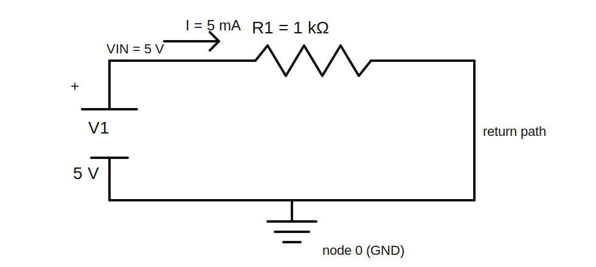

# Lesson 1 — A Circuit Needs a Loop

> **Level:** Foundation  
> **Estimated study time:** 60–90 minutes  
> **Simulation:** DC operating point, followed by a deliberately opened circuit

## 1. Learning objectives

By the end of this lesson, you should be able to:

- explain why steady current requires a complete conductive path;
- distinguish a node, branch, loop, open circuit, and short circuit;
- explain why SPICE requires a reference node called node `0`;
- predict the voltage and current in a one-source, one-resistor circuit;
- interpret positive and negative current signs without assuming the simulator is wrong;
- diagnose a floating or disconnected circuit in KiCad.

## 2. Prerequisites

Only basic algebra is required. This lesson introduces the electrical quantities as needed rather than assuming prior circuit theory.

## 3. The engineering question

A battery can have voltage even while sitting disconnected on a table. Why does current begin only after a complete path is connected, and why does a simulator care about ground even when a real battery can float relative to Earth?

## 4. Physical intuition

A voltage source establishes an electrical potential difference between two terminals. That difference can exert force on mobile charge when a conducting path connects the terminals.

A useful mental picture is not “current leaves the battery and gets used up.” Charge already exists throughout the conductors. Closing the loop establishes an electric field throughout the circuit, and that field causes charge carriers in the entire path to drift. The source supplies energy to the charges; the resistor converts electrical energy into heat.

A steady current cannot continue through an ordinary open gap because charge would have nowhere to keep moving. A tiny transient may occur because disconnected conductors still possess capacitance, but once charge accumulates on the separated surfaces, the current falls essentially to zero. Later volumes model that transient explicitly.

A complete path does not mean every point is at the same voltage. It means there is a continuous path through components and conductors from one source terminal back to the other.

## 5. Circuit under test

The circuit contains:

| Item | Value | Purpose |
|---|---:|---|
| V1 | 5 V DC | Supplies energy and establishes a 5 V potential difference |
| R1 | 1 kΩ | Limits current and converts electrical energy into heat |
| GND | node 0 | Defines the simulator's voltage reference |

The expected current is obtained from Ohm's law:

$$
I = \frac{V}{R}
$$

Substituting the values:

$$
I = \frac{5\ \text{V}}{1000\ \Omega} = 0.005\ \text{A} = 5\ \text{mA}
$$

The resistor's power is:

$$
P_R = VI = 5\ \text{V} \times 5\ \text{mA} = 25\ \text{mW}
$$

or equivalently:

$$
P_R = I^2R = (5\ \text{mA})^2(1\ \text{k}\Omega)=25\ \text{mW}
$$

The ideal source delivers the same 25 mW that the ideal resistor absorbs. Depending on the current-reference direction used by ngspice, source power may be displayed as negative. That negative sign normally means the source is delivering power, not that the result is physically impossible.

## 6. Why SPICE needs node 0

Voltage is always a difference between two points. A simulator solves for node voltages relative to a chosen reference. SPICE reserves node `0` as that reference and defines it as 0 V.

This does not claim that the node is physically connected to Earth. In this isolated low-voltage circuit, ground is simply the point from which all reported node voltages are measured.

Without a reference, the simulator could add 100 V, 1,000 V, or any other constant to every node while preserving all component voltage differences. The circuit behavior would be unchanged, but the absolute node-voltage solution would be mathematically indeterminate. Node `0` removes that ambiguity.

## 7. Build it in KiCad 10

1. Create a new project and open the Schematic Editor.
2. Place a DC voltage source suitable for simulation.
3. Place a resistor and set its value to `1k`.
4. Place the SPICE ground symbol connected to the source's negative terminal.
5. Wire the positive source terminal to the resistor and the resistor back to the negative source terminal.
6. Label the positive node `VIN`.
7. Verify every wire endpoint snaps to a component pin. A wire that merely appears to touch a pin can still be disconnected.
8. Open each component's simulation-model settings and confirm that the source and resistor have valid primitive models and pin mappings.

### Schematic SPICE directives / text fields

**Required directives: None.** Configure the operating-point analysis in KiCad's Simulator dialog.

You do not need to place `.op` as schematic text for this lesson. KiCad can request the operating-point calculation directly from the Simulator interface. This is preferable here because the lesson has no transient timing, initial condition, model include, or special ngspice option to preserve in the schematic.

An ordinary visible note saying `.op` is not necessarily a SPICE directive. For later lessons that require directives such as `.tran`, `.ic`, `.include`, or `.options`, the lesson will identify the exact text, explain how to place it so KiCad exports it to the netlist, and show how to verify it.

## 8. Configure the baseline simulation

Use a DC operating-point analysis. No time-dependent source is needed because the circuit is purely resistive and the DC solution is constant.

Display or inspect:

- `V(VIN)`;
- current through R1;
- current through V1;
- resistor power;
- source power.

## 9. Predict before running

Write down your answers before opening the simulator results:

1. What is `V(VIN)` relative to node 0?
2. What current flows through R1?
3. How much power does R1 absorb?
4. How much power does V1 deliver?
5. Should the current be different at the top and bottom of R1?

Expected reasoning:

- `V(VIN)` should be 5 V.
- The loop current should be 5 mA.
- The same current must flow through every series element because there is nowhere for charge to accumulate indefinitely.
- R1 should absorb 25 mW.
- V1 should deliver 25 mW, often shown with a negative sign under the passive sign convention.

## 10. Baseline experiment

Run the operating-point simulation.

### What to observe

- The node labeled `VIN` should be approximately 5 V.
- The node connected to GND should be 0 V by definition.
- The resistor current magnitude should be approximately 5 mA.
- The source-current magnitude should also be approximately 5 mA, though its sign may be opposite.
- Resistor power should be approximately +25 mW.
- Source power may be approximately −25 mW.

### Why these observations occur

The source maintains a 5 V potential difference. The resistor relates voltage and current through its constitutive equation, $V=IR$. Because the source and resistor form one series loop, charge conservation requires the same steady current through both.

The power signs depend on how current direction is defined for each element. A component absorbs positive power when positive current enters its positively referenced terminal. For the source, current normally exits the terminal marked positive while it powers the resistor, so the passive-sign calculation produces negative power.

## 11. Experiment A — Change resistance

Run the operating point with these resistor values:

| Run | R1 | Predicted current | Predicted resistor power |
|---|---:|---:|---:|
| A1 | 100 Ω | 50 mA | 250 mW |
| A2 | 1 kΩ | 5 mA | 25 mW |
| A3 | 10 kΩ | 0.5 mA | 2.5 mW |
| A4 | 100 kΩ | 50 µA | 0.25 mW |

### What to observe

Increasing resistance by a factor of ten reduces current by a factor of ten when voltage is fixed. It also reduces power by a factor of ten because, for fixed voltage,

$$
P = \frac{V^2}{R}
$$

This is a useful reminder that the effect of changing resistance depends on what the source holds constant. Under a fixed-current source, increasing resistance would instead increase power according to $P=I^2R$.

## 12. Experiment B — Open the loop

Delete the wire between R1 and the return node, leaving a visible gap.

Before running, predict:

- current through R1;
- voltage at the source's positive terminal;
- voltage at the disconnected end of R1;
- whether the simulator will produce a clean solution or a warning.

### Expected observation

The DC current should be zero or numerically negligible because no closed conductive path exists. The disconnected node may be reported as floating, may be assigned a numerically convenient value through tiny simulator conductances, or may cause a singular-matrix/convergence warning depending on the exact model and settings.

### Why this happens

An ideal open circuit has infinite resistance, so the steady current is zero. The floating-node warning is a separate mathematical issue: the disconnected node has no defined DC relationship to node 0. Real conductors have leakage and capacitance, but an idealized DC model may omit both.

## 13. Experiment C — Create a short circuit safely in simulation

Replace R1 with a very small resistance such as `1mΩ`; do not begin with an exact zero-ohm wire across an ideal voltage source.

Predict the current:

$$
I = \frac{5\ \text{V}}{1\ \text{m}\Omega}=5000\ \text{A}
$$

This absurd result is a feature of the idealized model. The source has zero internal resistance, the wire has almost zero resistance, and neither model includes thermal destruction or current limiting.

### What to learn

- A simulator obeys the model you gave it, not the physical device you imagined.
- Ideal sources can produce unbounded or unrealistic current into very small resistance.
- Real batteries, bench supplies, wires, and connectors have internal resistance, inductance, protection, and thermal limits.
- Later lessons replace the ideal source with a source-resistance model.

## 14. Common mistakes and debugging

| Symptom | Likely cause | Verification | Fix |
|---|---|---|---|
| `VIN` is 0 V | source value or polarity is wrong | inspect source properties | set 5 V and correct orientation |
| no current in the closed drawing | wire does not actually connect | highlight the net or inspect junctions | redraw the wire with snapping enabled |
| singular matrix | floating node or no node 0 | inspect ground and disconnected nodes | add node 0 and remove unintended floats |
| current is −5 mA | reference direction differs from expectation | inspect element pin order | interpret the sign or reverse the plotted expression |
| source power is negative | source is delivering energy | compare with resistor power | treat negative source power as expected |
| huge current | accidental short or tiny resistance | inspect netlist and values | restore intended resistance and add source resistance when appropriate |

## 15. Practical design guidance

A real design never chooses a resistor from current alone. It must also check:

- power rating and derating;
- maximum working voltage;
- tolerance;
- temperature coefficient;
- pulse energy;
- package size;
- availability;
- the effect of failure open or short.

For the baseline 1 kΩ resistor, 25 mW is far below the nominal rating of a common 0.25 W through-hole resistor. That does not mean every 1 kΩ resistor is automatically suitable in every application; package and environmental limits still matter.

## 16. Knowledge check

1. A disconnected 9 V battery still measures about 9 V. Why is its external current approximately zero?
2. Why can a simulator call one node 0 V without claiming that it is connected to Earth?
3. Why does the same steady current flow through V1 and R1?
4. Why might source power be negative while resistor power is positive?
5. Why is a 5 V ideal source directly shorted by 1 mΩ not a physically realistic battery model?

## 17. Design challenge — Build a 10 mA test load

Design a one-resistor load for an ideal 5 V source.

### Constraints

- target current: 10 mA;
- allowed current error: ±1% using the nominal resistor value;
- choose a standard resistor value;
- resistor steady-state power must remain below 50% of its selected nominal power rating;
- use node labels and document current direction.

### Acceptance criteria

- simulated current is between 9.9 mA and 10.1 mA;
- calculated and simulated resistor power differ by less than 1%;
- selected resistor power rating is at least twice the calculated dissipation;
- source power and load power balance within numerical precision.

### Required validation measurements

- `V(VIN)`;
- current through the resistor;
- resistor power;
- source power;
- sum of all component powers.

Do not open the worked solution until you have selected a value, calculated the expected results, and run the simulation.

## 18. Optional hardware experiment

Use a current-limited 5 V bench supply or USB-derived 5 V source with suitable protection, a resistor of adequate power rating, and a multimeter.

Measure:

- source voltage with no load;
- source voltage under load;
- resistor voltage;
- current;
- resistor value before and after warming.

Expect small differences from simulation due to source resistance, resistor tolerance, lead resistance, meter accuracy, and temperature.

## 19. Summary

A voltage source can establish a potential difference without external current. Sustained current through an ordinary resistive circuit requires a complete loop. SPICE additionally requires node 0 so node voltages have a mathematical reference. The first discipline of simulation is to distinguish circuit physics from model assumptions and sign conventions.

The next lesson examines current as a rate of charge flow and turns charge conservation into a quantitative design rule.
