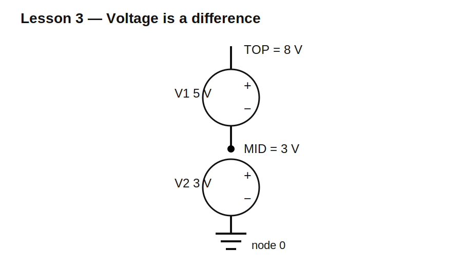

# Lesson 3 — Voltage Is a Difference

> **Level:** Foundation  
> **Estimated study time:** 90–120 minutes  
> **Simulation:** DC operating point with several reference choices

## Learning objectives

By the end of this lesson, you should be able to:

- explain why voltage always exists between two points;
- distinguish node voltage from component voltage;
- predict the sign of a differential-voltage measurement;
- explain why changing the reference node changes reported node voltages but not circuit behavior;
- use meaningful net labels and differential expressions in KiCad/ngspice.

## Physical intuition

Voltage describes energy change per unit charge. Saying that a point “has 5 V” is incomplete unless the reference point is understood. In circuit work, the omitted reference is usually node `0`.

A voltmeter has two leads because it measures a difference. Reversing them does not damage an ideal simulated meter; it changes the sign.

## Circuit under test

The baseline circuit uses two ideal DC sources in series:

- V1 = 5 V from node `MID` to node `TOP`;
- V2 = 3 V from node `0` to node `MID`.

Therefore:

$$V(MID)=3\text{ V}$$

$$V(TOP)=3\text{ V}+5\text{ V}=8\text{ V}$$

The voltage from `TOP` to `MID` is:

$$V(TOP,MID)=V(TOP)-V(MID)=5\text{ V}$$

Reversing the order gives:

$$V(MID,TOP)=-5\text{ V}$$

## Build it in KiCad 10

1. Place two SPICE-compatible DC sources in series.
2. Set V1 to `5` and V2 to `3`.
3. Place SPICE ground at the negative terminal of V2.
4. Label the junction `MID` and the upper node `TOP`.
5. Verify source polarity and pin mapping.

## Schematic SPICE directives / text fields

No schematic directive is required. Configure a DC operating-point analysis in the Simulator dialog.

Plot or inspect:

- `V(TOP)`;
- `V(MID)`;
- `V(TOP,MID)`;
- `V(MID,TOP)`.

## Baseline observations

Expected values:

| Quantity | Expected result |
|---|---:|
| `V(MID)` | +3 V |
| `V(TOP)` | +8 V |
| `V(TOP,MID)` | +5 V |
| `V(MID,TOP)` | −5 V |

The component voltage across V1 remains 5 V regardless of which node is selected as the global reference.

## Experiment A — Move node 0

Move SPICE ground from the lower node to `MID` without changing any component connections.

Expected results:

- `V(MID)=0 V`;
- `V(TOP)=+5 V`;
- the lower node becomes `−3 V`;
- the voltage across each source remains unchanged.

This demonstrates that the reference changes coordinates, not physics.

## Experiment B — Reverse the probe

Compare `V(TOP,MID)` with `V(MID,TOP)`. Their magnitudes are equal and their signs are opposite because the subtraction order is reversed.

## Experiment C — Add a resistor load

Connect a 1 kΩ resistor from `TOP` to node `0` and run operating point again. The ideal sources hold the same node voltages while 8 mA flows through the resistor. This teaches that a defined voltage does not imply zero current or fixed current; current depends on the connected network.

## Common mistakes

| Symptom | Likely cause | Fix |
|---|---|---|
| `TOP` is 2 V | one source is reversed | inspect polarity |
| differential voltage has wrong sign | probe order reversed | swap expression order |
| singular matrix | no node 0 | add SPICE ground |
| unexpected generated net names | missing labels | label `TOP` and `MID` |

## Design challenge

Create a series-source circuit in which node `A` is +12 V relative to node `0`, while node `B` is −5 V relative to node `0`. Then verify:

$$V(A,B)=17\text{ V}$$

Acceptance criteria:

- `V(A)` within 1 mV of +12 V;
- `V(B)` within 1 mV of −5 V;
- `V(A,B)` within 1 mV of +17 V;
- no floating nodes;
- all source polarities documented.

## Summary

Voltage is never an absolute property of one node. Node voltage is measured relative to a reference, and component voltage is the difference between two node voltages. Changing the reference changes reported node values but not observable component behavior.