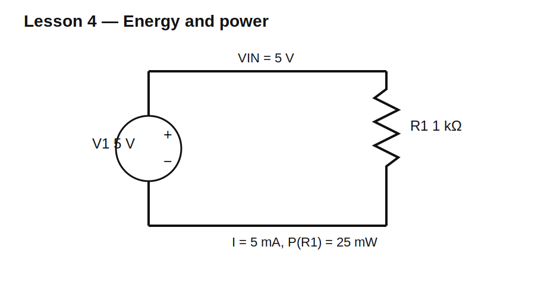

# Lesson 4 — Energy and Power

> **Level:** Foundation  
> **Estimated study time:** 100–140 minutes  
> **Simulation:** DC operating point and transient energy measurement

## Learning objectives

You will learn to:

- distinguish energy in joules from power in watts;
- use the passive sign convention;
- calculate resistor power with $P=VI$, $P=I^2R$, and $P=V^2/R$;
- explain negative source power in ngspice;
- integrate power over time to obtain energy;
- select a resistor rating with margin.

## Physical intuition

Voltage tells us energy transferred per unit charge, current tells us charge per unit time, and their product therefore gives energy per unit time:

$$P=VI$$

One watt is one joule per second. Power answers “how fast is energy moving or being converted?” Energy answers “how much accumulated over an interval?”

For constant power:

$$E=Pt$$

For changing power:

$$E=\int_{t_1}^{t_2}p(t)\,dt$$

## Circuit under test



Use an ideal 5 V source and a 1 kΩ resistor.

$$I=\frac{5\text{ V}}{1\text{ k}\Omega}=5\text{ mA}$$

$$P_R=VI=(5\text{ V})(5\text{ mA})=25\text{ mW}$$

Over 10 seconds:

$$E_R=(25\text{ mW})(10\text{ s})=0.25\text{ J}$$

## Build it in KiCad 10

1. Place a SPICE DC voltage source V1 and set it to 5 V.
2. Place R1 = 1 kΩ.
3. Complete the loop and add SPICE node `0`.
4. Label the upper node `VIN`.
5. Confirm primitive models and pin ordering.

## Schematic SPICE directives / text fields

For the DC operating point, no directive is required.

For the transient energy experiment, place this as a SPICE directive text field:

```spice
.tran 10m 10s
.meas tran E_R INTEG V(VIN)*I(R1) FROM=0 TO=10s
```

Depending on resistor-current orientation, the measured sign may be negative. If so, use `-V(VIN)*I(R1)` after verifying the current reference direction. Do not hide a sign problem without understanding it.

## Baseline operating-point observations

| Quantity | Expected result |
|---|---:|
| `V(VIN)` | 5 V |
| resistor current magnitude | 5 mA |
| resistor power | +25 mW |
| source power | −25 mW |
| power sum | approximately 0 W |

The source value is negative because it delivers energy; the resistor value is positive because it absorbs energy.

## Experiment A — Change resistance

| R | Current | Power at fixed 5 V |
|---:|---:|---:|
| 100 Ω | 50 mA | 250 mW |
| 1 kΩ | 5 mA | 25 mW |
| 10 kΩ | 0.5 mA | 2.5 mW |

At fixed voltage:

$$P=\frac{V^2}{R}$$

so ten times more resistance gives one tenth the power.

## Experiment B — Change voltage

Keep R = 1 kΩ and sweep the source through 1 V, 2 V, 5 V, and 10 V. Because power depends on voltage squared, doubling voltage multiplies power by four.

## Experiment C — Integrate power

Run the 10-second transient. The power trace should remain constant near 25 mW, and integrated energy should be close to 0.25 J.

Then repeat for 20 seconds. Power does not change, but energy doubles to 0.50 J.

## Practical rating guidance

A resistor marked 0.25 W should not automatically be operated continuously at exactly 0.25 W. Ratings assume specified ambient temperature, mounting, airflow, and derating. For this lesson’s 25 mW load, a 0.125 W or 0.25 W part has comfortable nominal margin.

## Common mistakes

| Symptom | Explanation |
|---|---|
| source power is negative | source is delivering energy |
| power seems too high | value or unit suffix is wrong |
| energy unit shown as watts | power was not integrated over time |
| transient `.meas` fails | directive not exported or current name differs |
| resistor rating equals calculated power | insufficient design margin |

## Design challenge

Design a resistor load that absorbs 100 mW from an ideal 10 V source.

Acceptance criteria:

- nominal power within ±1% of 100 mW;
- calculated current and resistance documented;
- selected resistor rating at least 2× calculated dissipation;
- source and load powers balance within numerical precision;
- energy over 30 seconds calculated and simulated.

## Summary

Power is the rate of energy transfer. Positive and negative signs describe whether a component absorbs or delivers energy under the chosen reference directions. Integrating power over time converts watts into joules.