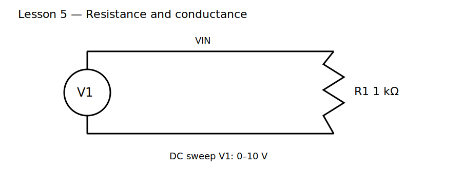

# Lesson 5 — Resistance and Conductance

> **Level:** Foundation  
> **Estimated study time:** 90–120 minutes  
> **Simulation:** DC sweep and operating point

## 1. Learning objectives

By the end of this lesson, you should be able to:

- explain resistance as a relationship between voltage and current;
- distinguish resistance from resistivity;
- use Ohm's law without treating it as a universal law for every component;
- use conductance and understand why parallel paths add naturally in conductance;
- identify linear and nonlinear current-voltage behavior;
- estimate resistor power and recognize when the ideal-resistor model becomes incomplete.

## 2. Physical intuition

A resistor does not consume current. It opposes charge motion and converts electrical energy into heat. In a metallic resistor, the electric field accelerates mobile electrons between collisions with the lattice. More collisions per unit length, a longer path, or a smaller cross-sectional area produce more resistance.

For a uniform material,

$$
R=\rho\frac{L}{A}
$$

where $\rho$ is resistivity, $L$ is length, and $A$ is cross-sectional area.

Conductance is the reciprocal quantity:

$$
G=\frac{1}{R}
$$

Its unit is the siemens. A 1 kΩ resistor has a conductance of 1 mS.

## 3. Circuit under test

Use a DC voltage source feeding a 1 kΩ resistor. Sweep the source from 0 V to 10 V.

## 4. Mathematical model

For an ideal linear resistor,

$$
V=IR
$$

so

$$
I=\frac{V}{R}=GV
$$

The current-voltage graph is a straight line through the origin. Its slope on an $I$ versus $V$ plot is conductance.

For $R=1\ \text{k}\Omega$:

| Voltage | Current | Power |
|---:|---:|---:|
| 1 V | 1 mA | 1 mW |
| 5 V | 5 mA | 25 mW |
| 10 V | 10 mA | 100 mW |

## 5. Build it in KiCad 10

1. Open the supplied project.
2. Convert the legacy schematic to KiCad 10 native format when prompted.
3. Confirm V1 is a DC source and R1 is 1 kΩ.
4. Confirm the lower node is SPICE node `0`.
5. Label the upper node `VIN`.

### Schematic SPICE directives / text fields

No schematic directive is required if the DC sweep is configured in the Simulator dialog.

Configure:

- source: `V1`;
- start: `0`;
- stop: `10`;
- step: `0.1`.

## 6. Predict before running

Predict the current at 2 V, 5 V, and 10 V. Predict whether doubling voltage doubles current and whether power doubles or quadruples.

## 7. Baseline experiment

Plot:

- `V(VIN)`;
- current through R1;
- resistor power.

### What to observe

- Current increases linearly with voltage.
- Doubling voltage doubles current.
- Doubling voltage quadruples power because $P=V^2/R$.

### Why it happens

The resistance remains constant in the ideal model, so the current-voltage ratio remains constant. Power depends on both voltage and current; when both double, their product increases by four.

## 8. Parameter experiments

### Experiment A — Change resistance

Repeat with 100 Ω, 1 kΩ, and 10 kΩ.

Observe that the $I$-versus-$V$ slope becomes steeper for lower resistance and flatter for higher resistance.

### Experiment B — Use conductance

Calculate conductance for each value:

- 100 Ω = 10 mS;
- 1 kΩ = 1 mS;
- 10 kΩ = 0.1 mS.

Verify that $I=GV$ gives the same result as $I=V/R$.

### Experiment C — Add a nonlinear element

Replace R1 with a diode model in a copy of the project. Sweep voltage again. The resulting curve will not be a straight line, demonstrating that Ohm's law with a constant $R$ is not a universal device law.

## 9. Limits of the model

A real resistor changes value with temperature, has voltage and power ratings, parasitic capacitance and inductance, excess noise, and finite pulse capability. At high power, self-heating changes resistance and may destroy the component.

## 10. Common mistakes

| Symptom | Likely cause | Fix |
|---|---|---|
| flat current trace | wrong current expression or source not swept | select V1 and plot R1 current |
| negative current | reference direction opposite your expectation | interpret sign or reverse expression |
| curved resistor plot | temperature effects or wrong model | use ideal resistor and fixed temperature |
| unrealistic power | forgot square-law relationship | calculate $P=V^2/R$ |

## 11. Design challenge

Choose a resistor that draws 3.3 mA from a 3.3 V source.

### Acceptance criteria

- nominal current within ±1%;
- resistor power below 50% of selected rating;
- use a standard value;
- verify current using both resistance and conductance forms;
- document expected current at 0 V, 1.65 V, and 3.3 V.

## 12. Summary

Resistance links voltage and current; conductance is its reciprocal. Ideal resistors are linear, but real components have thermal, voltage, frequency, and power limits. The next lesson uses charge conservation at a node to derive Kirchhoff's Current Law.