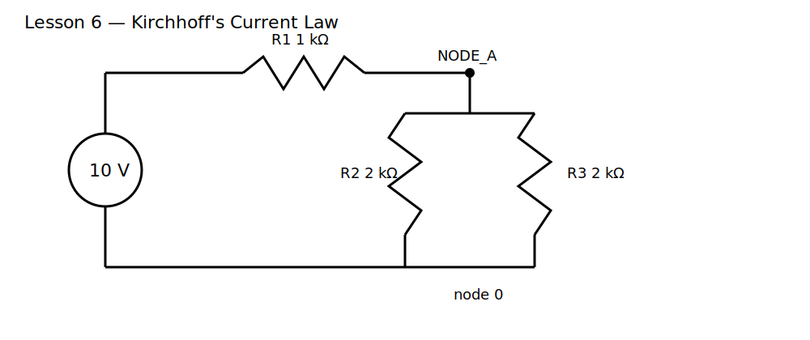

# Lesson 6 — Kirchhoff's Current Law

> **Level:** Foundation  
> **Estimated study time:** 90–120 minutes  
> **Simulation:** DC operating point and branch-current verification

## 1. Learning objectives

- derive Kirchhoff's Current Law (KCL) from conservation of charge;
- assign current directions consistently;
- distinguish a physical current from its signed numerical representation;
- verify current balance at a node in KiCad/ngspice;
- explain why current can split but charge does not disappear.

## 2. Physical intuition

A node is a conducting region whose points are treated as being at one voltage. In steady state, charge cannot accumulate indefinitely at a node. If more current entered than left, charge would build up and change the node voltage until the imbalance was removed.

Therefore,

$$
\sum I_{\text{entering}}=\sum I_{\text{leaving}}
$$

or, using signed currents,

$$
\sum_k I_k=0
$$

The second form is not a different law. It is the same law with one sign convention.

## 3. Circuit under test

A 10 V source feeds a node through R1 = 1 kΩ. Two return branches use R2 = 2 kΩ and R3 = 2 kΩ.

The two lower resistors are in parallel, so their equivalent is 1 kΩ. The node voltage is therefore 5 V.

Expected currents:

$$
I_{R1}=\frac{10-5}{1\ \text{k}\Omega}=5\ \text{mA}
$$

$$
I_{R2}=I_{R3}=\frac{5}{2\ \text{k}\Omega}=2.5\ \text{mA}
$$

Thus,

$$
5\ \text{mA}=2.5\ \text{mA}+2.5\ \text{mA}
$$

## 4. Build it in KiCad 10

Open the supplied project and convert the legacy schematic when prompted. Confirm:

- V1 = 10 V;
- R1 = 1 kΩ;
- R2 = R3 = 2 kΩ;
- central node label is `NODE_A`;
- return node is SPICE node `0`.

### Schematic SPICE directives / text fields

No directive is required. Use a DC operating-point analysis.

## 5. Predict before running

Predict:

- `V(NODE_A)`;
- current through each resistor;
- the algebraic sum of currents at `NODE_A`;
- what happens if R3 is changed to 4 kΩ.

## 6. Baseline experiment

Run the operating point and record all branch currents.

### What to observe

- current through R1 equals the sum through R2 and R3;
- R2 and R3 share equally because they have equal resistance and equal voltage;
- signs may differ because ngspice defines current according to pin order.

### Why it happens

Current splitting is not a decision made by the node. Each branch current follows its own voltage-current relationship. The node voltage settles at the value that simultaneously satisfies every branch equation and charge conservation.

## 7. Parameter experiments

### Experiment A — Make branches unequal

Set R3 to 4 kΩ. Predict the new node voltage and currents before running.

### Experiment B — Reverse one plotted sign

Plot `-I(R2)` or reverse the assumed arrow. The physical circuit is unchanged; only the reporting convention changes.

### Experiment C — Add a third branch

Add R4 = 5 kΩ from `NODE_A` to ground. Verify that the incoming current becomes the sum of three outgoing currents.

## 8. Common mistakes

| Symptom | Cause | Fix |
|---|---|---|
| currents do not add numerically | mixed sign conventions | draw arrows and convert all currents to one convention |
| node voltage unexpected | wrong resistor value or unconnected branch | highlight nets and inspect values |
| current appears negative | element pin order | interpret direction rather than magnitude alone |
| floating-node error | return path missing | connect every branch to node 0 |

## 9. Design challenge

Using a 12 V source, R1 = 1 kΩ, and two unknown return resistors, design the circuit so:

- `NODE_A` is 6 V;
- total source current is 6 mA;
- one branch carries twice the current of the other;
- both branch resistors are standard values.

Provide calculations, KiCad simulation results, current arrows, and a KCL balance table.

## 10. Summary

KCL is charge conservation expressed at a node. Branch currents arise from component laws, while the node voltage adjusts so all branch equations and current conservation hold simultaneously. The next lesson performs the analogous energy accounting around a loop.