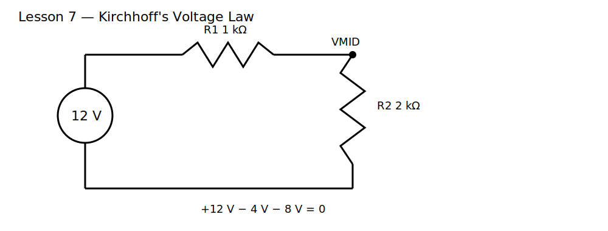

# Lesson 7 — Kirchhoff's Voltage Law

> **Level:** Foundation  
> **Estimated study time:** 90–120 minutes  
> **Simulation:** DC operating point and loop-voltage accounting

## 1. Learning objectives

- derive Kirchhoff's Voltage Law (KVL) from conservation of energy;
- assign voltage polarities consistently;
- calculate voltage rises and drops around a closed loop;
- verify a loop equation in KiCad/ngspice;
- distinguish an actual polarity from a chosen reference polarity.

## 2. Physical intuition

A charge returning to its starting point after moving around a closed loop cannot have gained or lost net potential energy merely because we chose to describe the loop. Sources raise electrical potential; passive elements usually produce drops. The signed sum of all voltage changes around a closed loop is zero:

$$
\sum_k V_k=0
$$

KVL is energy bookkeeping. A negative result for a measured voltage does not mean the component is malfunctioning; it means the actual polarity is opposite the chosen reference.

## 3. Circuit under test

A 12 V source drives R1 = 1 kΩ and R2 = 2 kΩ in series.

Total resistance:

$$
R_T=3\ \text{k}\Omega
$$

Loop current:

$$
I=\frac{12\ \text{V}}{3\ \text{k}\Omega}=4\ \text{mA}
$$

Voltage drops:

$$
V_{R1}=4\ \text{V},\qquad V_{R2}=8\ \text{V}
$$

Loop equation:

$$
+12-4-8=0
$$

## 4. Build it in KiCad 10

Open the supplied project, convert the legacy schematic, and verify:

- V1 = 12 V;
- R1 = 1 kΩ;
- R2 = 2 kΩ;
- midpoint label is `VMID`;
- source return is node `0`.

### Schematic SPICE directives / text fields

No directive is required. Run a DC operating-point analysis.

## 5. Predict before running

Predict:

- loop current;
- `V(VMID)`;
- voltage across each resistor using top-to-bottom polarity;
- the result when one voltage probe is reversed.

## 6. Baseline experiment

Measure:

- source voltage;
- `V(VIN)`;
- `V(VMID)`;
- `V(VIN,VMID)` across R1;
- `V(VMID,0)` across R2.

### What to observe

- `V(VIN)` is 12 V;
- `V(VMID)` is 8 V;
- R1 drops 4 V and R2 drops 8 V;
- signed rises and drops sum to approximately zero.

### Why it happens

The same current flows through both series resistors. Their voltage drops are proportional to resistance. The larger resistor receives the larger share of the source voltage.

## 7. Parameter experiments

### Experiment A — Reverse the loop direction

Write the KVL equation clockwise and counterclockwise. Every sign reverses, but both equations reduce to zero.

### Experiment B — Reverse a voltage probe

Compare `V(VIN,VMID)` with `V(VMID,VIN)`. They have equal magnitude and opposite sign.

### Experiment C — Add a second source

Add a 3 V source opposing V1. Predict the net driving voltage and new loop current. Then reverse it so the sources aid each other.

## 8. Common mistakes

| Symptom | Cause | Fix |
|---|---|---|
| loop sum is not zero | mixed polarity definitions | mark `+` and `−` before calculating |
| midpoint is 4 V instead of 8 V | assumed drop equals node voltage | measure relative to node 0 carefully |
| current sign surprises you | traversal direction differs from element pin order | separate physical direction from simulator sign |
| source voltages add when expected to subtract | source polarity reversed | inspect source symbols and netlist ordering |

## 9. Design challenge

Using a 15 V source and two series resistors, design a loop where:

- current is 3 mA;
- lower resistor drop is 9 V;
- upper resistor drop is 6 V;
- both values are standard resistors;
- each resistor operates below 50% of its selected power rating.

Provide a complete KVL equation, expected node voltages, simulated values, and power checks.

## 10. Summary

KVL is conservation of energy around a closed path. Voltage signs depend on chosen polarity and traversal direction, while the underlying physical potential differences remain unchanged. The next lesson applies these ideas to series resistor networks as reusable design blocks.