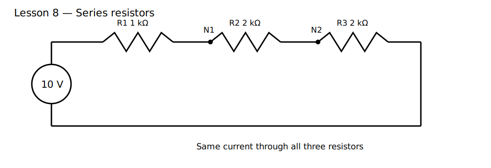

# Lesson 8 — Series Resistors

> **Level:** Foundation  
> **Estimated study time:** 90–120 minutes  
> **Simulation:** DC operating point and parameter sweeps

## 1. Learning objectives

- recognize when resistors are truly in series;
- calculate equivalent resistance;
- explain why current is identical through series elements;
- derive and use the voltage-divider relationship;
- calculate resistor power and identify the most stressed component;
- understand when a series reduction is invalid because another branch connects to the midpoint.

## 2. Physical intuition

Components are in series when the same current must pass through each because their shared node has no additional branch. Resistances then add:

$$
R_T=R_1+R_2+\cdots
$$

For a source voltage $V_S$,

$$
I=\frac{V_S}{R_T}
$$

and each resistor receives a voltage drop

$$
V_k=IR_k
$$

Combining these gives the divider relationship for two resistors:

$$
V_{OUT}=V_S\frac{R_2}{R_1+R_2}
$$

## 3. Circuit under test

Use V1 = 10 V, R1 = 1 kΩ, R2 = 2 kΩ, and R3 = 2 kΩ in series.

Total resistance:

$$
R_T=5\ \text{k}\Omega
$$

Current:

$$
I=\frac{10\ \text{V}}{5\ \text{k}\Omega}=2\ \text{mA}
$$

Expected drops:

- R1: 2 V;
- R2: 4 V;
- R3: 4 V.

## 4. Build it in KiCad 10

Open the supplied project, import the schematic, and verify meaningful labels at each node: `VIN`, `N1`, and `N2`.

### Schematic SPICE directives / text fields

No directive is required for the baseline operating point. For a resistor sweep, configure a parameter in the Simulator dialog or duplicate runs manually and record the result.

## 5. Predict before running

Predict:

- total current;
- all node voltages;
- each resistor's voltage and power;
- whether swapping R2 and R3 changes total current;
- whether swapping R1 and R3 changes the set of drops but not total current.

## 6. Baseline experiment

Measure all node voltages and resistor currents.

### What to observe

- every resistor carries the same current magnitude;
- drops add to the source voltage;
- voltage drop is proportional to resistance;
- total resistance equals the sum.

### Why it happens

There is only one current path. KCL forces the current to be the same at every intermediate node, and KVL forces all resistor drops to sum to the source voltage.

## 7. Parameter experiments

### Experiment A — Scale every resistor

Multiply all values by 10. Voltage ratios stay unchanged, but current and power fall by 10.

### Experiment B — Change only one resistor

Increase R2 from 2 kΩ to 8 kΩ. Observe that total current decreases and R2 takes a larger fraction of the source voltage.

### Experiment C — Break the series condition

Add a load from `N1` to ground. R1 and R2 are no longer a simple isolated series pair because current can split at `N1`. Compare the loaded result to the original divider prediction.

### Experiment D — Short one resistor

Replace R2 by 1 mΩ. Its drop approaches zero while current rises because total resistance falls.

## 8. Power distribution

For a common current,

$$
P_k=I^2R_k
$$

Therefore the largest series resistor dissipates the most power. This is different from parallel branches, where all resistors share voltage and the smallest resistance dissipates the most power.

## 9. Common mistakes

| Symptom | Cause | Fix |
|---|---|---|
| equivalent resistance calculation fails | midpoint has another branch | redraw topology and apply KCL |
| voltage ratio correct but current wrong | forgot total resistance | calculate $R_T$ first |
| expected same voltage across all resistors | confused series with parallel | remember series shares current |
| power rating overlooked | considered only total power | calculate each resistor separately |

## 10. Design challenge

Design a three-resistor series string from a 12 V source such that:

- current is 2 mA;
- voltage drops are 2 V, 4 V, and 6 V;
- all values are standard resistors;
- each resistor is below 50% of its selected power rating.

Provide node voltages, resistor values, current, individual powers, KVL validation, and a KiCad simulation.

## 11. Summary

Series resistances add because the same current passes through each element. Voltage divides in proportion to resistance. These relationships remain valid only while no additional path draws current from the intermediate nodes. The next lesson examines parallel resistors, where voltage is shared and current divides.