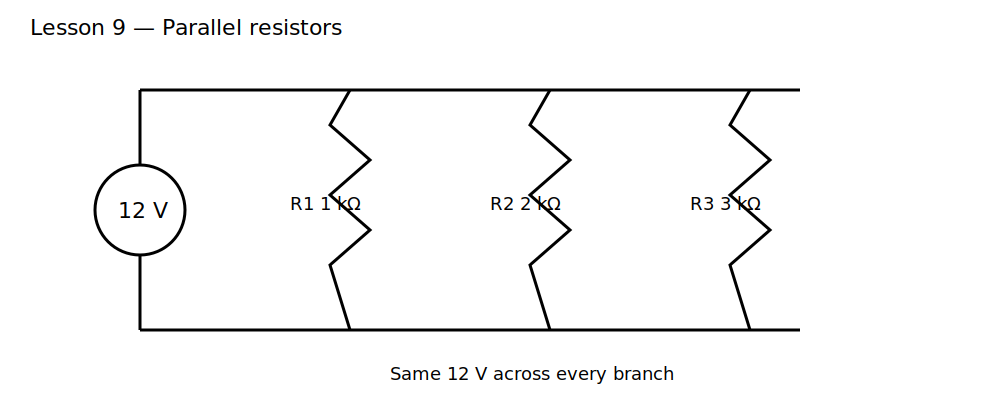

# Lesson 9 — Parallel Resistors

> **Level:** Foundation  
> **Estimated study time:** 90–120 minutes  
> **Simulation:** DC operating point and branch-current comparison

## 1. Learning objectives

- recognize when resistors are truly in parallel;
- calculate equivalent resistance and conductance;
- explain why parallel branches share voltage;
- derive current division from Ohm's law and KCL;
- explain why equivalent resistance is lower than the smallest branch resistance;
- calculate power in each branch.

## 2. Physical intuition

Components are in parallel when both of their terminals connect to the same two nodes. They therefore have the same voltage across them. Each branch draws current according to its own resistance:

$$
I_k=\frac{V}{R_k}
$$

The source supplies the sum:

$$
I_T=I_1+I_2+\cdots
$$

Because conductances add directly,

$$
G_T=G_1+G_2+\cdots
$$

and

$$
\frac{1}{R_T}=\frac{1}{R_1}+\frac{1}{R_2}+\cdots
$$

Adding a parallel path can only increase total conductance, so equivalent resistance must decrease.

## 3. Circuit under test

Use a 12 V source with R1 = 1 kΩ, R2 = 2 kΩ, and R3 = 3 kΩ in parallel.

Branch currents:

- R1: 12 mA;
- R2: 6 mA;
- R3: 4 mA.

Total current:

$$
I_T=22\ \text{mA}
$$

Equivalent resistance:

$$
R_T=\frac{12\ \text{V}}{22\ \text{mA}}\approx545.45\ \Omega
$$

This is lower than 1 kΩ, the smallest branch resistance.

## 4. Build it in KiCad 10

Open the supplied project and import the schematic. Confirm that all resistor top terminals connect to `VIN` and all bottom terminals connect to node `0`.

### Schematic SPICE directives / text fields

No directive is required for the baseline. Run a DC operating-point analysis.

## 5. Predict before running

Predict:

- voltage across every branch;
- each branch current;
- source current;
- equivalent resistance;
- which resistor dissipates the most power.

## 6. Baseline experiment

Measure `V(VIN)`, each resistor current, source current, and power.

### What to observe

- every branch has 12 V across it;
- lower resistance draws higher current;
- branch currents sum to the source current;
- equivalent resistance is below 1 kΩ;
- R1 dissipates the most power because all branches share voltage and $P=V^2/R$.

### Why it happens

The wiring fixes the same voltage across every branch. Each branch independently converts that voltage into current through Ohm's law. KCL then requires the source to provide the sum.

## 7. Parameter experiments

### Experiment A — Remove a branch

Disconnect R3. Total current falls and equivalent resistance rises.

### Experiment B — Add a high-value branch

Add 100 kΩ in parallel. The change is small but never zero. Calculate the new equivalent resistance before simulating.

### Experiment C — Add a very low resistance

Add 10 Ω. Observe that this branch dominates source current and total power. This models an accidental short more realistically than an ideal wire.

### Experiment D — Equal branches

Use three 3 kΩ resistors. Verify that the equivalent is 1 kΩ and each branch carries one-third of total current.

## 8. Current division

For two parallel resistors,

$$
I_1=I_T\frac{R_2}{R_1+R_2}
$$

$$
I_2=I_T\frac{R_1}{R_1+R_2}
$$

The opposite resistance appears in the numerator because the lower-resistance branch receives the larger current.

## 9. Common mistakes

| Symptom | Cause | Fix |
|---|---|---|
| equivalent resistance larger than a branch | added resistances directly | add reciprocals or conductances |
| branch voltages differ | branches do not share both nodes | highlight nets |
| source current does not equal branch sum | sign conventions mixed | define arrows consistently |
| smallest resistor expected least power | confused fixed-current and fixed-voltage cases | use $P=V^2/R$ for parallel branches |

## 10. Design challenge

Design three parallel branches across 10 V such that:

- total current is 20 mA;
- branch currents are 10 mA, 5 mA, and 5 mA;
- all resistor values are standard;
- each resistor operates below 50% of its selected power rating.

Provide equivalent resistance, conductance, KCL validation, branch powers, and KiCad simulation results.

## 11. Summary

Parallel branches share voltage while current divides according to conductance. Conductances add, making the equivalent resistance smaller than any individual branch resistance. The next lesson combines series and parallel sections into mixed networks.