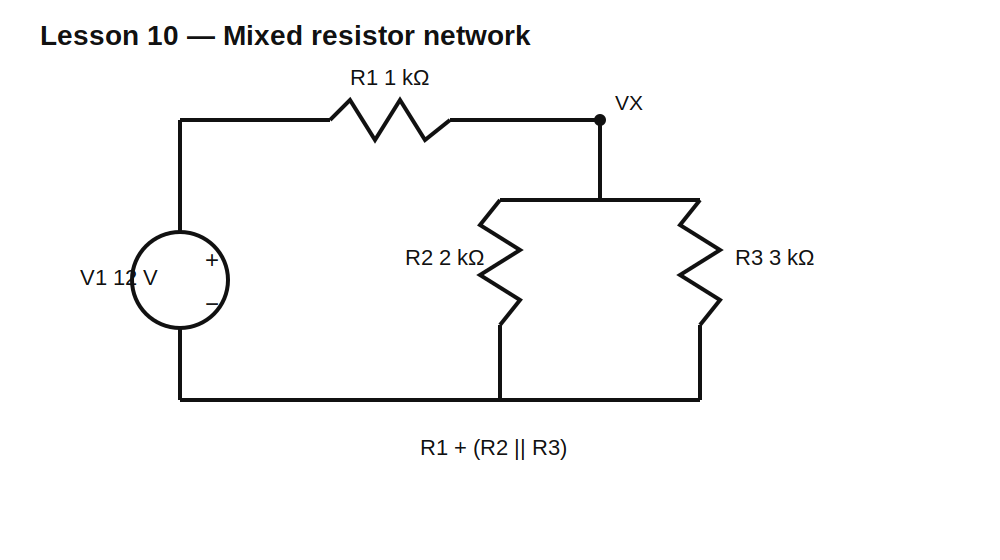

# Lesson 10 — Mixed Resistor Networks

> **Level:** Foundation / analysis  
> **Estimated study time:** 120–160 minutes  
> **Simulation:** DC operating point and resistor-value sweeps

## Learning objectives

You will learn to:

- identify series and parallel groups inside a larger network;
- reduce a network in a safe, traceable order;
- recognize when two components are **not** truly in series or parallel;
- verify hand calculations with node voltages and branch currents;
- use nodal reasoning when visual reduction becomes awkward;
- check power conservation as an error detector.

## Engineering question

Real schematics rarely contain only one obvious series chain or one obvious parallel bank. How do you reduce a mixed network without accidentally combining components that do not share the required topology?

## Circuit under test



Use:

- $V_1=12\text{ V}$
- $R_1=1\text{ k}\Omega$
- $R_2=2\text{ k}\Omega$
- $R_3=3\text{ k}\Omega$

$R_2$ and $R_3$ share both endpoints, so they are parallel:

$$R_{23}=\frac{R_2R_3}{R_2+R_3}=1.2\text{ k}\Omega$$

That parallel combination is in series with $R_1$:

$$R_T=R_1+R_{23}=2.2\text{ k}\Omega$$

Source current:

$$I_T=\frac{12\text{ V}}{2.2\text{ k}\Omega}=5.4545\text{ mA}$$

The parallel-node voltage is:

$$V_X=I_TR_{23}=6.5455\text{ V}$$

Branch currents:

$$I_2=\frac{V_X}{R_2}=3.2727\text{ mA}$$

$$I_3=\frac{V_X}{R_3}=2.1818\text{ mA}$$

and KCL confirms:

$$I_T=I_2+I_3$$

## Build it in KiCad 10

1. Open the supplied `lesson-10.sch` in KiCad 10.
2. Allow conversion and save as `lesson-10.kicad_sch`.
3. Confirm the SPICE source is 12 V.
4. Confirm resistor primitive models and values.
5. Label the source node `VIN` and branch node `VX`.
6. Use the SPICE-compatible node `0` symbol.

## Schematic SPICE directives / text fields

No schematic directive is required for the baseline DC operating point.

For a value sweep, either use KiCad Simulator’s parameter controls or place an actual SPICE directive after changing R3 to `{RVAR}`:

```spice
.param RVAR=3k
.step param RVAR list 1k 2k 3k 6k 12k
.op
```

Verify these lines appear in the generated ngspice netlist. Ordinary schematic notes are not automatically directives.

## Baseline predictions

| Quantity | Expected |
|---|---:|
| `V(VIN)` | 12.000 V |
| `V(VX)` | 6.545 V |
| source current magnitude | 5.455 mA |
| `I(R2)` magnitude | 3.273 mA |
| `I(R3)` magnitude | 2.182 mA |
| equivalent resistance | 2.200 kΩ |

## Experiment A — Verify topology before calculating

For each pair, ask:

1. Do they share exactly one node with no other branch at that shared node? Then they may be series.
2. Do they share both endpoints? Then they are parallel.
3. If neither is true, do not combine them using a shortcut.

Add a 10 kΩ resistor from `VX` to another source. R1 and the original parallel block can no longer be treated as an isolated simple series chain because another branch injects current at `VX`.

## Experiment B — Sweep R3

Observe:

- increasing R3 reduces its branch current;
- total equivalent resistance rises, but never exceeds $R_1+R_2$;
- `V(VX)` rises because the lower equivalent resistance increases;
- R2 current can rise even though R2 itself did not change.

The important lesson is that changing one component can change every operating point in the network.

## Experiment C — Power audit

Calculate each resistor’s power with $P=V^2/R$ and compare the sum to source power. The algebraic sum of all component powers should be approximately zero under consistent reference directions.

A large residual usually indicates a sign error, unit error, incorrect node voltage, or wrong current reference.

## Limits of reduction

Series/parallel reduction is a topology shortcut, not a universal analysis method. Bridge networks and networks with dependent sources may require nodal or mesh analysis. Later lessons use nodal equations systematically.

## Common mistakes

| Mistake | Why it fails |
|---|---|
| combining resistors that only look adjacent | drawing proximity does not define topology |
| treating a branched midpoint as series | current is no longer forced to be equal |
| using $R_2+R_3$ for parallel parts | parallel components share voltage, not current |
| comparing current signs without pin direction | ngspice signs follow element orientation |
| checking only one node | a wrong model can still produce one plausible number |

## Design challenge

Design a 12 V mixed resistor network consisting of one series resistor followed by two parallel resistors such that:

- total source current is between 4.9 mA and 5.1 mA;
- parallel-node voltage is between 5.8 V and 6.2 V;
- all values come from the E24 series;
- each resistor dissipates less than 100 mW;
- hand calculation and simulation agree within 1%.

Document at least two candidate designs and explain why one is preferable.

## Summary

Reduce only what topology actually permits. In a mixed network, combine one valid group at a time, preserve intermediate values, then reconstruct node voltages, branch currents, and powers. Use KCL and power conservation to catch mistakes.