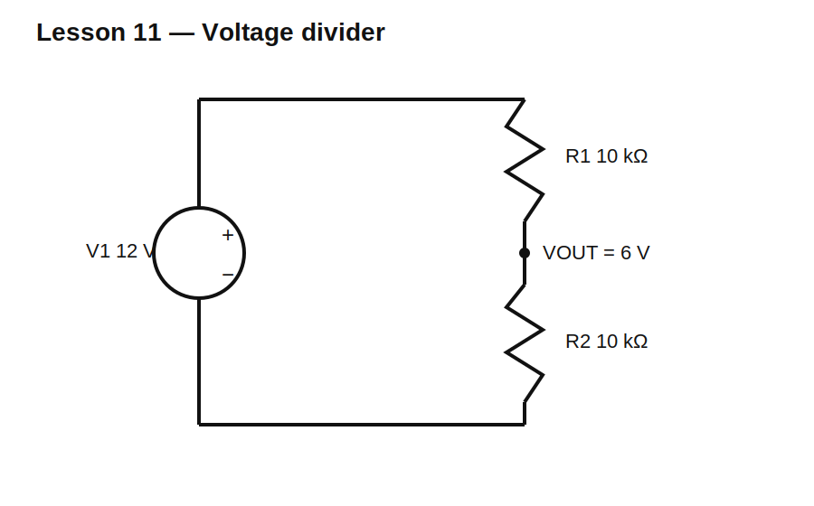

# Lesson 11 — The Voltage Divider as a Design Block

> **Level:** Foundation / design  
> **Estimated study time:** 120–160 minutes  
> **Simulation:** DC operating point and ratio sweeps

## Learning objectives

You will learn to:

- derive the unloaded voltage-divider equation;
- choose resistor ratios for a target output;
- distinguish ratio from absolute resistance scale;
- calculate divider current and dissipation;
- understand output resistance;
- select practical standard values.

## Circuit under test



For two series resistors:

$$V_{OUT}=V_{IN}\frac{R_2}{R_1+R_2}$$

Using $V_{IN}=12\text{ V}$, $R_1=10\text{ k}\Omega$, and $R_2=10\text{ k}\Omega$:

$$V_{OUT}=6\text{ V}$$

Divider current:

$$I_D=\frac{12\text{ V}}{20\text{ k}\Omega}=0.6\text{ mA}$$

Power:

$$P_{R1}=P_{R2}=I_D^2R=3.6\text{ mW}$$

## Why ratio and scale are different

The ratio sets nominal output. Multiplying both resistors by ten leaves the ideal unloaded ratio unchanged, but reduces divider current and power by ten. It also increases output resistance by ten, making the divider more sensitive to loading and noise.

The Thevenin output resistance is:

$$R_{OUT}=R_1\parallel R_2$$

For two 10 kΩ resistors, $R_{OUT}=5\text{ k}\Omega$.

## Build it in KiCad 10

1. Open `lesson-11.sch` and convert it to native KiCad 10 format.
2. Confirm V1 = 12 V, R1 = 10 kΩ, and R2 = 10 kΩ.
3. Label nodes `VIN` and `VOUT`.
4. Use node `0` at the bottom of R2.
5. Run a DC operating point.

## Schematic SPICE directives / text fields

No directive is required for the baseline operating point.

For a ratio sweep, change R2 to `{RLOW}` and add:

```spice
.param RLOW=10k
.step param RLOW list 1k 2.2k 4.7k 10k 22k 47k
.op
```

## Baseline observations

| Quantity | Expected |
|---|---:|
| `V(VIN)` | 12 V |
| `V(VOUT)` | 6 V |
| divider current | 0.6 mA |
| R1 power | 3.6 mW |
| R2 power | 3.6 mW |
| output resistance | 5 kΩ |

## Experiment A — Preserve ratio, change scale

Try 1 kΩ/1 kΩ, 10 kΩ/10 kΩ, 100 kΩ/100 kΩ, and 1 MΩ/1 MΩ.

Observe:

- unloaded output remains 6 V;
- divider current falls with resistance scale;
- power falls with resistance scale;
- output resistance rises;
- real measurements become more sensitive to meter and input loading.

## Experiment B — Design 3.3 V from 12 V

The required ratio is:

$$\frac{R_2}{R_1+R_2}=\frac{3.3}{12}=0.275$$

Rearranging:

$$R_1=R_2\left(\frac{V_{IN}}{V_{OUT}}-1\right)$$

Choose a convenient R2, calculate R1, then select nearby standard values and simulate the actual result.

## Experiment C — Power and fault tradeoffs

Compare low-value and high-value dividers. Low resistance wastes more power but is harder to disturb. High resistance saves power but is easier to load and may be more susceptible to leakage, contamination, and ADC sampling current.

## Common mistakes

| Mistake | Consequence |
|---|---|
| reversing R1 and R2 | output becomes the complementary ratio |
| assuming divider can power any load | loading changes output |
| choosing values from ratio alone | power and output impedance ignored |
| using megaohms without checking leakage | large output error |
| forgetting maximum input voltage | resistor power or voltage rating exceeded |

## Design challenge

Design an unloaded divider converting 15 V nominal to 3.0 V nominal.

Constraints:

- E24 resistor values;
- nominal error within ±1%;
- divider current between 100 µA and 500 µA;
- each resistor power below 25 mW;
- document output resistance.

## Summary

A divider is a ratio-setting network with real current, power, and output impedance. Correct design chooses both the ratio and the absolute resistance scale.