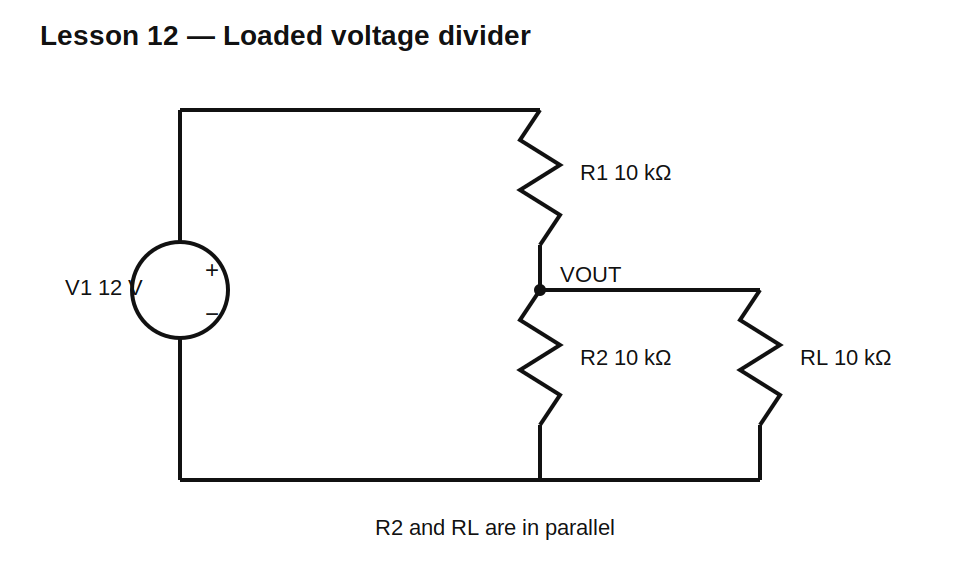

# Lesson 12 — Loading Changes the Divider

> **Level:** Foundation / design  
> **Estimated study time:** 120–160 minutes  
> **Simulation:** DC operating point and load sweeps

## Learning objectives

You will learn to:

- model a load as resistance connected to the divider output;
- calculate the loaded lower leg;
- quantify loading error;
- understand voltmeter and ADC input resistance;
- choose divider current relative to load current;
- recognize when a buffer is required.

## Circuit under test



Start with a 12 V divider using $R_1=10\text{ k}\Omega$ and $R_2=10\text{ k}\Omega$. Unloaded output is 6 V.

Add $R_L=10\text{ k}\Omega$ from output to ground. The lower effective resistance becomes:

$$R_{LOW}=R_2\parallel R_L=5\text{ k}\Omega$$

Therefore:

$$V_{OUT}=12\frac{5}{10+5}=4\text{ V}$$

The load did not merely consume current after the divider established 6 V. It became part of the network and changed the operating point.

## General loaded equation

$$V_{OUT}=V_{IN}\frac{R_2\parallel R_L}{R_1+(R_2\parallel R_L)}$$

Loading error relative to the unloaded output is:

$$\epsilon=\frac{V_{LOADED}-V_{UNLOADED}}{V_{UNLOADED}}\times100\%$$

## Build it in KiCad 10

1. Open `lesson-12.sch` and convert it.
2. Confirm V1 = 12 V, R1 = R2 = 10 kΩ, and RL = 10 kΩ.
3. Label `VIN` and `VOUT`.
4. Run a DC operating point.
5. Compare results with RL disconnected and connected.

## SPICE directives / text fields

No directive is needed for one operating point.

For a load sweep, change RL to `{RLOAD}` and add:

```spice
.param RLOAD=10k
.step param RLOAD list 1k 2.2k 4.7k 10k 22k 47k 100k 1Meg
.op
```

## Baseline observations

| Condition | VOUT |
|---|---:|
| no load | 6.000 V |
| 1 MΩ load | about 5.970 V |
| 100 kΩ load | about 5.714 V |
| 10 kΩ load | 4.000 V |
| 1 kΩ load | about 0.923 V |

## Why a meter changes a circuit

A real voltmeter has finite input resistance. A 10 MΩ meter placed across a high-resistance divider acts as another resistor. With 1 MΩ/1 MΩ divider legs, a 10 MΩ meter causes measurable error. With 10 kΩ/10 kΩ, the same meter causes very little error.

## Experiment A — Keep ratio, change scale

Compare 1 kΩ/1 kΩ, 10 kΩ/10 kΩ, 100 kΩ/100 kΩ, and 1 MΩ/1 MΩ while using the same 100 kΩ load.

Observe that the unloaded ratio is always one half, but loading error grows dramatically as divider resistance approaches or exceeds the load resistance.

## Experiment B — Rule of ten

A rough design heuristic is to make divider current at least ten times the expected load current. This often limits loading error to a few percent, but it is not a universal guarantee. Calculate the exact result when accuracy matters.

## Experiment C — ADC input model

Replace RL with a 1 MΩ resistor in parallel with a small capacitor. Apply a step or periodic sampling pulse. Observe that DC input resistance may look harmless while transient charging current disturbs the node. This motivates buffering and ADC acquisition-time analysis.

## Common mistakes

| Mistake | Consequence |
|---|---|
| using the unloaded equation after attaching a load | optimistic output voltage |
| treating a voltmeter as infinite resistance | hidden measurement error |
| considering only DC input resistance | ADC sampling errors missed |
| solving RL in series with R2 | wrong topology |
| lowering divider resistance without checking power | wasted power or overheated parts |

## Design challenge

Design a 24 V to 3.0 V divider that drives a 100 kΩ load.

Constraints:

- loaded output within ±1% of 3.0 V;
- E24 values;
- divider-plus-load current below 1 mA;
- resistor powers below 50 mW;
- calculate unloaded output and loading error.

## Summary

A divider output is not an ideal voltage source. Every connected input becomes part of the lower leg. Correct design includes the load, meter, leakage, and dynamic input behavior.