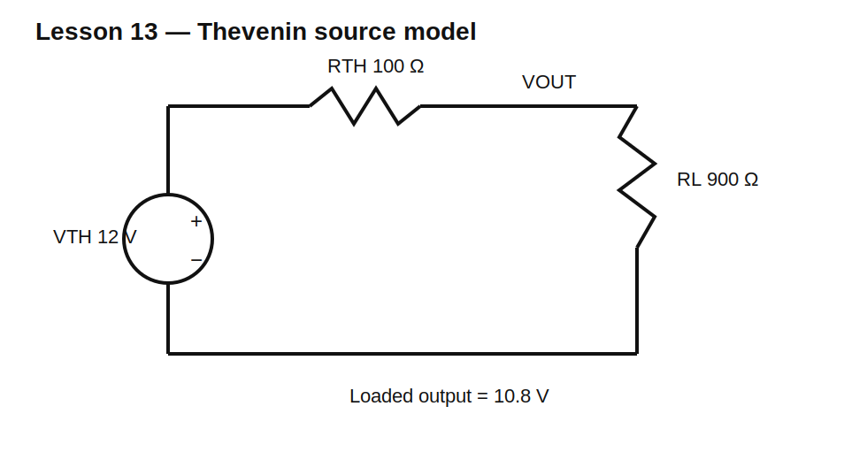

# Lesson 13 — Source Resistance and Thevenin Models

> **Level:** Foundation / modeling  
> **Estimated study time:** 130–180 minutes  
> **Simulation:** DC load sweep and source characterization

## Learning objectives

You will learn to:

- model a real voltage source as an ideal source plus series resistance;
- calculate loaded voltage and short-circuit current;
- derive a Thevenin equivalent from open-circuit voltage and resistance;
- replace a linear network with an equivalent source;
- understand maximum power transfer;
- distinguish maximum delivered power from efficient power delivery.

## Circuit under test



Use an ideal 12 V source with $R_S=100\ \Omega$ and a load $R_L=900\ \Omega$.

$$I=\frac{12}{100+900}=12\text{ mA}$$

$$V_L=IR_L=10.8\text{ V}$$

The source terminal voltage falls under load because current creates a voltage drop across the internal resistance.

## Thevenin model

Any linear two-terminal resistive network can be represented as:

- one ideal voltage source $V_{TH}$;
- one series resistance $R_{TH}$.

Find $V_{TH}$ by opening the load and measuring the terminal voltage. Find $R_{TH}$ by deactivating independent sources and looking into the terminals, or by:

$$R_{TH}=\frac{V_{OC}}{I_{SC}}$$

## Build it in KiCad 10

1. Open `lesson-13.sch` and save it in native KiCad 10 format.
2. Confirm V1 = 12 V, RS = 100 Ω, and RL = 900 Ω.
3. Label `VSRC` and `VOUT`.
4. Run an operating point.
5. Remove RL to measure open-circuit voltage.
6. Replace RL with a very small resistance only in simulation to estimate short-circuit current.

## SPICE directives / text fields

Baseline operating point needs no directive.

For a load sweep, change RL to `{RLOAD}` and add:

```spice
.param RLOAD=900
.step param RLOAD list 10 30 100 300 900 1k 3k 10k 1Meg
.op
```

## Expected baseline

| Quantity | Expected |
|---|---:|
| open-circuit voltage | 12 V |
| loaded output | 10.8 V |
| load current | 12 mA |
| RS power | 14.4 mW |
| RL power | 129.6 mW |
| short-circuit current | 120 mA |

## Experiment A — Load regulation

Sweep RL from 10 Ω to 1 MΩ. Observe that VOUT approaches 12 V as load current approaches zero and collapses toward zero for a heavy load.

## Experiment B — Identify an unknown source

Treat the source network as a black box. Measure:

1. $V_{OC}$ with no load.
2. Output voltage with one known load.
3. Calculate:

$$R_{TH}=R_L\left(\frac{V_{OC}}{V_L}-1\right)$$

Verify with another load.

## Experiment C — Maximum power transfer

Load power is maximized when:

$$R_L=R_{TH}$$

At that point, half the source voltage is lost internally and efficiency is only 50%. This is useful in some communication and matching problems, but usually undesirable in power supplies.

## Common mistakes

| Mistake | Consequence |
|---|---|
| modeling a battery as an ideal source only | unrealistic short-circuit current |
| using open-circuit voltage as loaded voltage | ignores source drop |
| measuring resistance with active sources | invalid result or damaged meter in hardware |
| confusing maximum power with best efficiency | poor power-system design |
| shorting an ideal source in SPICE | infinite or numerically extreme current |

## Design challenge

An unknown linear source measures 9.0 V open circuit and 7.5 V with a 1.5 kΩ load.

Determine:

- $V_{TH}$;
- $R_{TH}$;
- short-circuit current;
- output voltage with 470 Ω and 10 kΩ loads;
- load value for maximum power and that maximum power.

Build and validate the equivalent in KiCad.

## Summary

Thevenin models turn complicated linear source networks into one voltage and one resistance. They make loading, regulation, short-circuit behavior, and power transfer easy to predict.