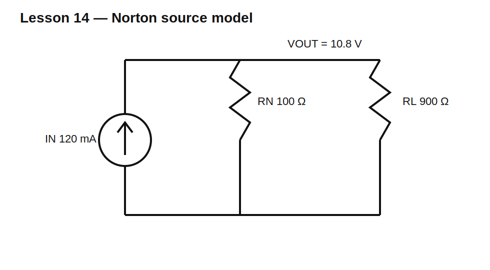

# Lesson 14 — Norton Models and Current Sources

> **Level:** Foundation / modeling  
> **Estimated study time:** 120–170 minutes  
> **Simulation:** DC operating point and source transformation

## Learning objectives

You will learn to:

- understand an ideal current source;
- derive Norton current and resistance;
- transform between Thevenin and Norton equivalents;
- calculate current division;
- choose the representation that makes analysis easiest;
- recognize unrealistic ideal-source behavior.

## Circuit under test



A Norton model consists of ideal current source $I_N$ in parallel with $R_N$.

For the Lesson 13 Thevenin source:

$$V_{TH}=12\text{ V},\qquad R_{TH}=100\ \Omega$$

The equivalent Norton current is:

$$I_N=\frac{V_{TH}}{R_{TH}}=120\text{ mA}$$

and:

$$R_N=R_{TH}=100\ \Omega$$

Attach $R_L=900\ \Omega$. The output voltage is:

$$V_{OUT}=I_N(R_N\parallel R_L)=0.12(100\parallel900)=10.8\text{ V}$$

This exactly matches the Thevenin circuit.

## Physical intuition

An ideal current source changes its terminal voltage as necessary to maintain its specified current. Real current sources have a finite compliance-voltage range. Outside that range, they can no longer hold the commanded current.

## Build it in KiCad 10

1. Open `lesson-14.sch` and convert it.
2. Confirm I1 = 120 mA, RN = 100 Ω, and RL = 900 Ω.
3. Label `VOUT`.
4. Run a DC operating point.
5. Compare against Lesson 13 for several load values.

## SPICE directives / text fields

No directive is required for the baseline.

For a load sweep:

```spice
.param RLOAD=900
.step param RLOAD list 10 30 100 300 900 1k 10k 1Meg
.op
```

## Baseline observations

| Quantity | Expected |
|---|---:|
| Norton current | 120 mA |
| output voltage | 10.8 V |
| load current | 12 mA |
| current in RN | 108 mA |

KCL at the output node requires:

$$I_N=I_{RN}+I_L$$

## Experiment A — Transform both ways

Use:

$$V_{TH}=I_NR_N$$

$$I_N=\frac{V_{TH}}{R_{TH}}$$

$$R_N=R_{TH}$$

Simulate both forms with the same load sweep. Their terminal voltages and load currents must match.

## Experiment B — Open and short circuit

With no external load, Norton current flows through RN and creates $V_{OC}=I_NR_N$.

With an ideal short, output voltage is zero and nearly all Norton current flows through the short.

## Experiment C — Current division

Change RL and observe how the fixed source current divides inversely with branch resistance. The lower-resistance branch carries more current.

## Common mistakes

| Mistake | Consequence |
|---|---|
| placing RN in series with the current source | no longer a Norton model |
| changing resistance during transformation | terminal behavior no longer equivalent |
| assuming ideal current source voltage is limited | unrealistic simulation results |
| comparing internal branch currents between equivalents | only external terminal behavior is guaranteed identical |

## Design challenge

Convert a 5 V Thevenin source with 250 Ω series resistance to Norton form. Then calculate and simulate terminal voltage and load current for 100 Ω, 250 Ω, 1 kΩ, and open-circuit loads.

## Summary

Thevenin and Norton models are two views of the same linear two-terminal behavior. Choose voltage-source form for series reasoning and current-source form for parallel-node reasoning.