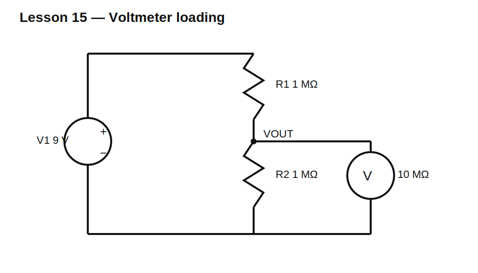

# Lesson 15 — Meters Are Circuit Elements

> **Level:** Foundation / measurement  
> **Estimated study time:** 120–170 minutes  
> **Simulation:** DC operating point with meter models

## Learning objectives

You will learn to:

- model voltmeters, ammeters, and oscilloscope inputs;
- quantify voltmeter loading;
- understand ammeter burden voltage;
- place instruments correctly;
- distinguish ideal simulator probes from real instruments;
- choose a measurement method that does not invalidate the circuit.

## Voltmeter model

An ideal voltmeter has infinite resistance. A real digital multimeter commonly has finite input resistance, often around 10 MΩ on DC ranges.

Use a 9 V source with a 1 MΩ / 1 MΩ divider. Unloaded output is 4.5 V. A 10 MΩ meter is parallel with the lower 1 MΩ resistor:

$$R_{LOW}=1\text{ M}\Omega\parallel10\text{ M}\Omega=909.09\text{ k}\Omega$$

Measured voltage becomes:

$$V_M=9\frac{909.09}{1000+909.09}=4.286\text{ V}$$

The meter introduces about −4.76% error.

## Ammeter model

An ideal ammeter has zero resistance. A real ammeter includes shunt resistance, fuse resistance, leads, and contacts. The voltage it drops is called burden voltage.

If an ammeter adds 10 Ω in a 5 V circuit with a 100 Ω load:

$$I_{without}=50\text{ mA}$$

$$I_{with}=\frac{5}{110}=45.45\text{ mA}$$

The act of measuring changes the current by about 9.1%.

## Circuit under test



## Build it in KiCad 10

1. Open `lesson-15.sch` and convert it.
2. Model the voltmeter as RM = 10 MΩ from VOUT to ground.
3. Run the operating point with RM present and absent.
4. For current measurement, insert a small resistor in series and calculate current from its voltage drop.
5. Compare this with KiCad’s ideal current probe.

## SPICE directives / text fields

No directive is required for baseline operating points.

For a meter-resistance sweep:

```spice
.param RMETER=10Meg
.step param RMETER list 100k 1Meg 10Meg 100Meg 1G
.op
```

## Experiment A — Voltmeter loading

Use divider values 1 kΩ, 10 kΩ, 100 kΩ, 1 MΩ, and 10 MΩ while preserving the 1:1 ratio. Keep the meter at 10 MΩ.

Observe that measurement error grows as source resistance approaches meter resistance.

## Experiment B — Ammeter burden

Insert series resistances of 0.01 Ω, 0.1 Ω, 1 Ω, and 10 Ω. Plot measured current and burden voltage.

A low-current range may use a larger shunt and therefore impose more burden than expected.

## Experiment C — Oscilloscope probe model

Model a 1× probe as approximately 1 MΩ in parallel with input capacitance, and a 10× probe as approximately 10 MΩ with lower effective capacitance. In DC, resistance dominates. At higher frequency, capacitance becomes critical.

## Practical measurement rules

- Place a voltmeter in parallel.
- Place an ammeter in series.
- Never place an ammeter directly across a voltage source.
- Estimate instrument loading before trusting a reading.
- Prefer measuring voltage across a known shunt when safe and appropriate.
- Remember that simulator probes are often ideal unless explicitly modeled.

## Common mistakes

| Mistake | Consequence |
|---|---|
| connecting ammeter in parallel | near-short circuit |
| assuming voltmeter is invisible | divider output changes |
| ignoring oscilloscope capacitance | fast waveform distortion |
| using wrong current range | large burden or blown fuse |
| trusting one reading without model | false confidence |

## Design challenge

A sensor has Thevenin voltage 2.5 V and output resistance 500 kΩ.

Compare the indicated voltage for:

- 1 MΩ meter;
- 10 MΩ meter;
- 100 MΩ electrometer.

Calculate percent error and choose the lowest input resistance that keeps error below 1%.

## Summary

A measuring instrument is connected to the circuit and therefore becomes part of it. Good measurements require modeling input resistance, burden, capacitance, and probe placement.