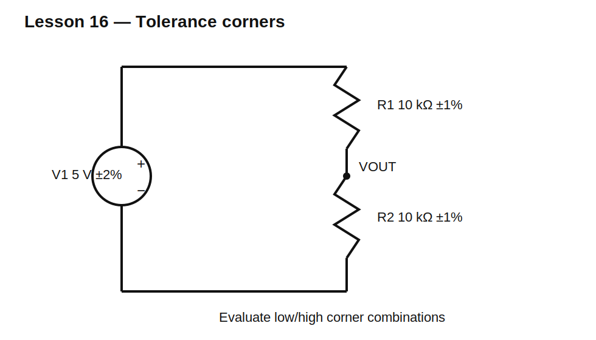

# Lesson 16 — Tolerance and Worst-Case Reasoning

> **Level:** Foundation / engineering analysis  
> **Estimated study time:** 130–180 minutes  
> **Simulation:** parameter stepping and corner analysis

## Learning objectives

You will learn to:

- distinguish nominal, minimum, maximum, and statistical behavior;
- calculate worst-case divider output;
- identify which component corners maximize or minimize a result;
- perform SPICE parameter sweeps;
- understand Monte Carlo versus guaranteed limits;
- build a simple tolerance budget.

## Why nominal is not guaranteed

A 10 kΩ, 1% resistor may be anywhere from 9.9 kΩ to 10.1 kΩ at its specified reference conditions. Temperature, aging, soldering stress, and measurement uncertainty can add further error.

For a divider:

$$V_{OUT}=V_{IN}\frac{R_2}{R_1+R_2}$$

Maximum output occurs when $R_2$ is high and $R_1$ is low. Minimum output occurs when $R_2$ is low and $R_1$ is high.

For 5 V with 10 kΩ ±1% legs:

$$V_{MAX}=5\frac{10.1}{9.9+10.1}=2.525\text{ V}$$

$$V_{MIN}=5\frac{9.9}{10.1+9.9}=2.475\text{ V}$$

The nominal 2.5 V divider can vary by ±1% even though each resistor is ±1%.

## Circuit under test



## Build it in KiCad 10

1. Open `lesson-16.sch` and convert it.
2. Use parameterized resistor values `{R1V}` and `{R2V}`.
3. Set V1 = 5 V.
4. Add parameter-step directives.
5. Record VOUT for all four corner combinations.

## SPICE directives / text fields

```spice
.param R1V=10k R2V=10k
.step param R1V list 9.9k 10.1k
.step param R2V list 9.9k 10.1k
.op
```

For statistical exploration, ngspice expressions or an external script may generate random values. Statistical results do not replace worst-case guarantees.

## Experiment A — Four corners

Run:

| R1 | R2 | Meaning |
|---:|---:|---|
| low | low | common shift |
| low | high | maximum ratio |
| high | low | minimum ratio |
| high | high | common shift |

Observe that both resistors moving in the same direction leaves a 1:1 divider near 2.5 V, while opposite corners create the largest error.

## Experiment B — Include source tolerance

Add a 5 V source tolerance of ±2%. Combine source and resistor corners. Determine guaranteed output range. Worst-case bounds usually add pessimistically because all errors are assumed to align.

## Experiment C — Monte Carlo intuition

Generate many random resistor pairs within a distribution. Most results cluster near nominal, and extreme corners are rare. However, production guarantees must still respect specified limits unless a statistical yield strategy is explicitly accepted.

## Error budgeting

List each contributor separately:

- resistor initial tolerance;
- source tolerance;
- temperature coefficient;
- load tolerance;
- meter accuracy;
- leakage;
- reference drift;
- quantization for ADC measurements.

State whether contributors are combined worst-case, root-sum-square, or statistically.

## Common mistakes

| Mistake | Consequence |
|---|---|
| simulating only nominal values | hidden field failures |
| moving both resistors in same direction only | misses ratio worst case |
| treating Monte Carlo as guaranteed | false assurance |
| ignoring source and load tolerances | incomplete budget |
| using percent values without reference | ambiguous specification |

## Design challenge

Design a 10 V to 2.5 V divider using 1% E96 resistors. Include a 1 MΩ ±5% load and a 10 V source tolerance of ±1%.

Find nominal, minimum, and maximum loaded output. Adjust resistor values so the complete worst-case output remains between 2.40 V and 2.60 V while divider current stays below 500 µA.

## Summary

Engineering design is not complete at nominal values. Worst-case analysis deliberately pushes every relevant parameter toward the result that threatens the requirement.