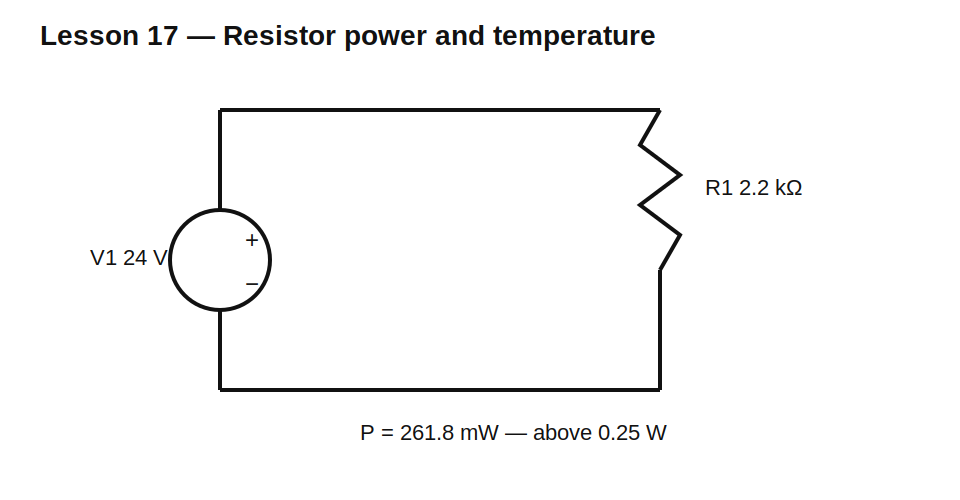

# Lesson 17 — Temperature and Resistor Ratings

> **Level:** Foundation / component reliability  
> **Estimated study time:** 120–170 minutes  
> **Simulation:** temperature sweep and power derating study

## Learning objectives

You will learn to:

- calculate resistance change from temperature coefficient;
- distinguish ambient temperature from resistor body temperature;
- read a power-derating curve;
- check voltage, pulse, and package limits;
- understand self-heating;
- select margin for reliable operation.

## Temperature coefficient

A first-order model is:

$$R(T)=R_0\left[1+\alpha(T-T_0)\right]$$

where $\alpha$ is temperature coefficient in per-degree units. A 10 kΩ resistor with 100 ppm/°C coefficient changes by:

$$\Delta R=10\text{ k}\Omega(100\times10^{-6})(85-25)=60\ \Omega$$

so at 85°C it is approximately 10.060 kΩ.

## Self-heating

Electrical power becomes heat. The resistor temperature rises until heat flow to the environment balances dissipation. A simplified estimate is:

$$\Delta T=P\theta$$

where $\theta$ is thermal resistance in °C/W. Real thermal behavior depends on package, copper area, airflow, board material, and nearby heat sources.

## Circuit under test



Use 24 V across 2.2 kΩ:

$$P=\frac{24^2}{2200}=261.8\text{ mW}$$

A nominal 0.25 W resistor is already slightly overloaded before derating.

## Build it in KiCad 10

1. Open `lesson-17.sch` and convert it.
2. Confirm V1 = 24 V and R1 = 2.2 kΩ.
3. Run an operating point and inspect resistor power.
4. Replace R1 with 2.7 kΩ and compare.
5. Use ngspice temperature controls only if the resistor model includes temperature dependence.

## SPICE directives / text fields

For a basic temperature sweep:

```spice
.temp -40 25 85 125
.op
```

A plain ideal resistor may not change unless a temperature coefficient is represented in its model or value expression. The lesson therefore distinguishes simulator temperature from a real component’s datasheet TCR.

## Ratings to check

- continuous power rating;
- derated power at actual ambient temperature;
- maximum working voltage;
- overload voltage;
- pulse-energy capability;
- temperature coefficient;
- maximum element temperature;
- package and land-pattern thermal behavior;
- failure mode.

## Experiment A — Power margin

Compare 2.2 kΩ, 2.7 kΩ, 3.3 kΩ, and 4.7 kΩ at 24 V. For each, calculate current and power. Select a package rating so continuous dissipation is no more than 50% of the derated rating.

## Experiment B — Divider drift

Use two divider resistors with equal TCR, then with opposite or unequal TCR. Equal tracking can preserve ratio even though both absolute values drift. Mismatched TCR changes the ratio.

## Experiment C — Voltage rating

A high-value resistor may dissipate little power yet exceed maximum working voltage. Split a 1 MΩ resistor across a high voltage into several series parts and observe how voltage stress and power divide.

## Common mistakes

| Mistake | Consequence |
|---|---|
| choosing by wattage only | voltage or pulse failure missed |
| using room-temperature rating at high ambient | overheating |
| assuming ideal SPICE resistor models self-heating | false confidence |
| ignoring TCR matching in dividers | ratio drift |
| operating continuously at exactly the headline rating | poor reliability margin |

## Design challenge

Choose a resistor network to place across 48 V and draw approximately 5 mA.

Constraints:

- E24 values;
- each physical resistor dissipates no more than 40% of a 0.25 W rating;
- each resistor sees less than 100 V;
- nominal current within ±3%;
- calculate total power and discuss behavior at 85°C for 100 ppm/°C parts.

## Summary

A resistor value is only one part of component selection. Temperature, derating, voltage stress, pulse energy, and physical mounting determine whether the part survives and remains accurate.