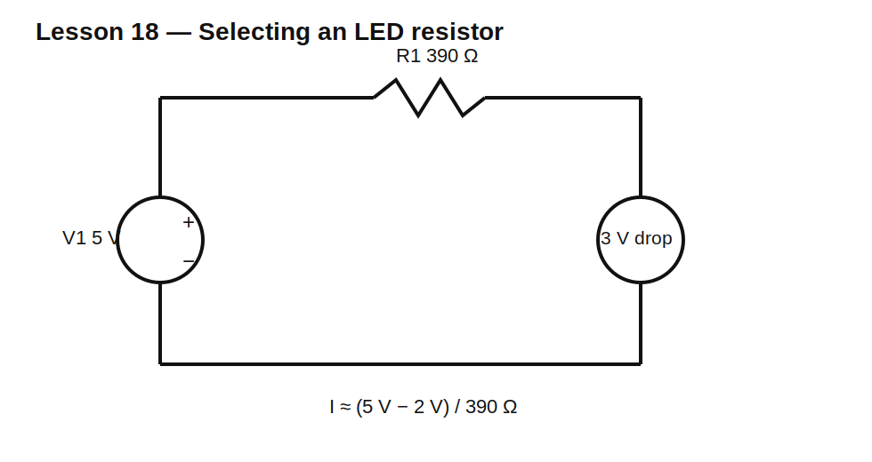

# Lesson 18 — Reading a Datasheet and Selecting a Resistor

> **Level:** Engineering practice  
> **Estimated study time:** 140–190 minutes  
> **Simulation:** value comparison and design verification

## Learning objectives

You will learn to:

- translate a circuit requirement into resistor specifications;
- use E-series preferred values;
- read tolerance, power, voltage, TCR, pulse, and package limits;
- separate electrical value from physical implementation;
- compare thin-film, thick-film, metal-film, wirewound, and current-sense parts;
- document a defensible selection.

## Selection workflow

A resistor selection should answer:

1. What nominal resistance is required?
2. What tolerance is acceptable?
3. What continuous and pulse power occur?
4. What maximum voltage appears across the part?
5. What ambient and self-heating temperature apply?
6. What TCR and long-term stability are acceptable?
7. What noise or inductance matters?
8. What package, footprint, and assembly process are required?
9. Is the part available from multiple sources?

## E-series values

Preferred-value series distribute values geometrically within each decade. Common series include E6, E12, E24, E48, E96, and E192. More values per decade generally correspond to tighter tolerance families.

Do not assume every mathematically ideal value is economical or stocked. Choose a standard value, then calculate the actual circuit result.

## Circuit under test



Design an LED-current resistor using a simplified constant LED drop:

- supply: 5 V nominal, 5.25 V maximum;
- LED drop: 2.0 V nominal, 1.8 V minimum;
- desired nominal current: about 8 mA;
- maximum allowed current: 10 mA.

Nominal estimate:

$$R=\frac{5-2}{8\text{ mA}}=375\ \Omega$$

A nearby E24 value is 390 Ω.

Worst-case maximum current:

$$I_{MAX}=\frac{5.25-1.8}{390}=8.85\text{ mA}$$

Worst-case resistor power:

$$P=I^2R\approx30.5\text{ mW}$$

A common 0.125 W or 0.25 W part has ample power margin, but package voltage, pulse, TCR, and environment still need checking.

## Build it in KiCad 10

1. Open `lesson-18.sch` and convert it.
2. The supplied circuit uses a 3 V ideal drop source to isolate resistor-selection arithmetic from LED-model complexity.
3. Compare 330 Ω, 360 Ω, 390 Ω, 430 Ω, and 470 Ω.
4. Record current and resistor power at nominal and worst-case supply/drop combinations.
5. Later diode lessons replace the ideal drop with a nonlinear LED model.

## SPICE directives / text fields

For a resistance sweep, use parameter `{RLED}` and:

```spice
.param RLED=390
.step param RLED list 330 360 390 430 470
.op
```

## Datasheet fields to capture

Create a selection table containing:

- manufacturer and exact part number;
- resistance and tolerance;
- rated power at reference temperature;
- derating curve;
- maximum working voltage;
- overload voltage;
- TCR;
- operating-temperature range;
- package and dimensions;
- pulse/load-life specifications;
- qualification level;
- lifecycle and availability.

## Technology tradeoffs

- **Thick film:** inexpensive and common; often higher TCR and excess noise.
- **Thin film:** tighter tolerance, lower TCR, lower noise; may have lower pulse robustness.
- **Metal film through-hole:** good general precision and stability.
- **Wirewound:** high power and precision options; inductance may matter.
- **Metal element/current sense:** very low resistance, high current, Kelvin options.

## Experiment A — Value choice

Compare current error for each standard value. Observe that the closest nominal value is not always best when worst-case maximum current is the critical constraint.

## Experiment B — Package derating

Compare the same 390 Ω value in several packages. Electrical resistance is identical, but power, voltage, temperature rise, pulse capacity, and assembly constraints differ.

## Experiment C — Series implementation

Realize 390 Ω using 220 Ω + 170 Ω or other combinations. Compare tolerance accumulation, power sharing, BOM cost, and fault behavior.

## Common mistakes

| Mistake | Consequence |
|---|---|
| selecting only resistance value | hidden reliability failure |
| using nominal voltage and LED drop only | excessive worst-case current |
| assuming larger package always has higher voltage rating | datasheet may disagree |
| ignoring pulse curves | startup or surge damage |
| copying a generic footprint | assembly mismatch |
| choosing obsolete or unavailable parts | redesign late in project |

## Design challenge

Select a real-world resistor specification for a 12 V relay coil suppressor/indicator branch that requires 6 mA nominal through a 2.1 V LED model.

Constraints:

- supply range 10.8–13.2 V;
- LED drop range 1.8–2.3 V;
- maximum current 8 mA;
- minimum current 4.5 mA;
- ambient up to 85°C;
- at least 2× power margin after derating.

Provide the resistance, tolerance, minimum power rating, maximum required working voltage, preferred technology, package class, and validation calculations.

## Summary

A resistor is not merely a number. Good selection connects circuit behavior, worst-case analysis, physical ratings, technology, manufacturing, and supply-chain reality.