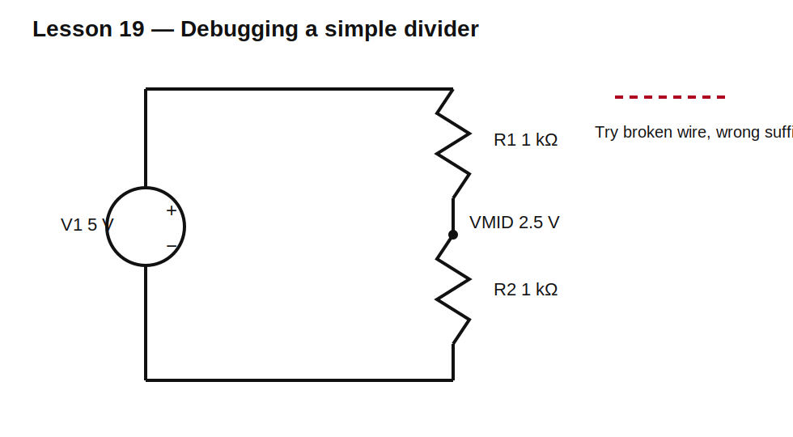

# Lesson 19 — Debugging Deliberately Broken Circuits

> **Level:** Investigation / engineering practice  
> **Estimated study time:** 150–210 minutes  
> **Simulation:** operating point, netlist inspection, and controlled fault injection

## Learning objectives

You will learn to:

- debug from topology and expected invariants rather than random changes;
- identify floating nodes, accidental shorts, reversed sources, wrong values, and bad model mappings;
- inspect generated ngspice netlists;
- use KCL, KVL, and power balance as consistency checks;
- separate schematic errors, model errors, simulator settings, and misunderstood physics;
- build a repeatable debugging checklist.

## Baseline circuit



Use a 5 V source, R1 = 1 kΩ, and R2 = 1 kΩ in series. Expected values:

- total current: 2.5 mA;
- midpoint voltage: 2.5 V;
- each resistor power: 6.25 mW;
- source power: −12.5 mW under passive sign convention.

## Debugging method

Before changing anything:

1. State what should happen.
2. Identify one violated invariant.
3. Check the simplest structural cause.
4. Inspect the netlist.
5. Change one thing only.
6. rerun and record whether the hypothesis was confirmed.

## Fault A — Missing node 0

Remove the SPICE ground symbol.

Expected behavior: singular-matrix or floating-network error. The circuit may be electrically meaningful as a floating loop, but SPICE still needs a voltage reference.

## Fault B — Wire that looks connected

Move a wire endpoint slightly away from a pin. The drawing can appear connected while the netlist contains separate nets.

Verification:

- highlight the net;
- inspect junction markers;
- inspect generated node names;
- check continuity in the netlist.

## Fault C — Wrong suffix

Change 1 kΩ to `1m`. In SPICE, `m` means milli, not mega. The result is a 1 mΩ resistor and enormous current.

Use `Meg` for megaohms.

## Fault D — Reversed source

Flip the source. Node voltages and current signs reverse. The simulator is not wrong; the circuit definition changed.

## Fault E — Incorrect SPICE pin mapping

Use a symbol whose graphical pins do not map to model pins as expected. This is especially common with diodes, BJTs, MOSFETs, op-amp macromodels, and vendor subcircuits.

Check:

- symbol pin numbers;
- SPICE model pin order;
- KiCad model mapping;
- generated element line.

## Fault F — Directive is only visible text

Place `.tran 1u 10m` as ordinary schematic text without marking it as a SPICE directive. It looks correct but never reaches ngspice.

Always verify the generated netlist contains required directives.

## Fault G — Unrealistic ideal components

Short an ideal voltage source or place ideal voltage sources in conflict. SPICE may report huge current, singularity, or convergence trouble. Add physically meaningful source resistance or revise the model.

## Fault H — Inappropriate analysis

A DC operating point cannot show capacitor charging over time. An AC small-signal analysis cannot replace a nonlinear startup transient. Select analysis that answers the actual question.

## Build it in KiCad 10

1. Open `lesson-19.sch` and save it in native format.
2. Run the correct baseline first.
3. Create one copy for each fault.
4. Record error messages and netlist differences.
5. Restore the baseline before introducing the next fault.

## SPICE directives / text fields

The baseline needs no directive.

For a transient fault exercise, add and correctly mark:

```spice
.tran 10u 10m
```

Then deliberately convert it back to ordinary text and compare simulator behavior and generated netlist.

## Diagnostic invariants

- KCL residual at every node should be approximately zero.
- KVL residual around each closed loop should be approximately zero.
- Sum of component powers should be approximately zero.
- A resistor’s DC voltage and current should satisfy $V=IR$.
- Series elements without branches should carry equal current.
- parallel elements should share voltage.

## Debugging order

1. node `0`;
2. actual connectivity;
3. values and suffixes;
4. source type, polarity, and waveform;
5. simulation analysis settings;
6. model existence and pin mapping;
7. DC operating point;
8. timestep and initial conditions;
9. ideal-source loops or floating nodes;
10. model validity range.

## Design challenge

The supplied challenge circuit contains at least six faults. Find and document each one without looking at the solution first.

Acceptance criteria:

- corrected output is 3.3 V ±1%;
- source current is below 10 mA;
- no floating nodes;
- netlist contains the required analysis directive;
- KCL and power checks pass;
- every correction is linked to observed evidence.

## Summary

Debugging is structured hypothesis testing. Predict, inspect, test one cause, and use conservation laws to distinguish a wrong circuit from a misunderstood result.