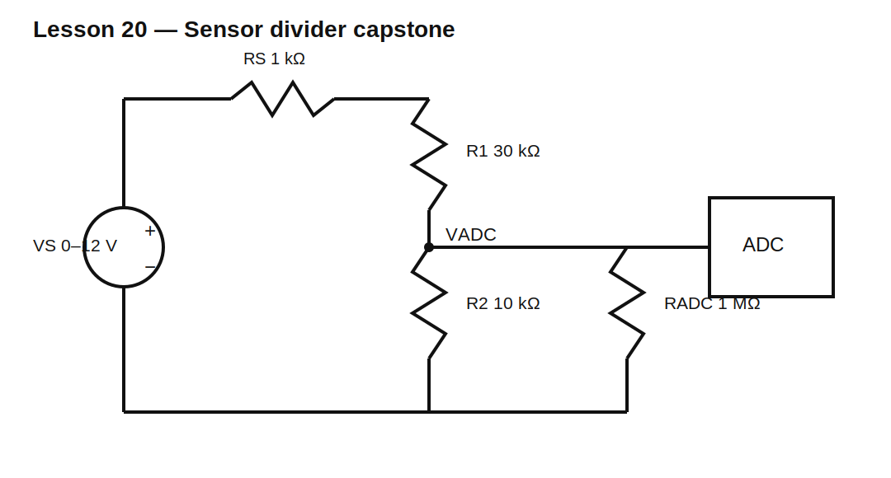

# Lesson 20 — Capstone: Low-Voltage Sensor Divider Interface

> **Level:** Capstone / design review  
> **Estimated study time:** 180–260 minutes  
> **Simulation:** nominal, loading, tolerance, and fault analysis

## Capstone outcome

Design a resistor interface that scales a 0–12 V sensor signal into a 0–3.0 V ADC range while respecting source loading, ADC input resistance, resistor tolerance, power, and fault constraints.

## Requirements

- sensor output range: 0–12 V;
- sensor Thevenin resistance: 1 kΩ maximum;
- ADC absolute maximum: 3.3 V;
- desired full-scale ADC input: 3.0 V at 12 V sensor input;
- ADC DC input resistance: 1 MΩ minimum;
- divider current at 12 V: below 500 µA;
- use 1% standard resistor values;
- nominal full-scale error: within ±1%;
- worst-case full-scale voltage must remain below 3.3 V;
- each resistor power below 25% of its nominal rating;
- document behavior for open lower resistor, open upper resistor, and shorted ADC input.

## First-pass ratio

Ignoring loading:

$$\frac{V_{OUT}}{V_{IN}}=\frac{3}{12}=0.25$$

Therefore:

$$R_1=3R_2$$

To keep divider current below 500 µA:

$$R_1+R_2>\frac{12}{500\ \mu\text{A}}=24\text{ k}\Omega$$

A starting choice is R1 = 30 kΩ and R2 = 10 kΩ.

## Include source and ADC loading

The source resistance is in series with R1. The ADC input resistance is parallel with R2.

$$R_{LOW}=R_2\parallel R_{ADC}$$

$$V_{ADC}=V_S\frac{R_{LOW}}{R_S+R_1+R_{LOW}}$$

For $R_S=1\text{ k}\Omega$, $R_1=30\text{ k}\Omega$, $R_2=10\text{ k}\Omega$, and $R_{ADC}=1\text{ M}\Omega$:

$$R_{LOW}=9.90099\text{ k}\Omega$$

$$V_{ADC}=12\frac{9.90099}{1+30+9.90099}=2.905\text{ V}$$

The source resistance and ADC loading reduce the full-scale voltage more than the ideal-divider equation predicts.

## Circuit under test



## Engineering workflow

### 1. Define requirements

Separate nominal targets, hard safety limits, environmental limits, and assumptions.

### 2. Build a mathematical model

Include source resistance and ADC loading before selecting final values.

### 3. Select standard values

Search nearby E96 pairs and calculate actual nominal behavior.

### 4. Verify power and ratings

At maximum input, calculate current, voltage across each resistor, and power.

### 5. Analyze tolerances

Evaluate source high, ADC resistance low, R1 low, and R2 high for maximum ADC voltage. Evaluate opposite corners for minimum gain.

### 6. Analyze faults

- **R1 open:** ADC is pulled toward ground through R2.
- **R2 open:** ADC may rise close to the sensor voltage; this is potentially destructive.
- **ADC short to ground:** current is limited by source resistance plus R1.
- **Sensor overvoltage:** determine when ADC exceeds 3.3 V.

### 7. Decide whether protection is needed

A divider alone may not satisfy single-fault safety. Consider series resistance, clamp diodes, a TVS, buffering, or an ADC with tolerant inputs in later volumes.

## Build it in KiCad 10

1. Open `lesson-20.sch` and convert it.
2. Confirm VS = 12 V, RS = 1 kΩ, R1 = 30 kΩ, R2 = 10 kΩ, and RADC = 1 MΩ.
3. Label `VSENSOR` and `VADC`.
4. Run the nominal operating point.
5. Replace R1 and R2 with parameterized candidate values.
6. Add tolerance corners.
7. Create separate fault copies rather than modifying the validated baseline.

## SPICE directives / text fields

For candidate sweeps:

```spice
.param RUP=30k RLOW=10k RADC=1Meg RSRC=1k
.step param RUP list 28.7k 29.4k 30.1k 30.9k 31.6k
.step param RLOW list 9.76k 10k 10.2k 10.5k
.op
```

For a sensor-input sweep:

```spice
.dc VS 0 12 0.1
```

Mark directives correctly and verify the generated netlist.

## Experiments

### Experiment A — Nominal candidate search

Plot VADC at 12 V for candidate pairs. Reject pairs outside ±1% of 3.0 V.

### Experiment B — Loading sensitivity

Sweep RADC from 100 kΩ to 100 MΩ. Observe how the same divider performs with different ADC inputs.

### Experiment C — Source resistance

Sweep RS from 0 to 5 kΩ. Determine gain error caused by the sensor output impedance.

### Experiment D — Worst-case maximum voltage

Use:

- source voltage high;
- RS low;
- R1 low;
- R2 high;
- RADC high.

This combination maximizes VADC.

### Experiment E — Fault injection

Simulate open and short faults using very large or very small resistances. Record current, VADC, and whether the ADC limit is violated.

## Review checklist

- [ ] requirements are explicit;
- [ ] all loading is modeled;
- [ ] standard values are used;
- [ ] nominal and worst-case results are documented;
- [ ] current and power are within limits;
- [ ] ADC absolute maximum is protected in required conditions;
- [ ] SPICE directives appear in the netlist;
- [ ] schematic node names are meaningful;
- [ ] failure modes are discussed;
- [ ] limitations and next steps are stated.

## Design challenge

Complete the final design and submit:

- calculations;
- KiCad schematic;
- nominal simulation;
- load and source-resistance sweeps;
- tolerance table;
- fault table;
- resistor-rating justification;
- one-page schematic-review summary.

## Summary

The capstone combines every Volume 1 skill: topology, Ohm’s law, KCL, KVL, series and parallel reduction, loading, Thevenin modeling, measurement effects, tolerance, power, component selection, and structured debugging.