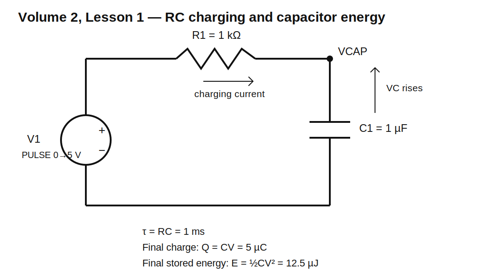

# Lesson 1 — What a Capacitor Physically Stores

> **Volume:** 2 — Capacitors, Inductors, and Time-Domain Circuits  
> **Level:** Foundation  
> **Estimated study time:** 2.5–3.5 hours  
> **Simulation:** Transient analysis in KiCad 10 / ngspice

## What you will learn

By the end of this lesson, you should be able to:

- explain what a capacitor stores physically;
- distinguish charge stored on conductors from energy stored in the electric field;
- use $Q=CV$ and $E=\tfrac12CV^2$ correctly;
- predict the voltage, current, charge, and energy during RC charging;
- configure the required transient simulation in KiCad 10;
- understand why current starts high and then falls;
- explain why a capacitor does not become an open circuit instantly;
- compare the effects of changing capacitance, resistance, and supply voltage;
- validate the result using energy conservation;
- recognize where the ideal-capacitor model differs from a real component.

## Prerequisites

You should already understand:

- voltage and current;
- Ohm's law;
- resistor power;
- series circuits;
- energy and power from Volume 1.

## The engineering question

When an engineer says that a capacitor “stores charge,” what does that actually mean?

Does charge enter the dielectric and remain trapped there? Does one plate become full of electrons? Where is the energy located? Why does current flow only while voltage is changing?

This lesson answers those questions using one simple RC circuit.

## Circuit under test



Use these values:

- pulse source: 0 V to 5 V;
- $R_1=1\text{ k}\Omega$;
- $C_1=1\ \mu\text{F}$;
- initial capacitor voltage: 0 V.

The source rises from 0 V to 5 V at the beginning of the transient simulation. R1 limits the charging current. C1 accumulates equal and opposite charge on its two conductive terminals.

## What a capacitor physically is

The simplest capacitor consists of:

1. one conductive plate;
2. a second conductive plate;
3. an insulating dielectric separating them.

When a voltage source moves electrons onto one plate, it removes the same amount of electron charge from the other plate through the external circuit. The dielectric blocks direct conduction between the plates, but an electric field forms through it.

The capacitor therefore does **not** store net charge as a whole in the usual idealized circuit model. One terminal has charge $+Q$ relative to neutrality and the other has charge $-Q$.

The net charge of the complete capacitor is approximately zero:

$$+Q+(-Q)=0$$

What changes is the **separation of charge**.

That charge separation creates the electric field, and the field stores energy.

## Charge, capacitance, and voltage

Capacitance tells us how much separated charge is required per volt:

$$C=\frac{Q}{V}$$

Rearranging:

$$Q=CV$$

For $C=1\ \mu\text{F}$ at $V=5\text{ V}$:

$$Q=(1\times10^{-6}\text{ F})(5\text{ V})=5\times10^{-6}\text{ C}$$

Therefore:

$$Q=5\ \mu\text{C}$$

This means one plate has approximately $+5\ \mu\text{C}$ relative charge and the other has approximately $-5\ \mu\text{C}$.

The number of elementary charges represented by this magnitude is:

$$N=\frac{Q}{e}$$

where:

$$e\approx1.602\times10^{-19}\text{ C}$$

Thus:

$$N\approx\frac{5\times10^{-6}}{1.602\times10^{-19}}\approx3.12\times10^{13}$$

That sounds enormous, but it is still a tiny fraction of the conduction electrons already present in the metal plates.

## Where the energy is stored

The energy stored in an ideal capacitor is:

$$E_C=\frac12CV^2$$

For 1 µF charged to 5 V:

$$E_C=\frac12(1\times10^{-6})(5^2)$$

$$E_C=12.5\ \mu\text{J}$$

The important physical idea is:

> The energy is associated with the electric field between and around the conductors.

The plates establish the boundary conditions for that field. The dielectric affects how much electric field energy can be stored for a given voltage and geometry.

## Why the energy formula contains one half

Suppose the capacitor starts uncharged. At the beginning, almost no voltage is required to move the first small amount of charge. As more charge accumulates, the capacitor voltage rises and each additional unit of charge requires more work.

The voltage during charging rises from 0 to $V$. The average voltage against which the source moves charge is therefore $V/2$ for an ideal linear capacitor.

Since total energy is charge multiplied by average voltage:

$$E=Q\frac{V}{2}$$

Using $Q=CV$:

$$E=CV\frac{V}{2}$$

Therefore:

$$E=\frac12CV^2$$

The one-half is not arbitrary. It comes from the fact that voltage rises gradually as charge is added.

## Before simulating: predict the initial state

At the instant before the source rises:

- source voltage is 0 V;
- capacitor voltage is 0 V;
- resistor current is 0 A;
- capacitor charge is 0 C;
- capacitor energy is 0 J.

Immediately after the source rises to 5 V, capacitor voltage cannot change instantaneously in this circuit because that would require infinite current.

Therefore, at the first instant:

$$V_C(0^+)\approx0\text{ V}$$

The resistor initially sees nearly the full 5 V:

$$V_R(0^+)\approx5\text{ V}$$

Initial current is:

$$I(0^+)=\frac{5\text{ V}}{1\text{ k}\Omega}=5\text{ mA}$$

Initial resistor power is:

$$P_R(0^+)=I^2R=(5\text{ mA})^2(1\text{ k}\Omega)=25\text{ mW}$$

Initial capacitor energy remains nearly zero because its voltage remains near zero.

## The RC time constant

The charging speed is controlled by:

$$\tau=RC$$

For this circuit:

$$\tau=(1\text{ k}\Omega)(1\ \mu\text{F})=1\text{ ms}$$

The charging waveform is:

$$V_C(t)=V_S\left(1-e^{-t/RC}\right)$$

The current is:

$$I(t)=\frac{V_S}{R}e^{-t/RC}$$

At one time constant:

$$V_C(\tau)=V_S(1-e^{-1})\approx0.632V_S$$

For 5 V:

$$V_C(1\text{ ms})\approx3.1606\text{ V}$$

The current at one time constant is:

$$I(\tau)=I_0e^{-1}\approx0.368I_0$$

Therefore:

$$I(1\text{ ms})\approx1.839\text{ mA}$$

## Why current falls while the capacitor charges

At any instant, Kirchhoff's Voltage Law gives:

$$V_S=V_R+V_C$$

Since:

$$V_R=IR$$

then:

$$I=\frac{V_S-V_C}{R}$$

As $V_C$ rises, the difference $V_S-V_C$ becomes smaller. Therefore the resistor voltage falls, and current falls.

The capacitor does not “decide to stop accepting charge.” Rather, the growing capacitor voltage opposes further charge movement from the source.

When $V_C$ is nearly equal to $V_S$, only a very small resistor voltage remains, so only a very small current flows.

## Build the circuit in KiCad 10

Open the provided project directory:

```text
schematics/lesson-01-capacitor-energy-storage/
```

Open `lesson-01.kicad_pro`, then open the schematic.

The included schematic uses a KiCad-compatible import format. In KiCad 10:

1. open `lesson-01.sch` if the project does not automatically open it;
2. allow KiCad to convert the schematic;
3. save it as `lesson-01.kicad_sch`;
4. inspect each component's SPICE model mapping;
5. confirm that the ground symbol is SPICE node `0`;
6. open **Inspect → Simulator**.

### Component values

| Reference | Value | Purpose |
|---|---:|---|
| V1 | pulse 0–5 V | applies a voltage step |
| R1 | 1 kΩ | limits charging current |
| C1 | 1 µF | stores electric-field energy |

## Schematic SPICE directives / text fields

This lesson requires a transient-analysis directive.

Use the exact directive:

```spice
.tran 10u 8m startup
```

The provided standalone netlist also includes measurements:

```spice
.meas tran T63 WHEN V(VCAP)=3.1606 RISE=1
.meas tran T90 WHEN V(VCAP)=4.5 RISE=1
.meas tran V1MS FIND V(VCAP) AT=1m
.meas tran I1MS FIND I(R1) AT=1m
.meas tran ERES INTEG V(VIN,VCAP)*I(R1) FROM=0 TO=8m
```

### Important KiCad distinction

Text that merely looks like `.tran 10u 8m startup` on the schematic may be only a visible note.

It must be inserted or marked as an actual SPICE directive so that it appears in the generated ngspice netlist.

After opening the simulator:

1. view the generated netlist;
2. search for `.tran`;
3. confirm the exact line is present;
4. confirm the capacitor appears as `C1 VCAP 0 1u` or an equivalent node ordering;
5. confirm the source contains the pulse definition.

## Source waveform

Use:

```spice
PULSE(0 5 0 1u 1u 100m 200m)
```

Meaning:

- initial voltage: 0 V;
- pulsed voltage: 5 V;
- delay: 0;
- rise time: 1 µs;
- fall time: 1 µs;
- on-time: 100 ms;
- period: 200 ms.

Only the first 8 ms are simulated, so the source stays at 5 V after rising.

## What to plot

Plot these traces:

- `V(VIN)`;
- `V(VCAP)`;
- `V(VIN)-V(VCAP)` or differential voltage across R1;
- `I(R1)`;
- capacitor charge calculated as $C\cdot V(VCAP)$;
- capacitor energy calculated as $0.5\cdot C\cdot V(VCAP)^2$;
- resistor power.

Depending on KiCad's expression syntax, you may plot derived quantities directly or export waveform data and calculate them separately.

## Baseline expected results

| Time | Capacitor voltage | Current | Capacitor charge | Capacitor energy |
|---:|---:|---:|---:|---:|
| 0 ms | 0 V | 5.000 mA | 0 µC | 0 µJ |
| 1 ms | 3.161 V | 1.839 mA | 3.161 µC | 4.995 µJ |
| 2 ms | 4.323 V | 0.677 mA | 4.323 µC | 9.344 µJ |
| 3 ms | 4.751 V | 0.249 mA | 4.751 µC | 11.286 µJ |
| 5 ms | 4.966 V | 0.0337 mA | 4.966 µC | 12.332 µJ |
| final | 5.000 V | approximately 0 A | 5.000 µC | 12.500 µJ |

Small differences are expected because the source rise time is finite and simulator timesteps are discrete.

## Experiment 1 — Change capacitance

Run the circuit with:

- 100 nF;
- 1 µF;
- 10 µF.

Keep R = 1 kΩ and V = 5 V.

### Predict first

| C | Time constant | Final charge | Final energy |
|---:|---:|---:|---:|
| 100 nF | 0.1 ms | 0.5 µC | 1.25 µJ |
| 1 µF | 1 ms | 5 µC | 12.5 µJ |
| 10 µF | 10 ms | 50 µC | 125 µJ |

### What to observe

- initial current is nearly unchanged because it is set by $V/R$;
- larger capacitance charges more slowly;
- larger capacitance stores more charge at the same final voltage;
- larger capacitance stores proportionally more energy at the same voltage;
- the voltage curve stretches horizontally with increasing C.

### Why this happens

From:

$$i=C\frac{dv}{dt}$$

we get:

$$\frac{dv}{dt}=\frac{i}{C}$$

For the same current, a larger capacitance changes voltage more slowly.

## Experiment 2 — Change resistance

Run with:

- 100 Ω;
- 1 kΩ;
- 10 kΩ.

Keep C = 1 µF and V = 5 V.

### Predict first

| R | Initial current | Time constant | Final capacitor energy |
|---:|---:|---:|---:|
| 100 Ω | 50 mA | 0.1 ms | 12.5 µJ |
| 1 kΩ | 5 mA | 1 ms | 12.5 µJ |
| 10 kΩ | 0.5 mA | 10 ms | 12.5 µJ |

### What to observe

- lower resistance causes higher initial current;
- lower resistance charges the capacitor faster;
- final capacitor voltage is still approximately 5 V;
- final capacitor energy is unchanged;
- resistor peak power changes strongly.

### Why final energy does not depend on R

The final energy depends only on C and final V:

$$E_C=\frac12CV^2$$

Resistance controls the path and rate by which energy arrives, not the ideal final stored energy.

## Experiment 3 — Change source voltage

Run with 2.5 V, 5 V, and 10 V.

Keep R = 1 kΩ and C = 1 µF.

### Predict first

| Voltage | Initial current | Final charge | Final energy |
|---:|---:|---:|---:|
| 2.5 V | 2.5 mA | 2.5 µC | 3.125 µJ |
| 5 V | 5 mA | 5 µC | 12.5 µJ |
| 10 V | 10 mA | 10 µC | 50 µJ |

### Important observation

Doubling voltage doubles charge but quadruples stored energy because energy depends on $V^2$.

This is why capacitor voltage rating and stored-energy safety become increasingly important at high voltage.

## Experiment 4 — Verify energy conservation

The ideal source delivers energy while the capacitor charges. Some energy is stored in C1 and some is dissipated in R1.

For an ideal voltage step through a resistor:

- energy delivered by source approaches $CV^2$;
- energy stored by capacitor approaches $\tfrac12CV^2$;
- energy dissipated by resistor approaches $\tfrac12CV^2$.

For this circuit:

$$E_{source}\approx25\ \mu\text{J}$$

$$E_C\approx12.5\ \mu\text{J}$$

$$E_R\approx12.5\ \mu\text{J}$$

This result is independent of R for the ideal voltage-step charging process.

R only changes how quickly the resistor dissipates the energy.

## Experiment 5 — Disconnect the resistor conceptually

Ask what would happen if C1 were connected directly to an ideal 5 V source with zero source resistance.

The ideal equations demand an instantaneous voltage jump. Since:

$$i=C\frac{dv}{dt}$$

an instantaneous voltage jump means infinite $dv/dt$, which implies an impulse of infinite current in the ideal model.

Real circuits always contain resistance and inductance, so actual current is limited. SPICE may report numerical trouble or extremely large currents if the idealization is too severe.

This is not a simulator bug. It is the mathematical consequence of combining incompatible ideal components.

## What the capacitor looks like after charging

After several time constants:

- capacitor voltage is nearly constant;
- current is nearly zero;
- resistor voltage is nearly zero;
- energy remains stored;
- the capacitor behaves approximately like an open circuit for **steady DC**.

But “capacitor equals open circuit” is not a universal rule. It is only a steady-state DC approximation.

During charging, switching, AC operation, noise transients, and startup, current does flow.

## Real capacitor limitations

The ideal capacitor used here omits:

- leakage resistance;
- equivalent series resistance;
- equivalent series inductance;
- dielectric absorption;
- voltage-dependent capacitance;
- temperature dependence;
- tolerance;
- breakdown voltage;
- ripple-current heating;
- polarity restrictions for some technologies.

Later lessons add each of these effects one at a time.

## Common mistakes

| Mistake | Why it is wrong |
|---|---|
| “The dielectric fills with electrons” | charge remains primarily on conductive electrodes; the dielectric polarizes and supports the field |
| “The capacitor stores current” | it stores separated charge and electric-field energy, not current |
| “Once connected, it instantly becomes open circuit” | charging current flows until voltage approaches its final value |
| “A bigger capacitor always charges with more initial current” | with the same R and source step, initial current is set primarily by V/R |
| “Energy is $CV^2$” | ideal stored energy is $\tfrac12CV^2$ |
| “The resistor wastes more total energy if it is larger” | for ideal step charging, total resistor loss is still $\tfrac12CV^2$ |
| “The visible `.tran` note must be active” | only an actual SPICE directive reaches ngspice |
| “Ground and node 0 are always interchangeable symbols” | SPICE specifically requires electrical reference node 0 |

## Debugging checklist

If the capacitor begins already charged:

- check whether ngspice calculated a DC operating point before the transient;
- confirm `startup` is present;
- inspect the source waveform;
- inspect any capacitor initial-condition field.

If no current appears:

- verify R1 and C1 are electrically connected;
- verify source pulse definition;
- verify node 0 exists;
- inspect current sign and element orientation;
- zoom into the first few microseconds.

If current is negative:

- check the resistor pin order used by ngspice;
- remember that current sign is a reference-direction convention;
- compare magnitude and KCL rather than assuming negative means wrong.

If the simulation ends before charging is visible:

- calculate $5RC$;
- set stop time beyond that value;
- choose maximum timestep small enough to resolve the curve.

## Design challenge

Design an RC charging circuit that stores approximately **12.5 mJ** at 5 V.

### Requirements

- supply: 5 V step;
- stored energy after charging: 12.5 mJ ±2%;
- initial current: no more than 20 mA;
- capacitor voltage must reach at least 4.5 V within 1 second;
- use an E24 resistor value;
- use a practical capacitor value;
- resistor continuous power rating must have at least 2× margin over the highest sustained power relevant to the design;
- include a KiCad transient simulation;
- report charge, energy, time constant, initial current, 90% charging time, and peak resistor power.

### Acceptance criteria

Your submission passes if:

- calculated and simulated stored energy agree within 2%;
- initial current is at or below 20 mA;
- `V(VCAP)` reaches 4.5 V by 1 second;
- the generated netlist contains the required transient directive;
- the selected resistor and capacitor ratings are justified;
- energy conservation is checked.

Do not open the worked solution until you have attempted the design.

## Lesson summary

A capacitor stores energy by separating charge and establishing an electric field. The defining relationships are:

$$Q=CV$$

$$i=C\frac{dv}{dt}$$

$$E=\frac12CV^2$$

In the RC charging circuit, current begins at $V/R$ and falls because the rising capacitor voltage leaves less voltage across the resistor. Capacitance controls how much charge and energy are stored, resistance controls the rate and peak current, and voltage strongly affects energy because of the square-law relationship.