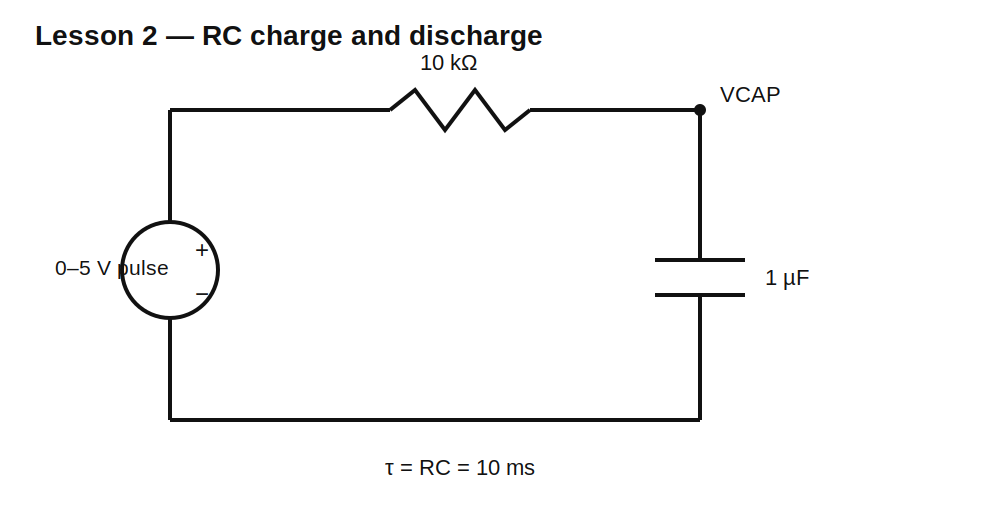

# Lesson 2 — Capacitors in Time: Charging, Discharging, and the RC Constant

> **Fast-track time:** 15–20 minutes  
> **Capability unlocked:** Design and predict simple RC timing circuits.

## The problem this solves

A capacitor is useful because its voltage cannot change instantly. That lets you delay, smooth, hold, or shape signals. The practical question is: **how long does the voltage take to move?**

## Core mental model

A capacitor’s voltage changes only when current moves charge onto or off its plates:

$$i=C\frac{dv}{dt}$$

Large current changes voltage quickly. Large capacitance changes voltage slowly.

For a resistor charging a capacitor from a step source:

$$\tau=RC$$

$$V_C(t)=V_S\left(1-e^{-t/RC}\right)$$

For discharge from initial voltage $V_0$:

$$V_C(t)=V_0e^{-t/RC}$$

At one time constant:

- charging reaches 63.2% of the final value;
- discharging falls to 36.8% of the initial value.

At about five time constants, the transition is effectively complete for most engineering work.

## Circuit



Use:

- $V_1$: 0–5 V pulse;
- $R_1=10\text{ k}\Omega$;
- $C_1=1\ \mu\text{F}$;
- $\tau=10\text{ ms}$.

## Predict before simulating

| Time | Charging voltage | Discharging voltage from 5 V |
|---:|---:|---:|
| 0 | 0 V | 5.000 V |
| 10 ms | 3.161 V | 1.839 V |
| 20 ms | 4.323 V | 0.677 V |
| 30 ms | 4.751 V | 0.249 V |
| 50 ms | 4.966 V | 0.0337 V |

## KiCad 10 simulation

Use the supplied project in:

```text
schematics/lesson-02-capacitors-in-time/
```

Required directive:

```spice
.tran 50u 120m startup
```

Use this pulse source:

```spice
PULSE(0 5 0 1u 1u 50m 100m)
```

Plot:

- `V(IN)`;
- `V(VCAP)`;
- `I(R1)`.

Verify the generated netlist contains the `.tran` line. A visible note is not enough.

## What you should observe

During charging, current starts at $5/10\text{k}=0.5\text{ mA}$ and then falls. The rising capacitor voltage leaves less voltage across the resistor.

When the source returns to zero, current reverses. The capacitor becomes the temporary source and releases its stored energy through R1.

The waveform is exponential because the current depends on the remaining voltage difference, and that difference shrinks continuously.

## One useful design equation

To find when a charging capacitor reaches a fraction $f$ of the final voltage:

$$t=-RC\ln(1-f)$$

Examples:

- 50%: $0.693RC$;
- 90%: $2.303RC$;
- 99%: $4.605RC$.

## Experiment

Change only one item at a time:

1. Double R. The time doubles; initial current halves.
2. Double C. The time doubles; initial current is unchanged.
3. Double supply voltage. Time is unchanged; current and final voltage double.

This separates **timing**, **current**, and **voltage** effects.

## Engineering use

RC timing appears in:

- reset delays;
- switch debounce;
- signal smoothing;
- pulse stretching;
- analog filtering;
- startup sequencing.

The receiving circuit’s threshold matters. An RC does not create a clean digital delay by itself; it creates an analog ramp.

## Common mistakes

- Treating $RC$ as the time to fully charge.
- Forgetting source and load resistance are part of R.
- Using a high-value resistor without checking leakage.
- Running a transient shorter than about $5RC$.
- Expecting a crisp digital edge from a passive RC.

## Design challenge

Design a 5 V RC node that crosses 3.0 V after 100 ms.

Requirements:

- use one E24 resistor and one standard capacitor;
- initial current below 1 mA;
- simulated crossing time within ±5 ms;
- explain the effect of ±10% capacitor tolerance.

See the separate worked solution after attempting it.

## Remember

> A resistor controls how fast charge can move; a capacitor converts that charge movement into a gradual voltage change.