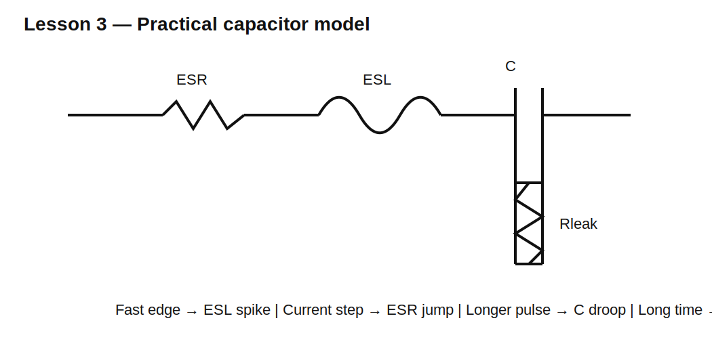

# Lesson 3 — Real Capacitors: ESR, ESL, Leakage, and Bias Loss

> **Fast-track time:** 15–20 minutes  
> **Capability unlocked:** Choose a capacitor that behaves correctly in a real circuit.

## The problem this solves

An ideal capacitor is only $C$. A real capacitor also contains loss, inductance, leakage, tolerance, and sometimes strong voltage dependence. These effects explain why a nominally “larger” capacitor can perform worse.

## Practical model



A useful first model contains:

- ideal capacitance $C$;
- series resistance ESR;
- series inductance ESL;
- parallel leakage resistance $R_{leak}$.

## What each imperfection does

### ESR

A current step causes an immediate voltage jump:

$$\Delta V_{ESR}=I\cdot ESR$$

Then the ideal capacitance produces the slower voltage ramp:

$$\Delta V_C=\frac{I\Delta t}{C}$$

ESR also heats the part:

$$P_{ESR}=I_{RMS}^2ESR$$

### ESL

Fast current edges create a voltage spike:

$$V_{ESL}=L\frac{di}{dt}$$

This is why placement and package geometry matter.

### Leakage

Leakage slowly discharges the capacitor and creates DC error in high-impedance circuits:

$$\tau_{leak}=R_{leak}C$$

### DC-bias loss

Many high-capacitance ceramic capacitors lose effective capacitance as DC voltage increases. A part marked 10 µF may behave like only 3–6 µF at its operating voltage.

## KiCad 10 experiment

Use the supplied RLC model and a pulsed current source.

Required directive:

```spice
.tran 10n 20u startup
```

Baseline values:

- $C=10\ \mu\text{F}$;
- ESR = 50 mΩ;
- ESL = 1 nH;
- current step = 1 A.

Expected immediate ESR step:

$$\Delta V=1\text{ A}\times0.05\ \Omega=50\text{ mV}$$

Then the capacitive droop over 10 µs is:

$$\Delta V_C=\frac{1\cdot10\ \mu s}{10\ \mu F}=1\text{ V}$$

## What to observe

- The earliest narrow spike is dominated by ESL.
- The instantaneous level change after the spike is dominated by ESR.
- The later linear slope is dominated by capacitance.
- Leakage matters over much longer times.

These are different time scales, so one number cannot describe the capacitor completely.

## Self-resonance

Run:

```spice
.ac dec 100 10 1G
```

Below self-resonance, impedance falls with frequency. Near resonance, impedance reaches a minimum close to ESR. Above resonance, ESL dominates and the part behaves inductively.

## Technology choices

| Need | Usually suitable |
|---|---|
| Stable small capacitance | C0G/NP0 ceramic |
| Local IC decoupling | X7R/X5R ceramic, with bias check |
| Low-loss signal path | Film or C0G |
| Large low-frequency bulk | Electrolytic or polymer |
| Very low ESR bulk | Polymer, sometimes parallel ceramics |
| Long hold-up | Large electrolytic or supercapacitor, with leakage check |

## Experiment

Compare three models:

1. 10 µF ceramic: low ESR, 3 µF effective under bias.
2. 10 µF electrolytic: full C, higher ESR and ESL.
3. 100 nF ceramic: tiny C, very low ESL.

Apply the same fast load pulse. The 100 nF handles the fastest edge, the larger ceramic supports the next interval, and the bulk capacitor supports longer current demand.

This is why capacitors are often paralleled: not because their values merely add, but because their impedance is useful over different frequency ranges.

## Common mistakes

- Selecting only by printed capacitance.
- Ignoring effective capacitance at DC bias.
- Assuming zero ESR is always desirable for regulator stability.
- Ignoring ripple-current heating.
- Using an electrolytic with reversed polarity.
- Treating capacitor placement as irrelevant.

## Design challenge

A 3.3 V rail experiences a 1 A step lasting 50 µs. Allow 100 mV total droop.

Choose a capacitor bank and allocate the droop between ESR and capacitance. Account for ceramic bias loss and justify capacitor technologies.

## Remember

> Real capacitor behavior is impedance versus frequency, voltage, temperature, and time—not just the value printed on the package.