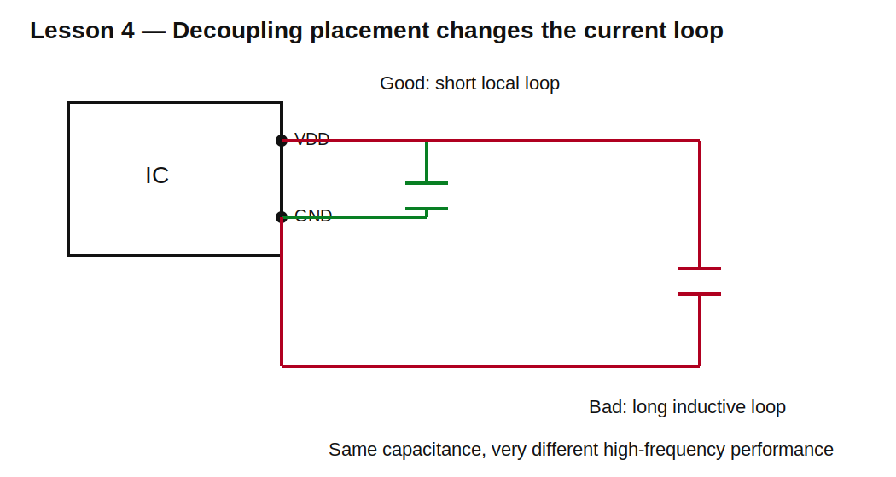

# Lesson 4 — Choosing and Placing Capacitors in Real Designs

> **Fast-track time:** 15–20 minutes  
> **Capability unlocked:** Select capacitor values, technologies, ratings, and placement for practical circuits.

## The engineering question

When a schematic shows 100 nF, 1 µF, and 10 µF in parallel, why are all three present? Why not replace them with one 11.1 µF capacitor?

Because capacitance is only one requirement. Real designs also need low impedance over frequency, adequate energy, stable behavior, safe voltage rating, and correct physical placement.

## Start from the job

Capacitors commonly perform four different jobs:

1. **Decoupling:** supply fast local current to an IC.
2. **Bulk storage:** support slower load changes and supply movement.
3. **Filtering/timing:** create a predictable RC response.
4. **Signal coupling:** pass AC while blocking DC.

The correct capacitor depends on the job.

## Decoupling selection

An IC draws current in short bursts. The supply path has resistance and inductance, so current cannot arrive instantly from a distant regulator. A nearby capacitor supplies the first part of the pulse.

Approximate droop from stored charge:

$$\Delta V=\frac{I\Delta t}{C}$$

For a 100 mA pulse lasting 100 ns with 50 mV allowed droop:

$$C\ge\frac{0.1\cdot100\text{ ns}}{50\text{ mV}}=200\text{ nF}$$

A 100 nF part alone is not enough under this simplified calculation; two 100 nF parts or a nearby 220 nF/1 µF part may be appropriate. But ESL and layout may dominate the earliest edge.

## Why several values are used

A smaller package and smaller capacitance often has lower ESL and remains useful at higher frequency. A larger capacitor provides more charge over a longer interval but may become inductive sooner.

A typical set might be:

- 100 nF close to each supply pin;
- 1 µF nearby for local medium-duration support;
- 10–100 µF per rail or board region for bulk energy.

The exact values come from the IC datasheet, power-distribution impedance target, regulator requirements, and layout.

## Placement matters



The current loop should be short:

```text
IC power pin → capacitor → ground return → IC ground pin
```

Long traces add inductance. Even a perfect capacitor connected through a poor loop cannot suppress a fast voltage transient effectively.

Practical rules:

- place the smallest local capacitor closest to the power pin;
- minimize loop area;
- use a direct ground via or plane connection;
- avoid routing through narrow necks;
- place bulk capacitance near the load region or regulator as required;
- follow regulator-specific output-capacitor ESR and value requirements.

## Voltage rating

Do not operate exactly at the printed voltage rating.

Check:

- maximum steady voltage;
- startup overshoot;
- ripple;
- transients;
- ceramic DC-bias loss;
- reliability margin.

For a 5 V rail, a 6.3 V ceramic may lose substantial capacitance and have limited margin. A 10 V or 16 V part may behave better, but package and dielectric still matter.

## Timing-capacitor selection

For accurate RC timing, prioritize:

- tolerance;
- temperature coefficient;
- leakage;
- dielectric absorption;
- voltage dependence.

C0G and film are far more predictable than high-capacitance Class II ceramics or electrolytics, but available capacitance and size differ.

## Coupling-capacitor selection

A coupling capacitor and the surrounding resistance create a high-pass corner:

$$f_c=\frac1{2\pi R_{eq}C}$$

Use the actual source and load resistances. Select a capacitor that keeps the corner below the lowest useful signal frequency, then verify bias, polarity, and distortion requirements.

## KiCad experiment

Simulate three capacitor models in parallel using ESR and ESL. Run:

```spice
.ac dec 100 10 1G
```

Plot the impedance of:

- 100 nF with 0.5 nH ESL;
- 1 µF with 1 nH ESL;
- 47 µF with 5 nH ESL and higher ESR;
- the combined bank.

The combined impedance should be lower over a broader range, but anti-resonance peaks can appear. Real design is not simply “more capacitors is always better.”

## A fast selection checklist

Before approving a capacitor, answer:

- What job is it doing?
- Required effective capacitance?
- Frequency range?
- Maximum voltage and bias loss?
- ESR/ESL requirements?
- Ripple current?
- Temperature range?
- Tolerance and leakage?
- Polarity?
- Regulator stability constraints?
- Package and placement?

## Common mistakes

- Copying 100 nF everywhere without understanding current paths.
- Replacing several capacitors by their arithmetic sum.
- Ignoring the IC or regulator datasheet.
- Choosing timing capacitors by nominal value only.
- Placing decoupling capacitors far from the pin.
- Using a polarized capacitor where voltage can reverse.

## Design challenge

Create a decoupling plan for a 3.3 V MCU with:

- four supply pins;
- 150 mA peak current steps;
- one nearby buck regulator;
- one ADC reference pin;
- board ambient up to 70°C.

Specify values, technologies, voltage ratings, placement, and which datasheet items must be verified.

## Remember

> Choose a capacitor by its job and impedance in the real circuit, then place it where the current actually flows.