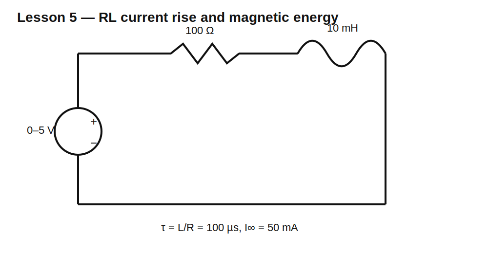

# Lesson 5 — Understanding Inductors and Magnetic Energy

> **Fast-track time:** 15–20 minutes  
> **Capability unlocked:** Predict how an inductor reacts to changing current and calculate stored energy.

## The problem this solves

Inductors appear in power converters, relays, motors, filters, transformers, and EMI suppression. Their defining behavior is simple:

> An inductor resists a change in current by producing whatever voltage its magnetic field requires.

## Physical intuition

Current through a conductor creates a magnetic field. Winding the conductor into a coil concentrates the field. A magnetic core can increase flux linkage and inductance.

The field stores energy:

$$E_L=\frac12LI^2$$

The voltage across an ideal inductor is:

$$v_L=L\frac{di}{dt}$$

This equation gives three essential insights:

- constant current produces zero ideal inductor voltage;
- changing current produces voltage;
- a faster current change or larger L requires more voltage.

## Voltage does not mean current already flows

Applying a constant voltage to an ideal inductor creates a linear current ramp:

$$\frac{di}{dt}=\frac{V}{L}$$

For 5 V across 10 mH:

$$\frac{di}{dt}=500\text{ A/s}=0.5\text{ A/ms}$$

After 1 ms, current would be 0.5 A in the ideal model.

## Circuit



Use:

- pulse source: 0–5 V;
- R1 = 100 Ω;
- L1 = 10 mH.

The resistor keeps the final current finite:

$$I_{final}=\frac{5}{100}=50\text{ mA}$$

The inductor stores at final current:

$$E_L=\frac12(10\text{ mH})(50\text{ mA})^2=12.5\ \mu\text{J}$$

## Why current cannot jump

An instantaneous current change means infinite $di/dt$. Since:

$$v=L\frac{di}{dt}$$

an ideal instantaneous current jump would require infinite voltage. Real circuits instead develop a large but finite voltage limited by resistance, capacitance, insulation breakdown, clamps, or device avalanche.

## KiCad 10 simulation

Use the supplied project and directive:

```spice
.tran 1u 1m startup
```

Source:

```spice
PULSE(0 5 0 1u 1u 500u 1m)
```

Plot:

- `I(L1)`;
- voltage across L1;
- voltage across R1;
- instantaneous inductor energy $0.5LI^2$.

Verify the generated netlist contains the transient directive and correct L value.

## What to observe

At turn-on:

- current begins near zero;
- most source voltage appears across L1;
- current rises;
- resistor voltage rises with current;
- inductor voltage falls as less voltage remains to change current.

At steady DC:

- current is nearly constant;
- ideal inductor voltage approaches zero;
- the inductor behaves approximately as a short circuit;
- its stored magnetic energy remains nonzero.

“Inductor equals short circuit” is only a steady-state DC approximation.

## Change L

Try 1 mH, 10 mH, and 100 mH with the same source and resistor.

- Final current is nearly unchanged because R sets it.
- Larger L makes the current rise more slowly.
- Larger L stores more energy at the same final current.

## Change R

Try 10 Ω, 100 Ω, and 1 kΩ.

- Smaller R gives higher final current.
- Smaller R also changes the time constant.
- Stored energy changes strongly because it depends on $I^2$.

## Real inductors

A real inductor includes:

- winding resistance (DCR);
- core loss;
- saturation current;
- parasitic capacitance;
- self-resonant frequency;
- thermal limit;
- magnetic coupling to nearby circuits.

Saturation is especially important: once the core saturates, effective inductance falls and current can rise much faster than expected.

## Common mistakes

- Thinking an inductor blocks all current.
- Treating it as a short during switching transients.
- Selecting by inductance alone.
- Confusing saturation current with thermal current rating.
- Ignoring DCR and copper loss.
- Opening an energized inductor without a safe current path.

## Design challenge

Choose an inductor for a test circuit that must store 5 mJ at 1 A.

Requirements:

- calculate required L;
- choose a current rating with 25% peak margin;
- limit DCR loss below 0.5 W at 1 A;
- explain what happens if the inductor saturates at 0.8 A;
- verify energy in KiCad.

## Remember

> A capacitor resists rapid voltage change; an inductor resists rapid current change. The inductor does this by exchanging energy with its magnetic field.