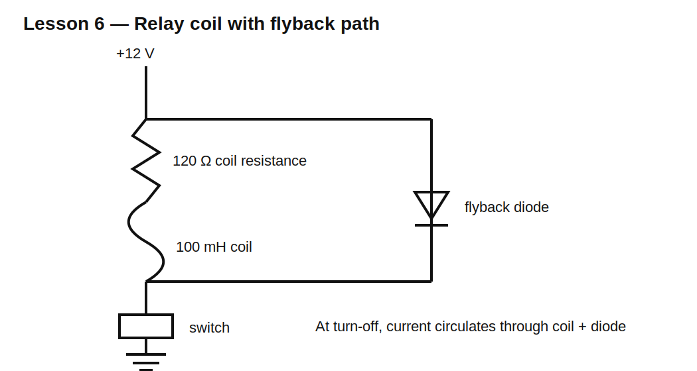

# Lesson 6 — RL Transients, Inductive Kickback, and Flyback Protection

> **Fast-track time:** 15–20 minutes  
> **Capability unlocked:** Design a safe switch for a relay, solenoid, or other inductive load.

## The engineering problem

A relay coil works normally while current flows. The danger appears when the switch opens. The coil current cannot stop instantly, so the inductor creates a large voltage to keep current moving.

Without a safe path, that voltage can damage a transistor, create EMI, arc across contacts, or upset nearby electronics.

## RL rise and decay

For a series RL circuit:

$$\tau=\frac{L}{R}$$

Current rise after applying voltage:

$$i(t)=\frac{V}{R}\left(1-e^{-tR/L}\right)$$

Current decay through resistance after the source is removed:

$$i(t)=I_0e^{-tR/L}$$

Use a 12 V relay model:

- coil resistance: 120 Ω;
- inductance: 100 mH;
- steady current: 100 mA;
- time constant: 0.833 ms;
- stored energy: 0.5 mJ.

## Turn-off without a clamp

If the switch opens and no current path exists, the inductor raises the switch-node voltage until something conducts:

- transistor avalanche;
- air arc;
- parasitic capacitance;
- insulation breakdown;
- an intentional clamp.

The ideal equation has no safe voltage limit. Real parasitics determine the result, often unpredictably.

## Flyback diode



A diode across the coil is reverse-biased during normal operation. At turn-off, the inductor reverses its voltage and forward-biases the diode, creating a local current loop.

The diode keeps switch voltage low, but current decays slowly because only the coil resistance and diode drop remove energy.

## Higher-voltage clamp

A diode plus Zener or TVS allows a higher turn-off voltage. Since:

$$\frac{di}{dt}=\frac{V_L}{L}$$

larger reverse voltage makes current decay faster.

Tradeoff:

| Clamp | Switch stress | Release speed | EMI |
|---|---:|---:|---:|
| Plain diode | lowest | slowest | usually lowest |
| Diode + Zener | higher | faster | higher |
| TVS/avalanche | configurable | fast | depends on layout and edge |
| No intentional clamp | uncontrolled | unpredictable | worst risk |

## KiCad 10 simulation

Use a voltage-controlled switch and these directives:

```spice
.tran 2u 20m startup
```

Drive the switch on for 10 ms, then turn it off.

Plot:

- coil current;
- switch-node voltage;
- diode current;
- transistor/switch power;
- clamp power.

Run three cases:

1. no clamp;
2. ordinary flyback diode;
3. 24 V clamp above the 12 V supply.

## What you should observe

### No clamp

Voltage rises sharply and depends heavily on parasitic values and model limits. This is a warning, not a trustworthy production design.

### Diode clamp

The switch sees approximately supply plus diode-related voltage. Coil current decays over several milliseconds.

### Higher clamp

The switch sees more voltage, but current falls much faster. The switch and clamp must be rated for the peak voltage and absorbed energy.

## Energy check

Initial stored energy is:

$$E_L=\frac12LI^2$$

For 100 mH and 100 mA:

$$E_L=0.5\text{ mJ}$$

That energy must go somewhere at every turn-off. Integrate power in:

- coil resistance;
- diode;
- Zener/TVS;
- switch avalanche.

The total should approximately match the lost magnetic energy.

## Selecting a flyback diode

Check:

- repetitive reverse voltage above supply and transients;
- forward current at least the coil current initially;
- pulse and repetitive energy;
- recovery behavior if switching rapidly;
- temperature and leakage;
- package thermal capability.

For slow relays, a basic rectifier diode is often suitable. For fast PWM or high-frequency switching, recovery and capacitance matter more.

## Common mistakes

- Installing the diode in the conducting direction across the supply.
- Selecting diode voltage rating equal to nominal supply with no margin.
- Assuming the diode dissipates steady coil power.
- Ignoring slower relay release caused by a plain flyback diode.
- Placing the clamp far from the current loop.
- Checking peak voltage but not energy or repetition rate.

## Design challenge

Protect a 24 V solenoid with:

- coil resistance 48 Ω;
- inductance 200 mH;
- current 0.5 A;
- MOSFET maximum desired VDS: 60 V;
- required current decay below 50 mA within 5 ms.

Compare a plain diode with a higher-voltage clamp. Choose the clamp target and component ratings, then validate current-decay time and energy in KiCad.

## Remember

> An energized inductor demands a current path. You choose whether that path is a safe clamp or an accidental breakdown.