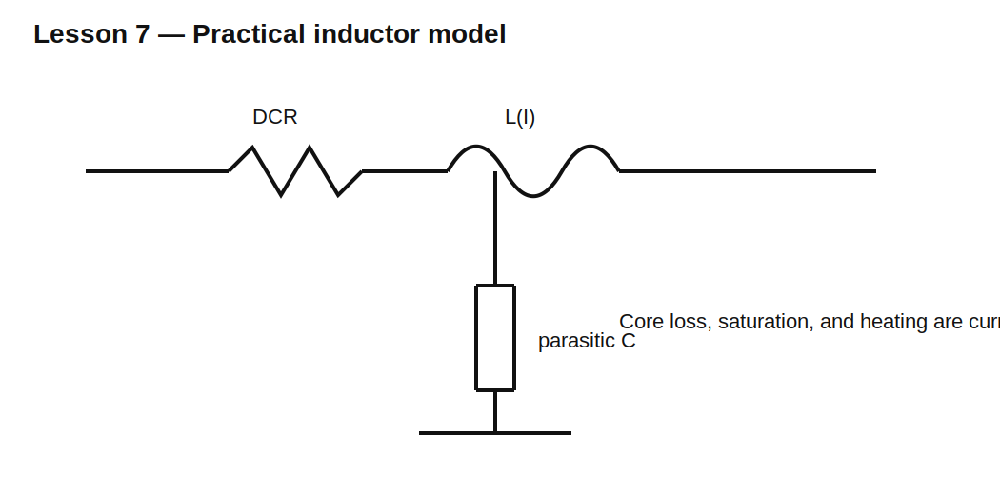

# Lesson 7 — Real Inductors and How to Choose One

> **Fast-track time:** 15–20 minutes  
> **Capability unlocked:** Select an inductor that survives the current, frequency, and temperature of a real design.

## The engineering question

A schematic may say “10 µH,” but that value alone is not enough. A real inductor can overheat, saturate, lose inductance, radiate magnetic noise, or become capacitive at high frequency.

## Practical model



A useful first model contains:

- ideal inductance L;
- winding resistance DCR in series;
- core-loss resistance;
- parasitic capacitance;
- current-dependent inductance representing saturation.

## The ratings that matter

### Saturation current

As core flux approaches saturation, incremental inductance falls. Under a fixed voltage:

$$\frac{di}{dt}=\frac{V}{L}$$

so falling L causes current to rise faster. Saturation current is therefore not merely an accuracy rating; it can become a destructive-current limit.

### Thermal or RMS current

Copper loss is:

$$P_{CU}=I_{RMS}^2R_{DCR}$$

Thermal current is the current that produces a specified temperature rise under stated conditions.

### Peak current versus RMS current

Peak current is relevant to saturation. RMS current is relevant to heating. A triangular-ripple waveform can pass one limit and fail the other.

### Self-resonant frequency

Parasitic capacitance resonates with L. Above self-resonance, the part can behave capacitively instead of inductively.

### Core loss

Core loss rises with frequency and flux swing. It is not captured by DCR alone.

## KiCad experiment

Model a 10 µH inductor with:

- DCR = 80 mΩ;
- parasitic capacitance = 30 pF;
- optional reduced L above 2 A.

Run:

```spice
.ac dec 100 1k 100Meg
```

Then run a transient current ramp and compare constant 10 µH with a model that falls to 3 µH above 2 A.

## What to observe

- At low frequency, impedance rises with frequency.
- Near self-resonance, impedance peaks.
- Above self-resonance, capacitance dominates.
- DCR limits Q and creates heating.
- Saturation appears as a sudden increase in current slope.

## A fast selection workflow

1. Determine nominal inductance.
2. Calculate peak current.
3. Calculate RMS current.
4. Require saturation current above worst-case peak with margin.
5. Require thermal current above worst-case RMS.
6. Check DCR and copper loss.
7. Check switching frequency against core-loss data and self-resonance.
8. Check tolerance and inductance versus DC bias.
9. Check package, shielding, EMI, and temperature rise.

## Example

A converter inductor carries 1.5 A average with 0.8 A peak-to-peak triangular ripple.

Peak current:

$$I_{PK}=1.5+0.4=1.9\text{ A}$$

RMS current is approximately:

$$I_{RMS}=\sqrt{I_{AVG}^2+\frac{\Delta I_{PP}^2}{12}}$$

$$I_{RMS}=\sqrt{1.5^2+\frac{0.8^2}{12}}\approx1.518\text{ A}$$

Choose saturation current comfortably above 1.9 A and thermal current above 1.52 A at the actual ambient and PCB conditions.

## Common mistakes

- Treating saturation current and thermal current as interchangeable.
- Checking DCR at room temperature only.
- Ignoring inductance loss under DC bias.
- Choosing an unshielded part beside sensitive analog circuitry.
- Using a part near or above self-resonance.

## Design challenge

Select an inductor for 2 A average current with 1.2 A peak-to-peak ripple at 500 kHz.

Requirements:

- 10 µH nominal;
- copper loss below 0.4 W;
- 25% saturation-current margin;
- explain which datasheet graphs must be checked;
- simulate the effect of inductance falling to 40% at saturation.

## Remember

> Choose an inductor from its current waveform, loss, bias behavior, and frequency—not from inductance alone.