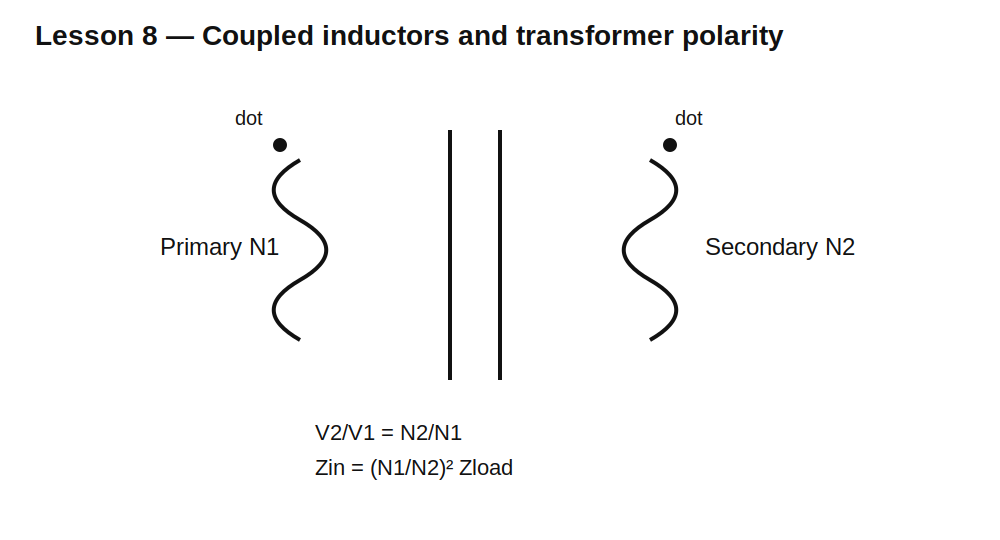

# Lesson 8 — Coupled Inductors and Transformers

> **Fast-track time:** 15–20 minutes  
> **Capability unlocked:** Predict voltage, current, impedance, and polarity through a transformer.

## The engineering question

How can energy move between two circuits without a direct electrical connection? A changing current in one winding creates changing magnetic flux, which induces voltage in another winding.

## Core relationships

For an ideal transformer:

$$\frac{V_2}{V_1}=\frac{N_2}{N_1}$$

$$\frac{I_2}{I_1}=\frac{N_1}{N_2}$$

$$Z_{IN}=\left(\frac{N_1}{N_2}\right)^2Z_L$$

Voltage follows turns ratio. Current changes inversely. Load impedance is reflected by the square of the turns ratio.

## Magnetic coupling

For two inductors:

$$M=k\sqrt{L_1L_2}$$

where $0\le k\le1$. Perfect coupling is idealized. Leakage flux makes $k<1$.



Dot markings define instantaneous polarity. If current enters the dotted end of one winding, the induced voltage is positive at the dotted end of the other winding under the usual reference convention.

## KiCad simulation

Use:

```spice
K1 L1 L2 0.99
.tran 1u 5m
```

Baseline:

- $L_1=10\text{ mH}$;
- $L_2=2.5\text{ mH}$;
- turns ratio $N_1:N_2=2:1$ because turns ratio is the square root of inductance ratio;
- 1 kHz sine input;
- 100 Ω load on secondary.

Expected secondary voltage is approximately half the primary voltage in the ideal case.

## What to observe

- Reversing one winding orientation flips secondary polarity.
- Reducing coupling adds leakage behavior and worsens transfer.
- Adding winding resistance causes voltage loss and heating.
- A secondary load changes primary current through reflected impedance.
- An unloaded real transformer still draws magnetizing current.

## Reflected-load example

A 4:1 primary-to-secondary turns ratio drives a 16 Ω load.

$$Z_{IN}=4^2(16)=256\ \Omega$$

The source behaves as though it were driving about 256 Ω, excluding magnetizing current and losses.

## Real transformer limits

Check:

- core saturation from volt-seconds;
- magnetizing inductance;
- leakage inductance;
- winding resistance;
- interwinding capacitance;
- insulation rating;
- creepage and clearance;
- frequency range;
- temperature rise;
- isolation and safety approvals.

A transformer designed for 100 kHz cannot usually be used at 60 Hz with the same voltage because core flux would become excessive.

## Common mistakes

- Using inductance ratio directly as turns ratio.
- Ignoring dot polarity.
- Assuming “no load” means zero primary current.
- Ignoring reflected impedance.
- Treating a coupled-inductor model as safety-rated isolation.
- Applying DC continuously to a transformer winding.

## Design challenge

Design an ideal transformer interface that makes an 8 Ω load appear as 200 Ω to a source.

Calculate turns ratio, choose representative winding inductances, simulate voltage/current ratios, and explain what real losses would change.

## Remember

> A transformer trades voltage for current and reflects impedance through magnetic coupling; it does not create power.