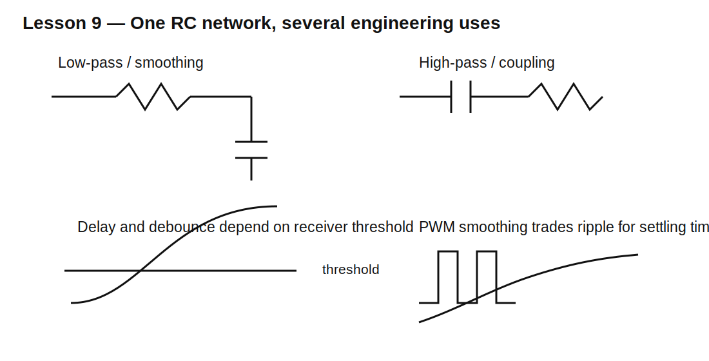

# Lesson 9 — RC Circuits Engineers Actually Use

> **Fast-track time:** 15–20 minutes  
> **Capability unlocked:** Design simple delay, debounce, coupling, and smoothing networks without misusing RC rules.

## One network, several jobs

The same resistor-capacitor pair can behave as:

- a delay/ramp;
- a low-pass smoother;
- a high-pass coupling network;
- an edge detector;
- a debounce filter.

The topology, source impedance, load, and signal time scale determine the function.

## 1. Delay and threshold crossing

A rising RC node crosses a receiver threshold at:

$$t=-RC\ln\left(1-\frac{V_T}{V_S}\right)$$

This is not a precision timer unless the resistor, capacitor, source, leakage, and receiver threshold are controlled.

## 2. Low-pass smoothing

With output across C:

$$f_c=\frac1{2\pi RC}$$

Signals much slower than $f_c$ pass. Signals much faster are attenuated. A PWM signal can be averaged into an approximate analog voltage, but ripple and settling time trade against each other.

## 3. AC coupling / high-pass

With C in series and output across R:

$$f_c=\frac1{2\pi R_{eq}C}$$

The capacitor blocks DC while passing changing signals. Use actual source and load resistances in $R_{eq}$.

## 4. Edge detection

If $RC$ is short compared with pulse width, a high-pass RC creates positive and negative pulses at transitions. The circuit responds to change, not steady level.

## 5. Switch debounce

A mechanical switch may bounce several times in a few milliseconds. RC smoothing reduces the disturbance, but a Schmitt-trigger input is usually needed to convert the slow ramp into one clean digital transition.



## KiCad simulation

The supplied project contains a PWM source, RC low-pass, and load.

Use:

```spice
.tran 2u 20m startup
```

Baseline:

- PWM: 0–3.3 V, 10 kHz, 50% duty;
- R = 10 kΩ;
- C = 1 µF;
- $RC=10$ ms.

The average target is about 1.65 V, but the output takes several time constants to settle.

## Design tradeoff

Increase C:

- ripple decreases;
- settling slows.

Decrease C:

- response speeds up;
- ripple increases.

There is no value that independently gives zero ripple and instantaneous response.

## Loading matters

A load resistor in parallel with C changes both DC gain and effective time constant. A 10 kΩ filter driving a 10 kΩ load does not behave like the unloaded formula.

Use Thevenin resistance seen by the capacitor when calculating the actual time constant.

## Common mistakes

- Using $R$ from the schematic while ignoring source/load resistance.
- Calling an RC node a “delay” without specifying the threshold.
- Sending a slow RC ramp into a non-Schmitt digital input.
- Choosing PWM filter values from cutoff alone without checking ripple and settling.
- Forgetting coupling capacitors can be polarized by DC bias.

## Design challenge

Filter a 20 kHz, 3.3 V PWM signal into 0–3.3 V analog control.

Requirements:

- ripple below 25 mV peak-to-peak at 50% duty;
- settle within 150 ms after a duty-cycle step;
- load resistance 100 kΩ;
- use one or two passive RC stages;
- compare ripple, settling, and loading in simulation.

## Remember

> RC design is always a time-scale and impedance problem: define the source, load, threshold, ripple, and response time before choosing values.