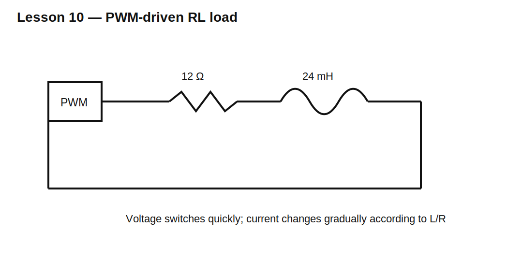

# Lesson 10 — RL Circuits Engineers Actually Use

> **Fast-track time:** 15–20 minutes  
> **Capability unlocked:** Design current rise, current decay, and simple inductive filters.

## Where RL behavior appears

RL time constants govern:

- relay and solenoid current;
- motor winding current;
- current-limited switching;
- EMI chokes;
- current-sense filtering;
- the first-order behavior inside power converters.

For a series RL circuit:

$$\tau=\frac{L}{R}$$

Current after applying a DC voltage:

$$i(t)=\frac{V}{R}\left(1-e^{-tR/L}\right)$$

## Current rise in a coil

A 24 V solenoid has 12 Ω resistance and 24 mH inductance.

Final current:

$$I_{final}=\frac{24}{12}=2\text{ A}$$

Time constant:

$$\tau=\frac{24\text{ mH}}{12\ \Omega}=2\text{ ms}$$

At 2 ms, current is about 1.264 A. At 10 ms, it is nearly 2 A.

This matters when the load is driven with short pulses: current may never reach its DC value.

## PWM current

During PWM on-time, current rises. During off-time, it decays through a diode or clamp. The average and ripple depend on:

- supply voltage;
- load resistance and inductance;
- duty cycle;
- switching frequency;
- off-state current path;
- clamp voltage.

At high enough switching frequency, current becomes relatively smooth even though voltage is switched abruptly.

## RL low-pass behavior

A series inductor followed by a resistor/load opposes high-frequency current changes. The corner of an ideal first-order RL network is:

$$f_c=\frac{R}{2\pi L}$$

Real inductors introduce DCR, core loss, saturation, and parasitic capacitance, so this simple formula is only the starting point.



## KiCad simulation

Simulate a 24 V PWM source driving:

- R = 12 Ω;
- L = 24 mH;
- flyback diode;
- 1 kHz and 10 kHz PWM cases.

Use:

```spice
.tran 2u 20m startup
```

Plot coil current and switch-node voltage.

## What to observe

At 1 kHz, current ripple is large because each cycle is a significant fraction of the 2 ms time constant.

At 10 kHz, current changes less during each cycle, so ripple is smaller.

Changing the clamp from a diode to a higher-voltage clamp speeds current decay and increases ripple for the same PWM conditions.

## Current-sense implication

A shunt resistor measures instantaneous current but adds loss:

$$P_{shunt}=I_{RMS}^2R_{shunt}$$

Choose resistance from required sense voltage, loss budget, and amplifier input range.

## Common mistakes

- Using DC current when pulse width is shorter than several time constants.
- Assuming PWM duty directly equals current fraction in all RL loads.
- Ignoring off-state current path.
- Choosing switching frequency without checking current ripple.
- Forgetting winding resistance changes with temperature.

## Design challenge

Drive a 24 V, 12 Ω, 24 mH solenoid with PWM so average current is approximately 1 A.

Compare 1 kHz and 20 kHz. Select duty cycle, estimate ripple, verify peak current, and justify the flyback/clamp strategy.

## Remember

> In an RL load, voltage commands the rate of current change; resistance and time determine where the current finally settles.