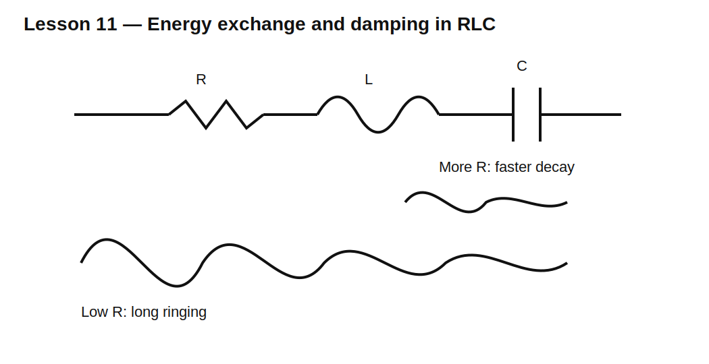

# Lesson 11 — RLC Resonance, Ringing, and Damping

> **Fast-track time:** 15–20 minutes  
> **Capability unlocked:** Predict and control ringing caused by interacting inductance and capacitance.

## Why this matters

Every real circuit contains some inductance and capacitance. When energy moves back and forth between them, the circuit can ring. Ringing appears in:

- switch nodes;
- long wires and PCB traces;
- relay contacts;
- power converters;
- clock edges;
- filters;
- sensor cables.

## Resonant frequency

For an ideal LC network:

$$f_0=\frac1{2\pi\sqrt{LC}}$$

A charged capacitor transfers energy into the inductor’s magnetic field. The inductor then keeps current flowing and charges the capacitor with opposite polarity. With no loss, this continues forever.

Resistance removes energy and determines damping.



## Example

Let:

- $L=10\text{ mH}$;
- $C=1\ \mu\text{F}$.

Then:

$$f_0=\frac1{2\pi\sqrt{10\text{ mH}\cdot1\ \mu\text{F}}}\approx1.59\text{ kHz}$$

## Series RLC and quality factor

For a simple series RLC:

$$Q=\frac{\omega_0L}{R}$$

Higher Q means:

- more cycles of ringing;
- a sharper resonance;
- larger internal voltages near resonance;
- slower decay.

Lower Q means more damping and less ringing.

## KiCad simulation

Start with C charged to 5 V and L current at zero.

Use:

```spice
.ic V(VCAP)=5
.tran 2u 10m uic
```

Run with series resistance:

- 1 Ω;
- 20 Ω;
- 200 Ω.

Plot capacitor voltage, inductor current, and stored energies:

$$E_C=\frac12CV^2$$

$$E_L=\frac12LI^2$$

## What to observe

- With low R, energy alternates repeatedly between C and L.
- With more R, oscillation decays faster.
- With enough R, the response no longer visibly overshoots.
- Total stored energy falls because resistance converts it to heat.

## Why switching circuits ring

A MOSFET switching node may contain:

- device output capacitance;
- diode capacitance;
- package and trace inductance;
- transformer leakage inductance.

A fast edge excites this parasitic RLC network. The observed frequency can be used to estimate parasitic L or C if the other is known.

## Damping methods

- Add series resistance where acceptable.
- Use an RC snubber.
- Use an RCD clamp.
- Slow the switching edge with gate resistance.
- Reduce loop inductance through layout.
- Choose devices with suitable capacitance/recovery behavior.

A snubber trades ringing for controlled dissipation. It must be sized from measured or simulated frequency, energy, voltage, and repetition rate.

## Common mistakes

- Blaming ringing only on the simulator.
- Adding arbitrary capacitance without checking increased switching loss.
- Ignoring layout inductance.
- Suppressing voltage overshoot while overheating the snubber.
- Using ideal L and C models and expecting hardware amplitude to match.

## Design challenge

A switch node rings at 20 MHz. Estimated node capacitance is 500 pF.

1. Estimate the parasitic inductance.
2. Propose an RC snubber starting point.
3. Explain how you would tune it in simulation and hardware.
4. Check snubber power at 200 kHz switching frequency.

## Remember

> Ringing is energy exchanging between unavoidable inductance and capacitance. Control the energy path, damping, and physical loop instead of treating the waveform as mysterious.