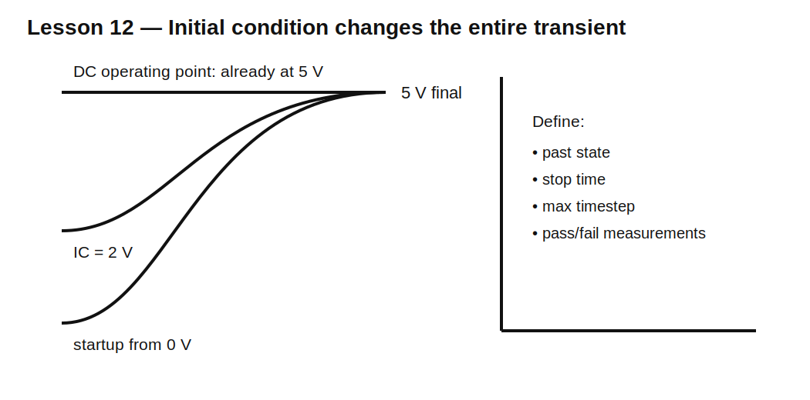

# Lesson 12 — SPICE Transient Analysis Without Fooling Yourself

> **Fast-track time:** 15–20 minutes  
> **Capability unlocked:** Configure and interpret time-domain simulations reliably.

## Why this matters

A transient plot can look convincing while answering the wrong question. The most common causes are incorrect startup conditions, insufficient simulation time, an excessive timestep, ideal components, or a directive that never reached ngspice.

## The four decisions

Before running a transient simulation, decide:

1. **What happened before time zero?**
2. **How long must the simulation run?**
3. **What is the fastest event that must be resolved?**
4. **Which measurements prove the requirement?**

## Operating point versus startup

Normal transient analysis often begins by calculating a DC operating point. Capacitors may therefore start charged and inductors may start at their DC current.

Useful controls:

- normal `.tran`: begin from DC operating point;
- `startup`: start independent sources at zero and ramp them to their initial values;
- `.ic`: state a desired node voltage or inductor current;
- `uic`: skip the operating-point solution.

Use `uic` only when you understand the full initial state. Skipping the operating point can create unrealistic or underdefined starting conditions.

## Example circuit



A 5 V source charges 10 µF through 10 kΩ. The time constant is 100 ms.

Compare:

```spice
.tran 100u 500m
```

with:

```spice
.tran 100u 500m startup
```

and:

```spice
.ic V(VCAP)=2
.tran 100u 500m uic
```

## Stop time

Choose stop time from the slowest meaningful behavior.

For a first-order circuit, approximately $5\tau$ shows near-complete settling. For a high-Q oscillator or resonator, startup can require hundreds or thousands of cycles.

## Maximum timestep

The simulator may choose large internal timesteps unless constrained. A useful starting rule is at least 20–100 points across the fastest edge, oscillation period, or pulse feature you care about.

A 1 µs pulse edge cannot be trusted if maximum timestep is 10 µs.

## Measurement directives

Do not rely only on visual cursors. Use objective measurements:

```spice
.meas tran T90 WHEN V(VCAP)=4.5 RISE=1
.meas tran VMAX MAX V(OUT) FROM=10m TO=20m
.meas tran VMIN MIN V(OUT) FROM=10m TO=20m
.meas tran IAVG AVG I(L1) FROM=10m TO=20m
```

These make design checks repeatable.

## KiCad-specific check

A visible line beginning with `.tran` may be ordinary schematic text. Always inspect the generated netlist and confirm:

- the analysis directive is present;
- source waveforms are correct;
- values use intended suffixes;
- device pin mapping is correct;
- node 0 exists.

## Common suffix trap

SPICE is generally case-insensitive. `M` commonly means milli, not mega. Use `Meg` for megaohms.

Examples:

- `1m` = 1 milliohm;
- `1Meg` = 1 megaohm;
- `1u` = 1 micro;
- `1n` = 1 nano.

## Common mistakes

- Trusting a precharged capacitor when studying power-on behavior.
- Simulating 10 ms for a circuit with a 1 s time constant.
- Using a timestep larger than the switching edge.
- Forcing an initial condition that hides a startup failure.
- Comparing current signs without checking reference direction.
- Accepting convergence by adding unrealistic resistance without documenting it.

## Design challenge

Create one RC simulation that demonstrates three distinct initial conditions:

- capacitor initially 0 V;
- capacitor initially 2 V;
- normal DC operating point at 5 V.

Measure time to reach 4.5 V in each case and explain why one case has no visible charging transient.

## Remember

> A simulator solves the circuit you described, including its assumed past. Define the past, duration, resolution, and pass/fail measurements explicitly.