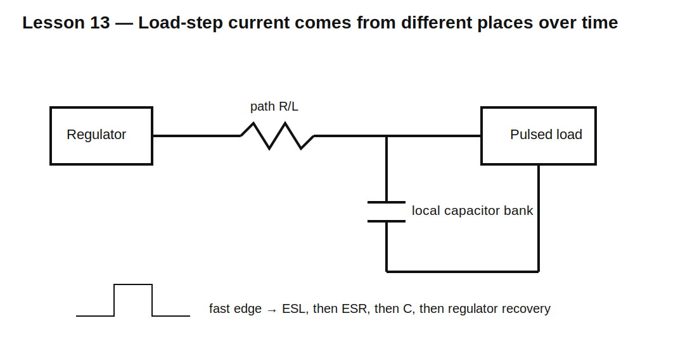

# Lesson 13 — Power-Rail Load Steps and Decoupling Design

> **Fast-track time:** 15–20 minutes  
> **Capability unlocked:** Size and place capacitors from a load-step requirement instead of copying values.

## The engineering problem

A digital or RF load can change current faster than the regulator and wiring can respond. The local rail droops because the missing current must come from nearby stored energy.

A useful first decomposition is:

$$\Delta V_{total}\approx I\cdot ESR + L\frac{di}{dt}+\frac{I\Delta t}{C}$$

The three terms dominate at different time scales:

- ESL and loop inductance: earliest edge;
- ESR: immediate step;
- capacitance: continuing droop;
- regulator control loop: later recovery.

## Example requirement

A 3.3 V load jumps by 500 mA for 20 µs. Maximum allowed droop is 100 mV.

Allocate:

- 20 mV to ESR and layout;
- 80 mV to capacitance.

Then:

$$ESR_{max}=\frac{20\text{ mV}}{0.5\text{ A}}=40\text{ m}\Omega$$

$$C_{min}=\frac{I\Delta t}{\Delta V_C}=\frac{0.5\cdot20\ \mu s}{80\text{ mV}}=125\ \mu F$$

This is effective capacitance at operating voltage and temperature, not nominal label value.

## Circuit



Model:

- ideal 3.3 V source;
- source resistance and inductance;
- capacitor bank with ESR/ESL;
- pulsed current load.

## KiCad simulation

Use:

```spice
.tran 10n 100u startup
```

Plot:

- load current;
- rail voltage at the source;
- rail voltage at the load;
- current from each capacitor branch;
- regulator/source current.

## What to observe

- The smallest, closest capacitor supplies the fastest edge.
- Bulk capacitance supports the longer pulse.
- A capacitor located behind trace inductance is less effective at the first instant.
- Lower ESR reduces the immediate step but may affect regulator stability.
- More capacitance slows recovery and can increase startup/inrush current.

## Design workflow

1. Obtain the load-step magnitude and edge rate.
2. Define allowed droop and recovery time.
3. Estimate how long before the source/regulator responds.
4. Allocate voltage budget among ESL, ESR, and C.
5. Calculate minimum effective C and maximum ESR.
6. Select technologies and packages.
7. Model source path and placement inductance.
8. Verify regulator stability and startup.
9. Measure at the load with a low-inductance probe.

## Why multiple capacitors help

Parallel capacitors can provide:

- lower combined ESR;
- lower combined effective inductance when placed well;
- useful impedance over a wider frequency range;
- distributed local energy near multiple pins.

They can also create anti-resonance peaks, so “add more” is not a complete design method.

## Common mistakes

- Calculating C from pulse duration but ignoring ESR.
- Using nominal ceramic capacitance at zero bias.
- Measuring at the regulator instead of the load pin.
- Ignoring plane/trace inductance.
- Adding output capacitance outside the regulator’s stable range.
- Forgetting inrush and discharge behavior.

## Design challenge

Design a 5 V rail for a 1.2 A load step lasting 50 µs with no more than 150 mV droop.

Requirements:

- reserve at least 30 mV for ESL/ESR;
- account for 50% ceramic bias loss;
- use at least two capacitor technologies or justify one;
- model 2 nH connection inductance;
- verify source current recovery after the pulse.

## Remember

> Decoupling is a current-delivery problem over time. Allocate the voltage error, then choose capacitance, ESR, ESL, and placement to meet it.