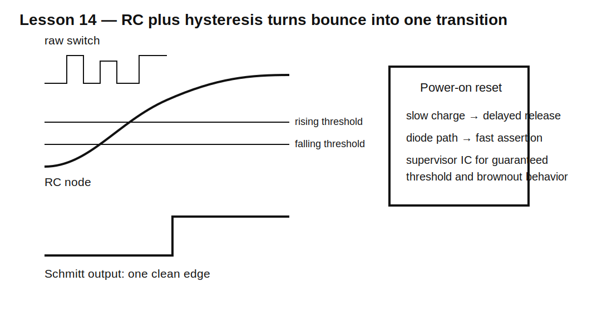

# Lesson 14 — Switch Debounce and Power-On Reset

> **Fast-track time:** 15–20 minutes  
> **Capability unlocked:** Turn noisy mechanical events and slow power ramps into reliable digital transitions.

## The engineering problem

A mechanical switch rarely changes state once. Contacts bounce, producing several transitions over a few milliseconds. Power rails also rise gradually and may pause or dip. Digital logic needs one clean, well-timed transition.

## Why RC alone is not enough

An RC network converts rapid changes into a slow voltage ramp. A normal digital input may switch unpredictably while the ramp passes through its undefined region.

The robust pattern is:

1. RC network limits the rate of change;
2. Schmitt-trigger input supplies separate rising and falling thresholds;
3. optional diode gives different charge and discharge times.



## Debounce design

Suppose switch bounce lasts up to 5 ms. Choose an RC time constant several times longer than the individual bounce pulses, but short enough to preserve acceptable response.

Example:

- R = 100 kΩ;
- C = 100 nF;
- $RC=10$ ms.

With a Schmitt rising threshold at 0.7 VCC, the nominal crossing time after a clean press is:

$$t=-RC\ln(1-0.7)=1.204RC\approx12\text{ ms}$$

The actual delay depends on thresholds, component tolerances, source resistance, leakage, and the bounce waveform.

## Power-on reset

A simple RC can delay release of reset while VCC rises. But reset must also reassert quickly when power falls. A diode across the timing resistor can discharge the capacitor rapidly.

Dedicated supervisor ICs are preferable when the design needs:

- a guaranteed voltage threshold;
- hysteresis;
- brownout detection;
- precise delay;
- fast reset assertion;
- operation during slow or non-monotonic ramps.

## KiCad simulation

Model switch bounce with a piecewise-linear or pulse sequence, then feed the RC node into a behavioral Schmitt comparator.

Use:

```spice
.tran 10u 100m startup
```

Plot:

- raw switch waveform;
- RC node;
- Schmitt output;
- reset output during a slow VCC ramp and brief brownout.

## What to observe

- RC suppresses short bounce pulses but does not create a crisp edge.
- Schmitt hysteresis prevents repeated switching near the threshold.
- A larger RC improves rejection but increases response delay.
- A diode can make reset release slow and assertion fast.
- A slow supply ramp can defeat a simplistic reset circuit.

## Design workflow

1. Determine worst-case bounce or power-ramp behavior.
2. Determine valid input thresholds and hysteresis.
3. Set maximum allowed response delay.
4. Include source resistance and leakage.
5. Calculate threshold-crossing time, not merely RC.
6. Simulate worst-case pulse sequences and tolerances.
7. Use a supervisor IC if threshold accuracy or brownout behavior matters.

## Common mistakes

- Connecting a large capacitor directly across switch contacts without checking current.
- Sending a slow ramp into a non-Schmitt CMOS input.
- Calling $RC$ the debounce delay without using threshold voltage.
- Designing reset only for power-up and ignoring power-down.
- Ignoring capacitor tolerance and leakage.
- Trusting a simulated ideal switch as a mechanical model.

## Design challenge

Design a debounced active-low button input for a 3.3 V MCU.

Requirements:

- reject any bounce pulse shorter than 3 ms;
- produce a valid transition within 30 ms;
- MCU Schmitt thresholds: rising 2.0 V, falling 1.0 V;
- switch current below 1 mA;
- include ±20% capacitor tolerance;
- validate press and release waveforms.

## Remember

> RC controls time; hysteresis creates certainty. Reliable digital transitions usually need both.