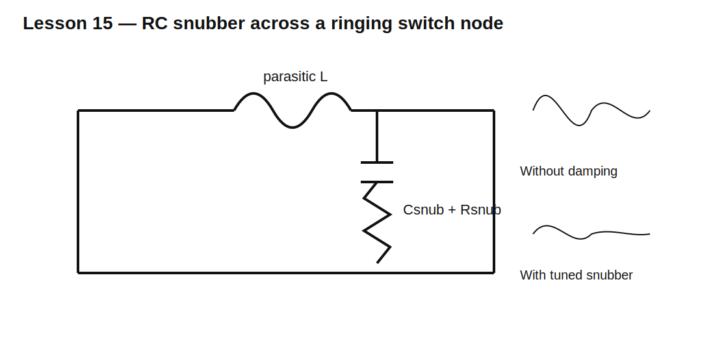

# Lesson 15 — Snubber Design: Controlling Overshoot and Ringing

> **Fast-track time:** 15–20 minutes  
> **Capability unlocked:** Develop and tune an RC snubber from measured or simulated ringing.

## The engineering problem

A fast switch excites parasitic inductance and capacitance. The result is overshoot and ringing that can exceed device ratings, create EMI, and cause false switching.

An RC snubber provides a controlled path that dissipates the ringing energy.

## Start from the ringing frequency

If ringing is dominated by parasitic L and C:

$$f_r\approx\frac1{2\pi\sqrt{LC}}$$

If C is estimated, solve for L:

$$L\approx\frac1{(2\pi f_r)^2C}$$

## A practical starting method

Choose snubber capacitance comparable to the estimated ringing capacitance, often 1–3 times larger.

Then choose resistance near the characteristic impedance:

$$R_{snub}\approx\sqrt{\frac{L}{C_{snub}}}$$

This is a starting point, not a final guarantee.



## Example

A switch node rings at 25 MHz. Estimated parasitic capacitance is 400 pF.

Estimated inductance:

$$L\approx\frac1{(2\pi\cdot25\text{ MHz})^2(400\text{ pF})}\approx101\text{ nH}$$

Choose $C_{snub}=1$ nF.

$$R_{snub}\approx\sqrt{101\text{ nH}/1\text{ nF}}\approx10\ \Omega$$

Start near 10 Ω and sweep around it.

## KiCad simulation

Use a pulse source, parasitic L, switch-node C, and RC snubber.

Run:

```spice
.tran 1n 5u startup
```

Compare:

- no snubber;
- 1 nF + 5 Ω;
- 1 nF + 10 Ω;
- 1 nF + 22 Ω.

Plot overshoot, ringing frequency, decay time, and resistor power.

## What to observe

- Too little resistance can move or worsen the resonance.
- Too much resistance weakly damps it.
- More capacitance reduces ringing frequency but increases switching loss.
- The best waveform is not automatically the lowest-loss solution.

## Power check

A rough energy estimate for charging and discharging the snubber capacitor is:

$$E_{event}\approx\frac12C_{snub}V^2$$

Average power is approximately event energy times event rate, adjusted for the actual topology and number of transitions. Confirm by integrating simulated resistor power.

## Hardware measurement warning

A long oscilloscope ground lead adds inductance and can create apparent ringing. Use:

- spring ground;
- coaxial probing;
- differential probe when appropriate;
- measurement directly across the device or loop of interest.

## Layout is part of the fix

Before adding dissipation, reduce parasitic L:

- shorten the high-current loop;
- place switch, diode, and capacitor close together;
- use wide copper and nearby return planes;
- minimize package and via inductance.

A snubber compensates for residual parasitics; it should not excuse poor layout.

## Common mistakes

- Choosing values randomly until the waveform looks quieter.
- Ignoring snubber resistor pulse and average power.
- Adding excessive C and creating large switching loss.
- Tuning with an inaccurate probe setup.
- Placing the snubber far from the ringing loop.
- Assuming the same values work across all operating conditions.

## Design challenge

A 48 V switch node rings at 18 MHz with estimated 700 pF parasitic capacitance and switches at 250 kHz.

Estimate L, choose an RC snubber starting point, estimate capacitor-related power, and define a simulation sweep that minimizes overshoot while keeping resistor dissipation below 0.75 W.

## Remember

> A snubber is a deliberate energy-loss path. Estimate the parasitic network, tune damping, and verify both waveform and power.