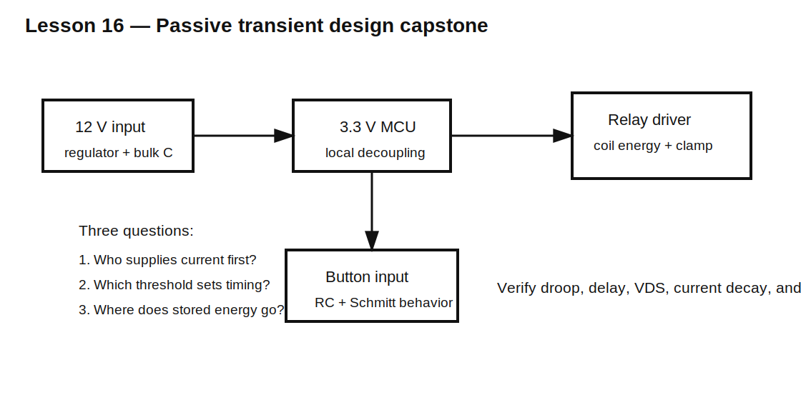

# Lesson 16 — Passive Transient Design Capstone

> **Fast-track time:** 20–30 minutes  
> **Capability unlocked:** Turn a timing, power-rail, and inductive-load specification into one verified passive design.

## The design brief

Create the passive support circuitry for a 12 V controller board containing:

- a 3.3 V MCU rail;
- a mechanical pushbutton;
- a 12 V relay coil;
- a MOSFET switch controlled by the MCU;
- a regulator that needs 100 µs to respond to a load step.

The goal is not to copy a reference circuit. It is to identify each energy-storage and transient problem, choose a topology, calculate values, and verify the design.

## Requirements

### MCU rail

- load step: 300 mA;
- duration before regulator response: 100 µs;
- maximum droop: 120 mV;
- ceramic capacitors retain only 60% of nominal capacitance at bias;
- connection inductance to bulk capacitor: 3 nH.

### Pushbutton

- bounce pulses up to 4 ms;
- valid transition required within 25 ms;
- 3.3 V Schmitt input thresholds: 2.0 V rising and 1.0 V falling;
- switch current below 0.5 mA.

### Relay

- coil resistance: 240 Ω;
- coil inductance: 200 mH;
- supply: 12 V;
- switch VDS target below 40 V;
- coil current must fall below 5 mA within 12 ms after turn-off.

## Step 1 — Separate the problems

Treat the board as three transient subsystems:

1. local rail current delivery;
2. noisy mechanical input;
3. stored magnetic energy at relay turn-off.

Each subsystem has a different time scale and failure mode.



## Step 2 — MCU rail estimate

Reserve 20 mV for ESR/ESL, leaving 100 mV for capacitive droop.

$$C_{effective}\ge\frac{0.3\cdot100\ \mu s}{0.1}=300\ \mu F$$

If ceramics retain 60%:

$$C_{nominal}\ge\frac{300}{0.6}=500\ \mu F$$

This likely requires bulk capacitance plus local ceramics. Verify the early edge with the 3 nH connection inductance.

## Step 3 — Button network

Choose pull-up resistance from the current limit:

$$R\ge\frac{3.3}{0.5\text{ mA}}=6.6\text{ k}\Omega$$

A larger value such as 47–100 kΩ reduces current. Choose C so the RC node ignores 4 ms disturbances but crosses the Schmitt threshold within 25 ms.

For charging toward 3.3 V and rising threshold 2.0 V:

$$t=-RC\ln\left(1-\frac{2.0}{3.3}\right)\approx0.931RC$$

Thus $RC$ should be below approximately 26.9 ms for the nominal rising requirement. Tolerance corners must still pass.

## Step 4 — Relay energy and clamp

Steady coil current:

$$I=rac{12}{240}=50\text{ mA}$$

Stored energy:

$$E_L=\frac12(0.2)(0.05)^2=0.25\text{ mJ}$$

A plain diode gives low switch voltage but slow release. A Zener-assisted clamp can speed decay while keeping VDS below 40 V. Include supply tolerance, clamp tolerance, and overshoot.

## KiCad verification

Use three simulation sheets or three clearly separated subcircuits.

Required analyses:

```spice
.tran 10n 500u startup
```

for the rail step,

```spice
.tran 10u 100m startup
```

for debounce,

and

```spice
.tran 2u 30m startup
```

for relay turn-off.

## Pass/fail measurements

Measure:

- minimum MCU rail voltage during the load step;
- peak ESR/ESL drop;
- button press and release transition times;
- number of output transitions during bounce;
- peak switch voltage;
- relay current 12 ms after turn-off;
- clamp energy and peak power.

## Review checklist

A competent design review should answer:

- Which component supplies current during each time interval?
- Which values are effective rather than nominal?
- Where does stored energy go?
- Which threshold determines timing?
- Which parasitic dominates the fastest event?
- Which datasheet limits still need verification?
- What hardware measurement would prove the simulation?

## Common failure patterns

- One large remote capacitor is expected to solve the entire rail transient.
- Button RC is designed from $RC$ alone without threshold/tolerance analysis.
- Relay diode is selected by average current only.
- Switch voltage margin ignores clamp and layout overshoot.
- Simulation uses ideal wiring and reports unrealistically clean results.

## Deliverable

Submit:

- complete schematic;
- calculations and assumptions;
- selected real component classes and ratings;
- three transient plots with measurements;
- worst-case table;
- explanation of every capacitor, resistor, diode, and inductor-related decision.

## Remember

> Competent circuit design means controlling charge, current, energy, time, and parasitics together—not solving isolated formulas.