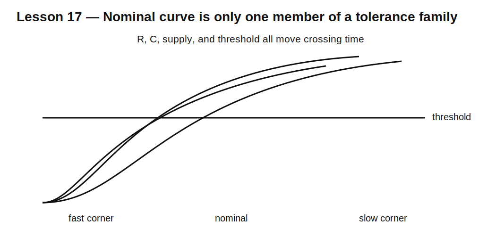

# Lesson 17 — Tolerance and Worst-Case Design

> **Fast-track time:** 15–20 minutes  
> **Capability unlocked:** Design RC, RL, and RLC circuits that still work when real components vary.

## The engineering problem

A nominal simulation proves only that one mathematical circuit works. Real resistors, capacitors, inductors, thresholds, supplies, and temperatures vary.

Competent design asks:

> Which allowed combination creates the fastest, slowest, hottest, or most stressful result?

## Extreme-value analysis

For a time constant:

$$\tau=RC$$

If R is ±5% and C is ±20%:

$$\tau_{min}=0.95R\cdot0.80C=0.76RC$$

$$\tau_{max}=1.05R\cdot1.20C=1.26RC$$

The range is −24% to +26%.

## Threshold timing has more variables

For an RC node charging toward $V_S$ and switching at $V_T$:

$$t=-RC\ln\left(1-\frac{V_T}{V_S}\right)$$

Timing depends on:

- R;
- C;
- threshold;
- supply voltage.

The slow corner is often maximum R, maximum C, high threshold, and low supply. The fast corner is usually the opposite.



## Corner simulation

Parameterize values:

```spice
.param RVAL=100k CVAL=1u VDD=3.3
R1 IN OUT {RVAL}
C1 OUT 0 {CVAL}
```

Then step or run explicit corners:

```spice
.step param RVAL list 99k 101k
.step param CVAL list 0.9u 1.1u
.meas tran TCROSS WHEN V(OUT)=2 RISE=1
```

Explicit corner netlists are often easier to review than a large statistical plot.

## Monte Carlo is different

Monte Carlo estimates yield when component variation is probabilistic. It does not prove guaranteed compliance unless the specification is statistical.

Use:

- corners for guaranteed limits;
- Monte Carlo for distribution and yield;
- both when production variation matters.

## Temperature and bias

Component variation may depend on operating conditions:

- ceramic capacitance falls with DC bias;
- inductor DCR rises with temperature;
- saturation current changes with temperature;
- leakage rises strongly with temperature;
- thresholds may shift nonlinearly.

Use datasheet curves rather than pretending every effect is a symmetric tolerance.

## Common mistakes

- Simulating nominal values only.
- Adding percentages without applying the actual equation.
- Using Monte Carlo as a guarantee.
- Ignoring supply and threshold variation.
- Assuming unrelated parts track each other.
- Ignoring bias and temperature dependence.

## Design challenge

Design an RC delay that crosses 2.0 V between 90 and 130 ms.

Available limits:

- source: 3.15–3.45 V;
- threshold: 1.9–2.1 V;
- resistor: ±1%;
- capacitor: ±10%.

Choose standard values, calculate fast and slow corners, and verify them in KiCad.

## Remember

> Nominal design finds a value. Engineering design proves that every allowed value still works.