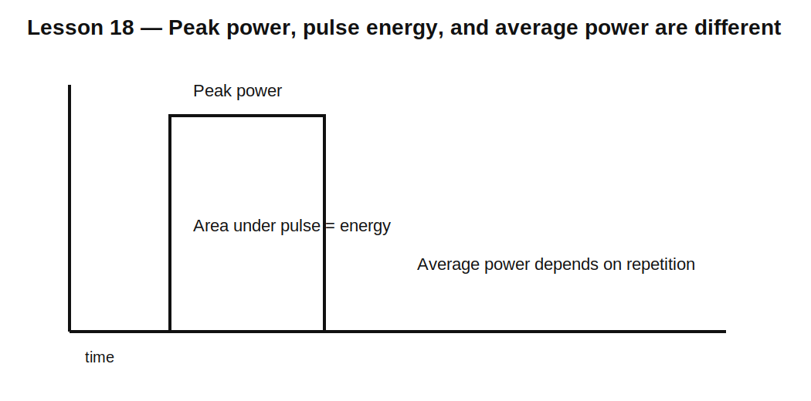

# Lesson 18 — Pulse Power and Component Ratings

> **Fast-track time:** 15–20 minutes  
> **Capability unlocked:** Check whether resistors, capacitors, inductors, diodes, and switches survive short transient stress.

## The engineering problem

A component may survive 1 W continuously but fail during a short 100 W pulse. Another may tolerate a large pulse because its thermal mass absorbs energy before temperature rises significantly.

You must distinguish:

- instantaneous power;
- pulse energy;
- average power;
- repetition rate;
- peak voltage/current;
- thermal recovery time.

## Core equations

Instantaneous power:

$$p(t)=v(t)i(t)$$

Pulse energy:

$$E=\int p(t)\,dt$$

Average power for repeated pulses:

$$P_{AVG}=E_{pulse}f_{rep}$$

For a resistor carrying constant current during a pulse:

$$E=I^2Rt_p$$

## Example: inrush resistor

A 10 Ω resistor carries 5 A for 2 ms.

Peak power:

$$P=I^2R=250\text{ W}$$

Pulse energy:

$$E=250\cdot2\text{ ms}=0.5\text{ J}$$

A 2 W resistor is not automatically safe or unsafe. The pulse-overload graph and construction determine whether it can absorb 0.5 J at that duration and repetition rate.



## Capacitor stress

Check:

- voltage rating;
- surge voltage;
- ripple-current RMS;
- ESR heating;
- charge/discharge current;
- lifetime versus temperature.

Ripple heating is approximately:

$$P_{ESR}=I_{RMS}^2ESR$$

## Inductor stress

Check both:

- peak current versus saturation;
- RMS current versus thermal rating.

Stored energy at peak current is:

$$E_L=\frac12LI_{PK}^2$$

## Semiconductor stress

Check simultaneous voltage and current, not each independently. Datasheet safe-operating-area graphs often include pulse duration, temperature, and duty cycle.

## KiCad simulation

Use a pulsed source and resistor. Plot and integrate power:

```spice
.meas tran ERES INTEG V(RIN,ROUT)*I(R1) FROM=1m TO=3m
.meas tran PAVG AVG V(RIN,ROUT)*I(R1) FROM=0 TO=100m
```

Then vary repetition period while keeping pulse width fixed.

## What to observe

- Peak power remains unchanged when repetition rate changes.
- Energy per pulse remains unchanged.
- Average power increases with repetition frequency.
- Component temperature may accumulate when pulses arrive before cooling completes.

## Datasheet workflow

1. Calculate waveform peak values.
2. Calculate pulse energy and average power.
3. Find pulse-overload, surge, SOA, or transient-thermal data.
4. Derate for ambient temperature.
5. Check repetition and cooling assumptions.
6. Verify package and PCB thermal path.
7. Include fault duration and protection-clearing time.

## Common mistakes

- Comparing pulse peak power only with continuous wattage.
- Checking average power only.
- Ignoring repetitive heating.
- Using room-temperature ratings at high ambient.
- Checking current and voltage separately instead of SOA.
- Assuming a simulator models physical destruction.

## Design challenge

A precharge resistor sees 48 V across 22 Ω for an initial 20 ms pulse, once every 10 seconds.

Calculate peak current, peak power, pulse energy, average power, and the datasheet information required to select a safe resistor with 2× energy margin.

## Remember

> Transient survival depends on waveform, energy, repetition, and thermal path—not one printed wattage number.