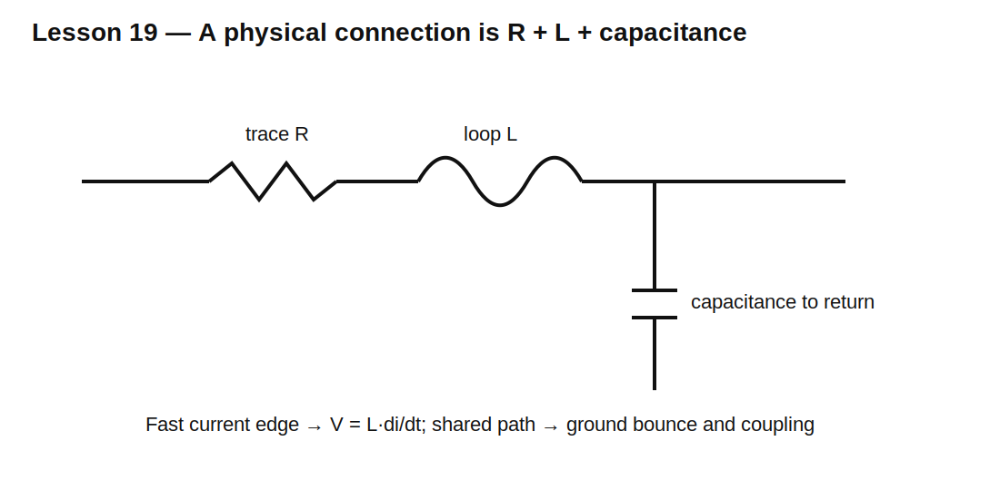

# Lesson 19 — Wires, PCB Traces, and Parasitics

> **Fast-track time:** 15–20 minutes  
> **Capability unlocked:** Recognize when a wire is no longer an ideal connection.

## The engineering problem

A schematic line has zero resistance, zero inductance, and no capacitance. A physical connection has all three.

At slow speed and low current, parasitics may be negligible. During fast edges or large current changes, they can dominate the circuit.

## First-order models

A connection can be approximated with:

- series resistance R;
- series inductance L;
- capacitance to nearby conductors or ground;
- mutual inductance to nearby loops.

The two most useful transient relationships are:

$$V_R=IR$$

$$V_L=L\frac{di}{dt}$$

## Example: ground bounce

A shared ground path has 10 nH inductance. Current changes by 1 A in 5 ns.

$$V=L\frac{di}{dt}=10\text{ nH}\cdot200\text{ MA/s}=2\text{ V}$$

The copper may have nearly zero DC voltage drop yet still produce a 2 V transient.



## Loop area matters

Current always returns to its source. The outgoing and return paths form a loop. Larger loop area generally creates more inductance and radiated magnetic field.

Reduce loop area by:

- placing supply and return close together;
- using a continuous ground plane;
- placing decoupling close to the device;
- shortening switch-current loops;
- avoiding unnecessary vias and narrow necks.

## Shared impedance coupling

Two circuits sharing a return path can disturb each other. A high-current load pulse creates voltage across the shared resistance and inductance, shifting the apparent ground of a sensitive circuit.

This is why grounding is about **current paths**, not simply using a ground symbol everywhere.

## KiCad simulation

Model a 3.3 V source driving a pulsed 1 A load through:

- 20 mΩ trace resistance;
- 5 nH supply inductance;
- 5 nH return inductance;
- local 10 µF capacitor.

Use:

```spice
.tran 1n 2u startup
```

Compare load voltage for:

- ideal wires;
- parasitic path;
- local capacitor at source side;
- local capacitor at load side.

## What to observe

- DC resistance creates a sustained drop during the pulse.
- inductance creates an edge spike proportional to $di/dt$;
- a capacitor behind the same inductive path cannot fully suppress the load-pin spike;
- placement changes performance even when the schematic is electrically identical.

## When transmission-line analysis begins

If connection delay becomes significant relative to edge rise time, a lumped L/C model is insufficient. The signal may need transmission-line treatment and controlled impedance.

A common rule is to consider transmission-line effects when interconnect delay is more than roughly one-sixth to one-tenth of the signal rise time.

## Common mistakes

- Evaluating interconnect only from signal frequency instead of edge rate.
- Treating ground as an equipotential node at all frequencies.
- Placing decoupling near the regulator rather than the load.
- Using a long probe ground lead and measuring the probe loop.
- Adding capacitance without reducing current-loop inductance.

## Design challenge

A 2 A load edge rises in 10 ns. The supply/return loop has 6 nH total inductance and 15 mΩ resistance.

Calculate the idealized edge spike and DC drop. Then redesign the layout model to keep total transient error below 250 mV using lower inductance and local capacitance.

## Remember

> Physical connections are circuit elements. Fast current and large loop area turn “just a wire” into voltage error, ringing, and EMI.