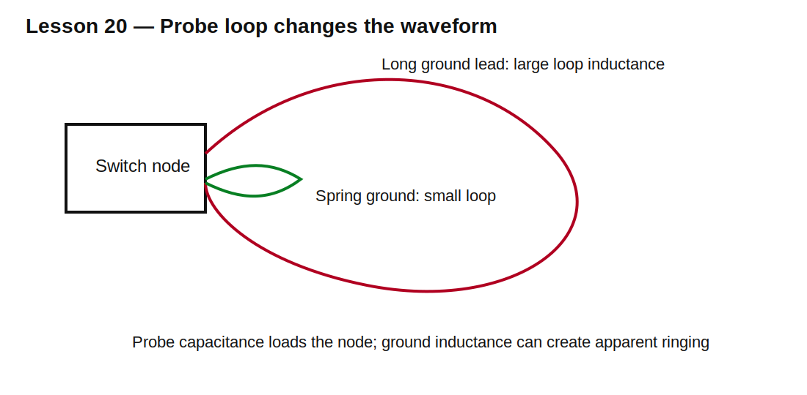

# Lesson 20 — Measuring Fast Transients Without Measuring Your Probe

> **Fast-track time:** 15–20 minutes  
> **Capability unlocked:** Measure rail droop, ringing, and switching edges without introducing major error.

## The engineering problem

A simulation node is measured perfectly. A real oscilloscope probe adds capacitance, inductance, resistance, bandwidth limits, and a physical current loop.

Poor probing can create ringing that is not present or hide ringing that is.

## Probe loading

A typical passive 10× probe may present:

- about 10 MΩ at DC;
- roughly 8–15 pF at high frequency;
- inductance from its ground lead.

That capacitance can alter a high-impedance or resonant node.

## Ground-lead inductance

A long ground clip forms a loop. During a fast current edge:

$$V=L\frac{di}{dt}$$

Even tens of nanohenries can create volts of apparent ringing.

Use a spring ground or coaxial connection for fast measurements.



## Measuring power-rail noise

For a rail at an IC:

- probe directly across the local supply and ground pins or capacitor terminals;
- minimize probe loop area;
- use AC coupling only when appropriate and document it;
- check probe and scope bandwidth limits;
- avoid accidentally shorting non-isolated grounds.

## Measuring switch nodes

A switch node may be high voltage and not ground-referenced. Use an appropriate differential probe or isolated measurement method. Observe:

- maximum differential and common-mode voltage;
- probe bandwidth;
- common-mode rejection versus frequency;
- ground safety;
- probe capacitance.

## Current measurement

Options include:

- shunt resistor plus differential voltage measurement;
- current probe;
- sense amplifier;
- transformer for AC current.

A shunt changes the circuit through resistance and inductance. Kelvin connections reduce error from load-current copper paths.

## Bandwidth and rise time

A first estimate relates bandwidth and rise time:

$$t_r\approx\frac{0.35}{BW}$$

A 100 MHz measurement system has an approximate 3.5 ns rise-time limit. To measure a 2 ns edge accurately, substantially more bandwidth is needed.

The complete system includes probe, scope, adapters, and fixture.

## KiCad experiment

Add a probe model to a 20 MHz ringing node:

- 10 MΩ parallel with 10 pF;
- optional 30 nH ground-lead inductance.

Compare the original node with the loaded/measured node.

Use:

```spice
.tran 100p 2u startup
```

## What to observe

- Probe capacitance changes ringing frequency.
- Ground inductance creates an additional resonance.
- Limited bandwidth rounds edges and lowers apparent peaks.
- A measurement can be repeatable yet still wrong.

## Measurement workflow

1. Define the quantity and expected time scale.
2. Choose probe type and bandwidth.
3. Minimize the physical loop.
4. Check voltage and safety ratings.
5. Measure at the actual point of interest.
6. Change probing method to see whether the waveform changes.
7. Compare with a parasitic-aware simulation.
8. Save setup details with the result.

## Common mistakes

- Using the long ground clip on a fast switch node.
- Measuring rail droop far from the load.
- Ignoring probe capacitance.
- Trusting auto-scaled bandwidth-limited waveforms.
- Connecting grounded scope clips to hazardous or floating nodes.
- Reporting a screenshot without probe/setup information.

## Design challenge

A 30 MHz ringing waveform is expected on a 12 V switch node. Compare a 10× passive probe with 10 pF capacitance and 40 nH ground lead against a 2 pF differential probe.

Simulate the measurement loading and recommend the safer, more accurate setup.

## Remember

> A measurement is another circuit connection. Model and minimize the probe’s effect before trusting the waveform.