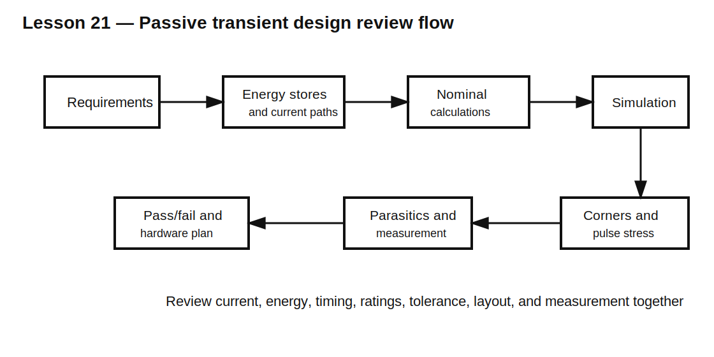

# Lesson 21 — Volume 2 Design Review: From Transient Requirement to Reliable Circuit

> **Fast-track time:** 20–30 minutes  
> **Capability unlocked:** Review a passive transient design like an engineer rather than checking equations one at a time.

## The design brief

A 24 V industrial controller contains:

- a 5 V logic rail;
- a 2 A pulsed load;
- a pushbutton input;
- a 24 V solenoid;
- a MOSFET switch;
- a 500 kHz switching converter nearby.

Your task is to review the passive components and transient behavior before hardware is built.

## Requirements

### Logic rail

- load step: 2 A;
- edge: 20 ns;
- duration before regulator response: 40 µs;
- maximum droop: 200 mV;
- remote bulk path inductance: 4 nH.

### Button

- bounce up to 5 ms;
- one valid transition within 35 ms;
- 5 V Schmitt thresholds: 3.0 V rising, 1.5 V falling.

### Solenoid

- R = 24 Ω;
- L = 120 mH;
- supply = 24 V;
- switch VDS rating = 80 V;
- current must fall below 100 mA within 8 ms.

### Layout and measurement

- switch loop estimated at 15 nH;
- switch node capacitance estimated at 600 pF;
- rail droop must be measured at the load pins.

## Review step 1 — Identify energy stores

List every important stored-energy element:

- rail capacitors;
- solenoid inductance;
- parasitic switch-loop inductance;
- switch-node capacitance;
- any intentional snubber capacitor.

Then state where each stored energy goes during the relevant transition.

## Review step 2 — Rail calculation

Reserve 50 mV for ESR/ESL and 150 mV for capacitance.

$$C_{effective}\ge\frac{2\cdot40\ \mu s}{0.15}=533\ \mu F$$

The 20 ns edge through 4 nH would ideally create:

$$V=L\frac{di}{dt}=4\text{ nH}\cdot100\text{ MA/s}=400\text{ mV}$$

Therefore remote bulk alone cannot meet the first-edge requirement. The review must demand a very local low-inductance path and realistic edge-current sharing.

## Review step 3 — Button timing

For a rising threshold of 3 V from 5 V:

$$t=-RC\ln(1-3/5)=0.916RC$$

Select RC so tolerance corners remain below 35 ms while rejecting 5 ms bounce. Verify both press and release thresholds.

## Review step 4 — Solenoid clamp

Steady current:

$$I_0=24/24=1\text{ A}$$

Stored energy:

$$E_L=\frac12(0.12)(1^2)=60\text{ mJ}$$

A plain diode likely decays too slowly. Select a higher clamp voltage, then verify:

- current at 8 ms;
- peak MOSFET VDS including tolerance and overshoot;
- clamp energy and average power;
- MOSFET SOA or avalanche exposure.

## Review step 5 — Ringing estimate

With 15 nH and 600 pF:

$$f_r\approx\frac1{2\pi\sqrt{15\text{ nH}\cdot600\text{ pF}}}\approx53\text{ MHz}$$

This is fast enough that layout and probe technique are critical. Develop an RC snubber starting point only after reducing loop inductance.

## Required simulations

Create separate analyses for:

1. rail load step;
2. button bounce and Schmitt thresholds;
3. solenoid turn-off;
4. parasitic ringing and snubber sweep;
5. tolerance corners.

For each simulation, define an objective `.meas` result.

## The review questions

A competent reviewer should ask:

- Is the initial condition realistic?
- Which component supplies current at each time scale?
- Are nominal and effective values distinguished?
- Have peak and RMS current both been checked?
- Does stored energy have an intentional path?
- Are parasitic R, L, and C represented?
- Are voltage/current ratings checked simultaneously?
- Are tolerance and temperature corners included?
- Can the proposed probe setup actually measure the event?
- Which assumptions require hardware validation?

## Deliverable

Submit:

- schematic and block diagram;
- calculations;
- selected component classes and ratings;
- measured simulation results;
- corner table;
- failure-mode list;
- hardware verification plan.

## Volume 2 competency check

You are ready to continue when you can independently:

- design RC and RL timing from thresholds and time constants;
- choose real capacitors and inductors from nonideal ratings;
- control inductive turn-off energy;
- estimate resonance and damping;
- design decoupling from a load-step requirement;
- configure transient simulation correctly;
- include tolerance, parasitics, pulse stress, and measurement loading.

## Remember

> Good transient design is the coordinated control of energy, current paths, timing, component limits, parasitics, and measurement.