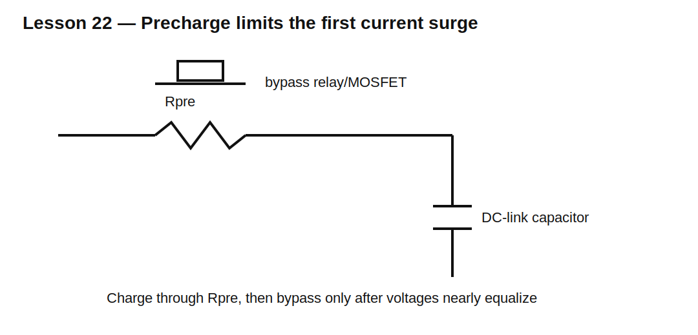

# Lesson 22 — Inrush Current and Precharge

> **Fast-track time:** 15–20 minutes  
> **Capability unlocked:** Limit startup current into large capacitors without overheating the limiter or preventing startup.

## The engineering problem

An uncharged input capacitor initially behaves almost like a short circuit. Connecting it to a low-impedance source can cause:

- connector arcing;
- fuse or breaker trips;
- damaged switches and rectifiers;
- supply collapse;
- EMI;
- welded relay contacts.

For an ideal source, initial current is limited only by total series resistance:

$$I_0=\frac{V_S}{R_{source}+R_{wire}+ESR+R_{limit}}$$

## Stored energy and source energy

A capacitor charged to V stores:

$$E_C=\frac12CV^2$$

With simple resistor charging from an ideal voltage source, approximately the same energy is dissipated in the charging resistance:

$$E_R\approx\frac12CV^2$$

The resistor must survive both peak power and pulse energy.

## Example

Charge 2200 µF to 48 V.

$$E_C=\frac12(2200\ \mu F)(48^2)\approx2.53\text{ J}$$

To limit initial current to 2 A:

$$R\ge\frac{48}{2}=24\ \Omega$$

Initial resistor power is:

$$P_0=I_0^2R=96\text{ W}$$

Although it decays quickly, the resistor needs adequate pulse-energy capability.



## Common approaches

### Fixed resistor

Simple and predictable, but wastes power if left in series.

### Resistor plus bypass relay or MOSFET

The resistor limits startup current, then a switch bypasses it after the capacitor is sufficiently charged.

### NTC thermistor

High resistance when cold, lower resistance after heating. Cheap, but performance depends on ambient temperature and cooldown time. Rapid restart may have little protection.

### Active current limiter

Uses a transistor and control circuit to limit current. More precise, but must satisfy SOA and thermal requirements during startup.

## Timing the bypass

For resistor charging:

$$V_C(t)=V_S(1-e^{-t/RC})$$

To reach 90%:

$$t_{90}=2.303RC$$

Do not close the bypass only from a fixed timer unless source voltage and load conditions are controlled. Measuring capacitor voltage is more robust.

## KiCad simulation

Model:

- 48 V source;
- 24 Ω precharge resistor;
- 2200 µF capacitor;
- bypass switch closing at 300 ms;
- optional load.

Use:

```spice
.tran 100u 1s startup
```

Plot capacitor voltage, source current, resistor power, and bypass current.

## What to observe

- Current is highest at startup.
- Resistor power decays exponentially.
- Closing the bypass too early creates a second current spike.
- A connected load may prevent the capacitor from reaching the expected threshold.
- Source resistance reduces inrush but also increases charge time.

## Design workflow

1. Determine capacitor value and maximum source voltage.
2. Define allowable peak input current.
3. Calculate minimum limiting resistance.
4. Calculate charging time to the bypass threshold.
5. Calculate resistor pulse energy and peak power.
6. Check relay/MOSFET current and voltage stress.
7. Check active-limiter SOA if used.
8. Test hot restart, low-line, high-line, and load-present cases.

## Common mistakes

- Selecting the resistor by continuous wattage only.
- Ignoring capacitor tolerance and source impedance.
- Closing the bypass before voltage equalizes.
- Using an NTC without checking rapid restart.
- Ignoring relay contact current at bypass closure.
- Assuming SPICE models component destruction.

## Design challenge

Precharge a 1000 µF capacitor from 60 V.

Requirements:

- initial current below 1.5 A;
- reach 54 V within 500 ms;
- use an E24 resistor;
- resistor must have 2× pulse-energy margin;
- bypass current spike below 3 A;
- verify low and high capacitor-tolerance corners.

## Remember

> Inrush design controls where capacitor-charging energy goes, how fast it gets there, and which component safely absorbs the loss.