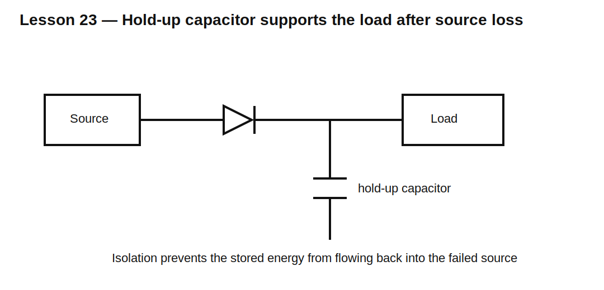

# Lesson 23 — Hold-Up Time and Backup Energy

> **Fast-track time:** 15–20 minutes  
> **Capability unlocked:** Size capacitors or supercapacitors to keep a circuit alive through a power interruption.

## The engineering problem

A circuit may need enough stored energy to:

- survive a brief supply dip;
- finish a write to nonvolatile memory;
- keep a relay or controller alive;
- ride through source switching;
- shut down safely.

The key is not only capacitance. The load power and minimum usable voltage determine how much stored energy can actually be used.

## Constant-current load

For approximately constant current:

$$I=C\frac{\Delta V}{\Delta t}$$

Therefore:

$$C=\frac{I\Delta t}{\Delta V}$$

Example: 200 mA for 50 ms while voltage may fall from 5.0 V to 4.5 V:

$$C=\frac{0.2\cdot0.05}{0.5}=20\text{ mF}$$

## Constant-power load

Many regulators make the input behave closer to constant power. Energy is the better method:

$$E_{usable}=\frac12C(V_{start}^2-V_{min}^2)$$

If efficiency is $\eta$ and load power is P:

$$t\approx\frac{\eta C(V_{start}^2-V_{min}^2)}{2P}$$

This differs significantly from the constant-current approximation.



## ESR and current step

The load sees an immediate drop:

$$\Delta V_{ESR}=I\cdot ESR$$

The remaining voltage range must cover the slower capacitive discharge. A capacitor with sufficient C can still fail if ESR is too high.

## Isolation path

A hold-up capacitor often needs a diode or ideal-diode MOSFET so it supports the load without back-powering the failed source or unrelated rails.

Check:

- forward drop;
- reverse leakage;
- current rating;
- switchover behavior;
- startup inrush.

## KiCad simulation

Model a 5 V source that disconnects at 10 ms, a diode, a hold-up capacitor, and a 200 mA load.

Use:

```spice
.tran 10u 150m startup
```

Plot source voltage, capacitor voltage, load voltage, and diode current.

Compare:

- ideal diode;
- silicon diode;
- Schottky diode;
- ideal-diode MOSFET model.

## What to observe

- Diode drop reduces usable voltage range.
- ESR creates an immediate step at switchover.
- Larger C extends hold-up but increases startup inrush.
- Constant-power loads draw increasing current as voltage falls.
- Leakage matters strongly for long hold-up times.

## Supercapacitors

Supercapacitors offer large energy but require checks for:

- high leakage;
- voltage balancing in series stacks;
- ESR;
- limited cell voltage;
- lifetime and temperature;
- charging current.

## Common mistakes

- Using $C=It/\Delta V$ for a strongly constant-power load.
- Ignoring diode drop and ESR.
- Forgetting load current rises as converter input voltage falls.
- Assuming all stored energy is usable down to 0 V.
- Ignoring startup inrush and recharge time.
- Back-powering the failed source.

## Design challenge

Keep a 3.3 V, 1 W load alive for 100 ms. The upstream rail begins at 5 V, the converter stops regulating below 3.8 V, and efficiency is 85%.

Choose minimum capacitance, reserve 100 mV for ESR, and verify the result with a constant-power load model.

## Remember

> Hold-up design is an energy-budget problem bounded by usable voltage, load behavior, ESR, efficiency, and isolation.