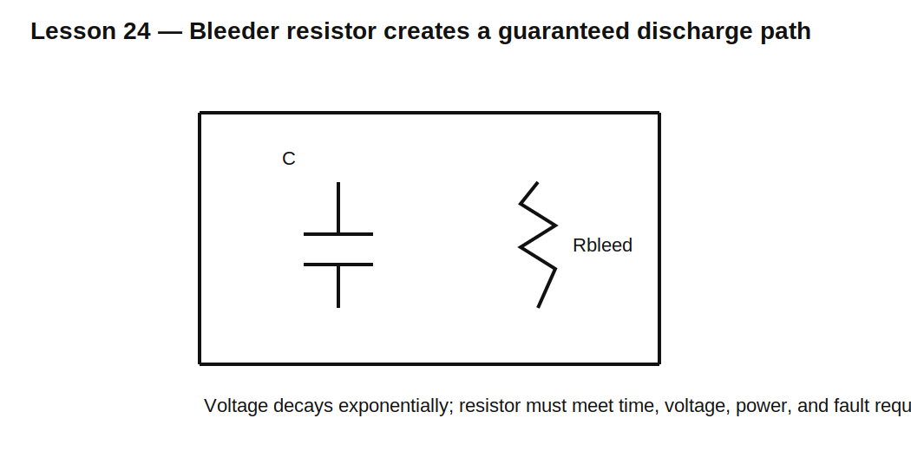

# Lesson 24 — Capacitor Discharge, Bleeder Resistors, and Safe Voltage Decay

> **Fast-track time:** 15–20 minutes  
> **Capability unlocked:** Design a predictable and safe discharge path for stored electrical energy.

## The engineering problem

A disconnected circuit can remain dangerous because capacitors retain charge. A bleeder resistor intentionally discharges them after power is removed.

For a capacitor discharging through R:

$$V(t)=V_0e^{-t/RC}$$

To reach a safe voltage $V_S$ within time t:

$$R\le-\frac{t}{C\ln(V_S/V_0)}$$

## Example

A 470 µF capacitor starts at 400 V and must fall below 60 V within 60 s.

$$R\le-\frac{60}{470\ \mu F\cdot\ln(60/400)}\approx67.3\text{ k}\Omega$$

Choose a standard value at or below this limit, such as 62 kΩ, then check continuous power:

$$P_0=\frac{V_0^2}{R}=\frac{400^2}{62k}\approx2.58\text{ W}$$

The resistor needs voltage, power, pulse, temperature, and safety margin—not only resistance value.



## Energy and heating

Initial capacitor energy is:

$$E_C=\frac12CV_0^2$$

All of it eventually becomes heat in the discharge path.

For the example:

$$E_C\approx37.6\text{ J}$$

A resistor bank may be preferable to one component because of:

- working-voltage limits;
- power distribution;
- creepage and clearance;
- redundancy requirements.

## Permanent versus switched discharge

### Permanent bleeder

Always connected. Simple and reliable, but wastes power continuously.

### Switched discharge

Activated when power is removed. Lower operating loss, but requires a reliable switch and failure analysis.

### Active discharge IC or MOSFET

Can provide faster controlled discharge but must remain functional during power loss.

## KiCad simulation

Use a 400 V source, 470 µF capacitor, and 62 kΩ bleeder. Disconnect the source at 1 s.

Use:

```spice
.tran 10m 70s startup
```

Measure:

```spice
.meas tran TSAFE WHEN V(CAP)=60 FALL=1
.meas tran EBLEED INTEG V(CAP)^2/62k FROM=1 TO=70
```

## What to observe

- Voltage falls exponentially, not linearly.
- Power is highest initially and decays with $V^2$.
- A load connected in parallel may speed discharge.
- Leakage alone is not a guaranteed safety mechanism.
- Measurement equipment can itself create a discharge path.

## Safety and reliability checks

- resistor maximum working voltage;
- continuous and transient power;
- single-fault behavior;
- open-circuit failure mode;
- creepage and clearance;
- capacitor tolerance;
- high-line voltage;
- verification method and waiting-time label.

For safety-critical designs, use appropriate standards and professional review.

## Common mistakes

- Sizing only from RC and ignoring resistor voltage rating.
- Assuming capacitor leakage guarantees discharge.
- Forgetting high-line and capacitor tolerance.
- Using one resistor where series parts are needed for voltage.
- Measuring too soon with a meter that changes the discharge.
- Treating “below nominal voltage” as “safe.”

## Design challenge

Discharge 1000 µF from 60 V to below 12 V within 5 s.

Requirements:

- use E24 resistor values;
- continuous operating loss below 3 W if permanently connected;
- each resistor below its working-voltage limit;
- 2× power margin at initial voltage;
- verify safe-time at capacitance +20% and voltage +10%.

## Remember

> A safe discharge path must satisfy time, energy, voltage, power, tolerance, and failure-mode requirements together.