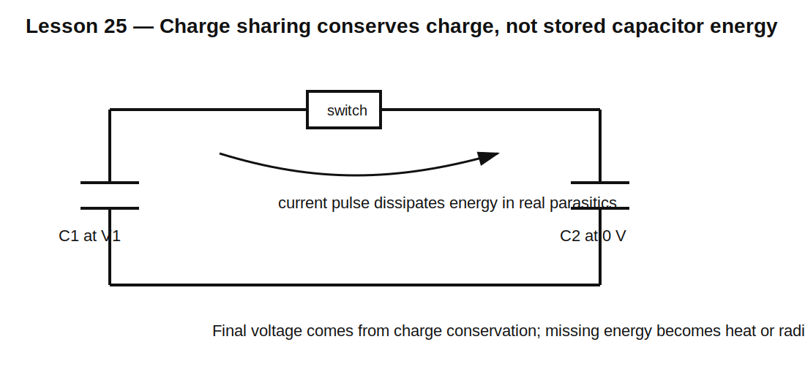

# Lesson 25 — Passive Energy Transfer and Why Half the Energy Can Disappear

> **Fast-track time:** 15–20 minutes  
> **Capability unlocked:** Track energy when capacitors are connected, charged, or redistributed.

## The engineering problem

Circuit voltages may settle exactly as expected while the energy accounting seems wrong. This often happens when capacitors exchange charge through resistance or parasitic loss.

## Charging from an ideal voltage source

A capacitor charged from 0 to V through any resistance stores:

$$E_C=\frac12CV^2$$

The ideal source supplies:

$$E_S=CV^2$$

The resistor dissipates:

$$E_R=\frac12CV^2$$

The total resistor loss is independent of resistance. R changes the current and time, not the final energy split.

## Charge sharing between capacitors

Suppose $C_1$ is charged to $V_1$ and is connected to uncharged $C_2$.

Charge conservation gives final voltage:

$$V_F=\frac{C_1V_1}{C_1+C_2}$$

Initial energy:

$$E_i=\frac12C_1V_1^2$$

Final energy:

$$E_f=\frac12(C_1+C_2)V_F^2$$

For equal capacitors, $V_F=V_1/2$ and final energy is only half the initial energy.



## Where did the energy go?

Real current flows through resistance, inductance, radiation, switch loss, and dielectric loss. The idealized instant connection is physically incomplete.

Adding a small series resistance to SPICE reveals the missing energy as heat. Adding inductance creates ringing before loss settles the system.

## Efficient energy transfer

To reduce dissipation, transfer energy gradually with reactive elements and controlled switching. This is the foundation of switched-mode power conversion.

Examples:

- resonant transfer;
- inductor-based converters;
- adiabatic charging concepts;
- current-limited active charging.

No practical method is lossless, but loss need not be the fixed 50% of simple resistor charging.

## KiCad simulation

Use two 10 µF capacitors. Charge C1 to 10 V and leave C2 at 0 V. Connect them through 1 Ω at 1 ms.

Use:

```spice
.tran 1u 20m uic
.ic V(C1N)=10 V(C2N)=0
```

Measure initial energy, final energy, and integrated resistor loss.

## What to observe

- Final voltage approaches 5 V.
- Initial energy is 500 µJ.
- Final stored energy is 250 µJ.
- About 250 µJ is dissipated in the connection resistance.
- Changing R changes current peak and settling time but not total ideal loss.

## Common mistakes

- Conserving energy but forgetting charge conservation.
- Conserving charge but assuming energy must remain stored in capacitors.
- Treating an ideal switch and ideal capacitors as a physically complete model.
- Assuming lower resistance always means lower total transfer loss.
- Ignoring parasitic inductance and resulting current spikes.

## Design challenge

A 100 µF capacitor charged to 12 V is connected to an uncharged 220 µF capacitor through 2 Ω.

Calculate final voltage, initial and final stored energy, expected dissipated energy, and initial current. Verify all four values in KiCad.

## Remember

> Charge can be conserved while stored electrical energy decreases. The missing energy is dissipated or radiated during the transfer process.