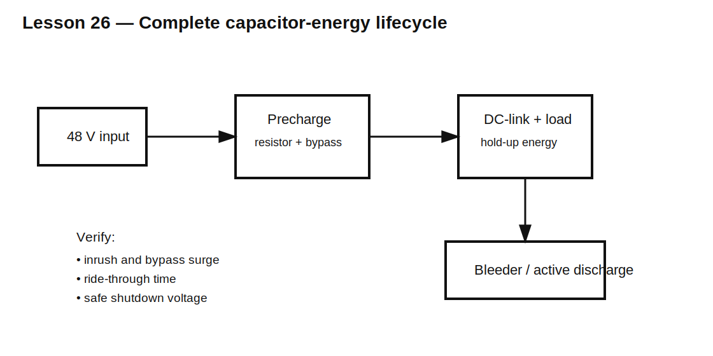

# Lesson 26 — Energy-Management Capstone: Inrush, Hold-Up, and Safe Discharge

> **Fast-track time:** 20–30 minutes  
> **Capability unlocked:** Design a capacitor-energy subsystem from startup through power loss and shutdown.

## Design brief

A 48 V controller contains a 2200 µF DC-link capacitor and a 20 W downstream converter.

The design must:

- limit startup current;
- bypass the precharge resistor safely;
- ride through a 50 ms input interruption;
- prevent backfeeding the source;
- discharge to a safe voltage after shutdown;
- keep all resistors, switches, and capacitors within ratings.

## Requirements

### Startup

- input: 44–52 V;
- DC-link capacitor: 2200 µF, ±20%;
- initial current below 2 A;
- bypass only after capacitor reaches at least 90% of input;
- bypass current step below 3 A.

### Hold-up

- downstream load: 20 W constant power;
- converter efficiency: 90%;
- converter operates down to 36 V;
- required interruption ride-through: 50 ms.

### Shutdown

- capacitor voltage below 12 V within 15 s;
- permanent bleeder loss below 2 W at 48 V nominal;
- resistor network must meet voltage and power ratings.



## Step 1 — Precharge

At maximum input, to keep current below 2 A:

$$R_{pre}\ge\frac{52}{2}=26\ \Omega$$

Choose a standard value above this and calculate charging time with maximum capacitance.

The bypass threshold is voltage-based:

$$V_C\ge0.9V_{IN}$$

Use the slow corner for timeout and the fast corner for bypass-current stress.

## Step 2 — Hold-up energy

The downstream converter draws input power:

$$P_{in}=\frac{20}{0.9}=22.2\text{ W}$$

Usable capacitor energy between 48 V and 36 V is:

$$E_{usable}=\frac12C(48^2-36^2)$$

For 2200 µF:

$$E_{usable}\approx1.11\text{ J}$$

Required energy for 50 ms is:

$$E=P_{in}t\approx1.11\text{ J}$$

Nominally this is just sufficient, but tolerance, ESR, high load, efficiency, and starting voltage remove margin. The design must use the minimum-capacitance and minimum-start-voltage corner.

## Step 3 — Isolation

Use a diode or ideal-diode MOSFET so the DC-link supports the load without discharging back into the failed input.

Check:

- voltage drop;
- reverse leakage;
- surge current;
- thermal loss;
- reverse-voltage rating.

## Step 4 — Bleeder

For discharge from $V_0$ to $V_S$:

$$R\le-\frac{t}{C\ln(V_S/V_0)}$$

Use maximum capacitor value and maximum initial voltage for the slowest safe-discharge corner. Then check permanent loss:

$$P=\frac{V^2}{R}$$

The simultaneous time and loss requirements may be incompatible with a permanent resistor. If so, use switched active discharge and explain its failure mode.

## KiCad verification

Create three simulations:

1. startup and bypass;
2. constant-power hold-up after source removal;
3. safe discharge.

Use objective measurements:

```spice
.meas tran IINMAX MAX I(VIN)
.meas tran TBYPASS WHEN V(LINK)=0.9*V(INPUT) RISE=1
.meas tran THOLD WHEN V(LINK)=36 FALL=1
.meas tran TSAFE WHEN V(LINK)=12 FALL=1
```

## Review questions

- Which tolerance corner controls each requirement?
- Where is energy dissipated during precharge?
- Does the bypass create a second surge?
- Is the hold-up load constant current or constant power?
- Does isolation still work during reverse polarity or source collapse?
- Can discharge protection fail open?
- Are resistor pulse, working-voltage, and continuous-power ratings all checked?

## Deliverable

Submit:

- topology and calculations;
- component values and ratings;
- three simulation plots;
- worst-case table;
- energy accounting;
- fault and restart analysis;
- hardware measurement plan.

## Remember

> A complete capacitor-energy design must behave correctly during connection, normal operation, interruption, restart, and shutdown.