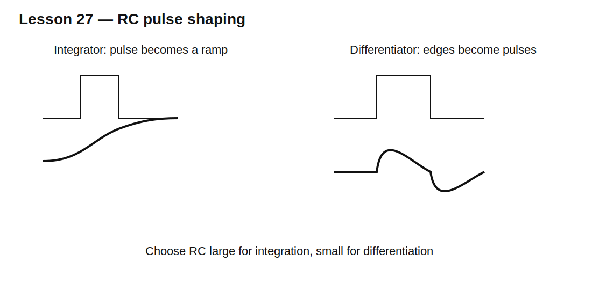

# Lesson 27 — Passive Pulse Shaping: Integrators and Differentiators

> **Fast-track time:** 15–20 minutes  
> **Capability unlocked:** Convert edges into pulses and pulses into ramps using simple RC networks.

## The engineering problem

Digital signals often need to be reshaped before another circuit can use them. A passive RC network can:

- smooth a pulse train into an average;
- create a short pulse from an edge;
- delay a threshold crossing;
- stretch or shorten a pulse;
- suppress narrow glitches.

These behaviors come from comparing signal duration with the RC time constant.

## RC integrator approximation

Use a low-pass RC with output across the capacitor.

If the input changes much faster than $RC$, the capacitor voltage changes only a little during each pulse:

$$\Delta V\approx\frac{1}{RC}\int V_{in}(t)\,dt$$

For a constant input pulse of amplitude V and duration $t_p$ with $t_p\ll RC$:

$$\Delta V\approx\frac{Vt_p}{RC}$$

This produces a ramp-like response.

## RC differentiator approximation

Use a high-pass RC with output across the resistor.

If $RC$ is much shorter than the input waveform's time scale:

$$V_{out}\approx RC\frac{dV_{in}}{dt}$$

A rising edge creates a positive pulse; a falling edge creates a negative pulse.



## The approximation condition matters

The circuit is not a perfect mathematical integrator or differentiator.

- Integrator behavior requires $RC$ much larger than the pulse width or period of interest.
- Differentiator behavior requires $RC$ much smaller than the waveform duration.
- Source and load resistances modify the effective R.

## KiCad simulation

Use a 0–5 V pulse source.

### Integrator case

- R = 100 kΩ;
- C = 1 µF;
- pulse width = 1 ms;
- period = 10 ms;
- $RC=100$ ms.

Expected first-pulse rise:

$$\Delta V\approx\frac{5\cdot1\text{ ms}}{100\text{ ms}}=50\text{ mV}$$

### Differentiator case

- C = 10 nF;
- R = 10 kΩ;
- $RC=100\ \mu s$;
- pulse width = 5 ms.

Each edge produces an exponential pulse with approximately 100 µs decay.

Use:

```spice
.tran 2u 30m startup
```

## What to observe

- Increasing integrator RC reduces ripple and slows response.
- Increasing differentiator RC widens the edge pulse.
- A differentiator can create negative voltage even from a unipolar input.
- Load resistance changes amplitude and time constant.
- Real digital inputs may need clamps or Schmitt hysteresis.

## Practical uses

- edge detection;
- pulse generation;
- crude PWM-to-voltage conversion;
- reset pulse generation;
- glitch suppression;
- envelope approximation;
- slope limiting.

## Common mistakes

- Calling any low-pass an integrator without checking time scales.
- Driving a digital input with an unbounded negative differentiator pulse.
- Ignoring source and load impedance.
- Expecting a passive network to preserve amplitude while reshaping time.
- Using RC pulse shaping where precise timing is required.

## Design challenge

Create a positive pulse approximately 500 µs wide from the rising edge of a 0–3.3 V square wave.

Requirements:

- load is 100 kΩ;
- peak output at least 2.5 V;
- output below 0.5 V after 500 µs;
- explain how to handle the negative pulse at the falling edge.

## Remember

> RC pulse shaping works by choosing a time constant intentionally large or small relative to the waveform you want to reshape.