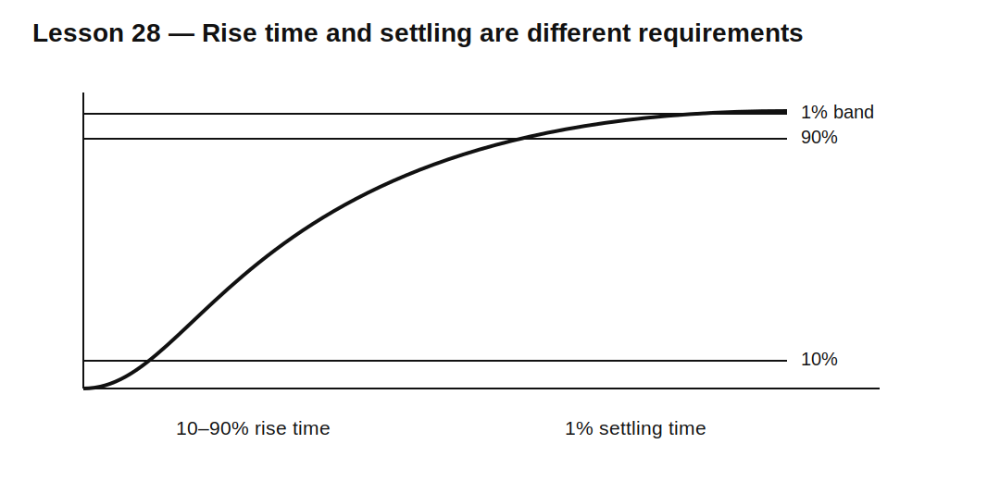

# Lesson 28 — Rise Time, Bandwidth, and Settling

> **Fast-track time:** 15–20 minutes  
> **Capability unlocked:** Predict how a passive low-pass network rounds edges and delays accurate settling.

## The engineering problem

A low-pass filter reduces noise, but it also slows the signal. The same RC that improves smoothing creates finite rise time and settling delay.

For a first-order RC low-pass:

$$\tau=RC$$

$$f_c=\frac{1}{2\pi RC}$$

The 10–90% rise time is approximately:

$$t_r\approx2.2RC\approx\frac{0.35}{f_c}$$

## Settling is stricter than rise time

For a step response, remaining error is:

$$\epsilon=e^{-t/RC}$$

Useful values:

| Accuracy band | Approximate settling time |
|---|---:|
| 10% | 2.303 RC |
| 5% | 2.996 RC |
| 1% | 4.605 RC |
| 0.1% | 6.908 RC |

A signal can look visually settled while still failing a precision requirement.



## Example

A sensor filter uses 10 kΩ and 10 nF.

$$RC=100\ \mu s$$

$$f_c\approx1.59\text{ kHz}$$

$$t_r\approx220\ \mu s$$

Time to 1% settling:

$$t_{1\%}\approx461\ \mu s$$

## Cascaded stages

Two identical RC stages attenuate high-frequency noise more strongly, but the total response is slower than one stage. Loading between passive stages also changes both poles.

Do not assume:

$$t_{total}=t_1+t_2$$

without checking the actual topology and buffering.

## KiCad simulation

Compare:

1. one 10 kΩ/10 nF stage;
2. two directly cascaded identical stages;
3. two stages separated by an ideal buffer.

Use:

```spice
.tran 1u 2m startup
.ac dec 100 10 10Meg
```

Measure:

- 10% and 90% crossing times;
- time to enter and stay within ±1%;
- −3 dB bandwidth;
- overshoot, if any parasitics are added.

## What to observe

- Lower bandwidth produces slower edges.
- Directly cascaded passive stages load each other.
- Buffered stages preserve the intended individual poles.
- Rise time and small-error settling answer different questions.
- Probe capacitance can further slow a high-impedance node.

## Design workflow

1. Define required noise attenuation.
2. Define maximum acceptable rise time.
3. Define settling accuracy and time.
4. Include source and load resistance.
5. Choose one or more poles.
6. Simulate both AC response and step response.
7. Check tolerance and probe loading.

## Common mistakes

- Choosing cutoff frequency without checking time response.
- Using 10–90% rise time as a 1% settling guarantee.
- Cascading passive filters without loading analysis.
- Measuring with a probe whose capacitance creates an extra pole.
- Assuming higher-order response cannot overshoot.

## Design challenge

Filter a sensor output so 100 kHz noise is attenuated by at least 30 dB while a 1 V step settles to 1% within 2 ms.

Use one or two passive RC stages, include a 50 kΩ load, and prove both frequency-domain and time-domain requirements.

## Remember

> Noise reduction, bandwidth, rise time, and settling are different views of the same dynamic tradeoff.