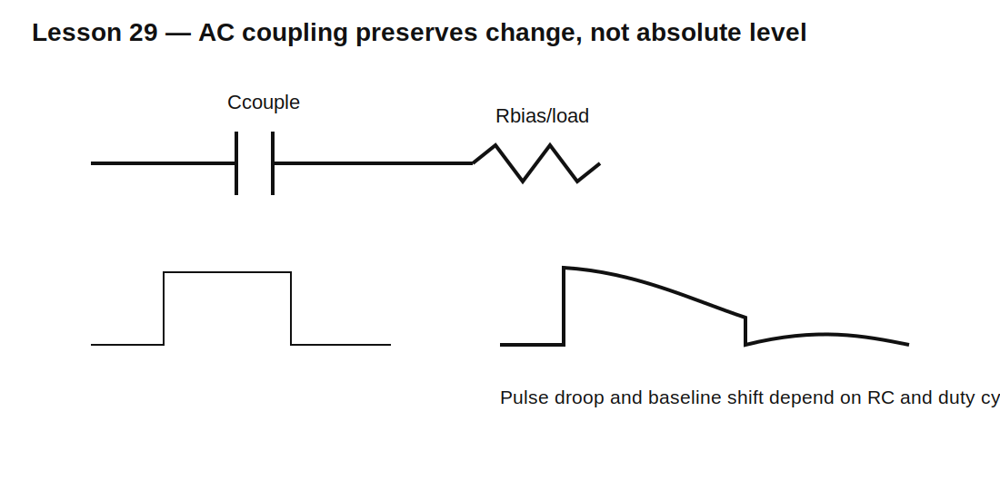

# Lesson 29 — AC Coupling, Droop, and Baseline Shift

> **Fast-track time:** 15–20 minutes  
> **Capability unlocked:** Choose coupling capacitors that pass useful pulses without distorting their baseline.

## The engineering problem

A series capacitor blocks DC and passes changing signals. This is useful for coupling signals between differently biased circuits, but pulse waveforms can droop or shift because the capacitor must maintain zero average current over time.

## High-pass corner

For a coupling capacitor feeding resistance $R_{eq}$:

$$f_c=\frac{1}{2\pi R_{eq}C}$$

For pulse fidelity, cutoff must usually be far below the lowest significant pulse-repetition or content frequency.

## Pulse droop

During a flat pulse, the output decays exponentially toward its bias level:

$$V_{out}(t)=V_0e^{-t/RC}$$

Fractional droop after pulse width $t_p$ is:

$$D=1-e^{-t_p/RC}$$

For small droop:

$$D\approx\frac{t_p}{RC}$$

## Example

A 1 ms pulse may droop no more than 1%.

Require approximately:

$$RC\ge100t_p=100\text{ ms}$$

With a 100 kΩ load:

$$C\ge1\ \mu F$$



## Baseline shift

If positive and negative pulse areas are unequal, the coupling capacitor charges until the average current balances. The visible waveform baseline moves.

This matters for:

- serial links with long runs of identical bits;
- pulse transformers;
- audio coupling;
- sensor pulses;
- oscilloscope AC coupling.

## Bias restoration

The receiving side needs a DC path that establishes its operating point. This may be:

- a resistor to ground;
- a resistor divider;
- an amplifier input bias network;
- an active baseline-restoration circuit.

Without a defined path, the node may float.

## KiCad simulation

Use a 0–5 V pulse source, 1 µF series capacitor, and 100 kΩ load to 2.5 V bias.

Use:

```spice
.tran 10u 100m startup
```

Compare:

- 50% duty cycle;
- 10% duty cycle;
- one isolated pulse;
- 100 nF, 1 µF, and 10 µF.

## What to observe

- Smaller C creates more pulse-top droop.
- Unequal duty cycle shifts the baseline.
- The output can exceed the bias rail temporarily.
- Source and load resistance both affect the time constant.
- Polarized capacitors may experience reverse voltage depending on bias.

## Common mistakes

- Choosing C only from sine-wave cutoff.
- Ignoring pulse width and allowed droop.
- Forgetting the receiver needs a DC bias path.
- Using a polarized capacitor without checking both steady and transient polarity.
- Assuming AC coupling preserves absolute voltage levels.

## Design challenge

Couple a 0–3.3 V, 2 ms pulse into a receiver biased at 1.65 V with 47 kΩ input resistance.

Requirements:

- pulse-top droop below 2%;
- return within 1% of baseline before the next pulse at 10 Hz;
- no capacitor reverse voltage beyond its rating;
- verify 10% and 90% duty-cycle cases.

## Remember

> AC coupling preserves change, not absolute level. Choose RC from pulse droop, baseline recovery, bias, and polarity requirements.