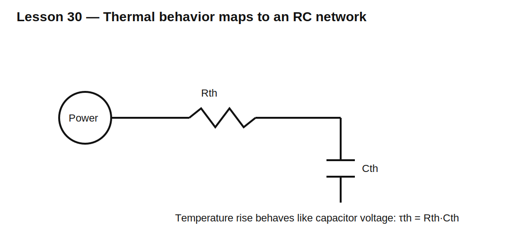

# Lesson 30 — Thermal Time Constants and Self-Heating

> **Fast-track time:** 15–20 minutes  
> **Capability unlocked:** Predict why components survive short pulses yet overheat under repetitive loading.

## The engineering problem

Electrical stress becomes heat. Temperature does not rise instantly because components have thermal mass and a thermal path to ambient.

A useful first-order thermal model is electrically analogous to RC:

- power is like current;
- temperature rise is like voltage;
- thermal resistance $\theta$ is like electrical resistance;
- thermal capacitance $C_{th}$ is like capacitance.

Thermal time constant:

$$\tau_{th}=\theta C_{th}$$

## First-order temperature rise

For constant power P:

$$\Delta T(t)=P\theta\left(1-e^{-t/\tau_{th}}\right)$$

Final steady-state rise:

$$\Delta T_{SS}=P\theta$$

After power is removed:

$$\Delta T(t)=\Delta T_0e^{-t/\tau_{th}}$$



## Example

A resistor dissipates 2 W. Its effective thermal resistance is 40°C/W and thermal time constant is 20 s.

Steady-state rise:

$$\Delta T_{SS}=80^\circ C$$

After 2 s:

$$\Delta T=80(1-e^{-2/20})\approx7.6^\circ C$$

This explains why a short pulse can produce high instantaneous power without immediate destructive temperature rise.

## Repetitive pulses

If pulses repeat before the component cools, temperature accumulates. Average power is useful only when the pulse period is short relative to thermal time constants and peak stress is independently safe.

Real components often have multiple thermal time constants:

- junction or resistive film;
- package;
- PCB copper;
- enclosure and ambient.

Datasheet transient-thermal-impedance curves capture this better than one RC.

## KiCad/ngspice thermal analogy

Model a 10 W, 100 ms pulse repeated every second as a current source into a thermal RC:

- $R_{th}=20$;
- $C_{th}=2$;
- $	au=40$ s.

Treat 1 V as 1°C rise.

Use:

```spice
.tran 10m 200s startup
```

Compare one pulse, 1 Hz repetition, and 10 Hz repetition.

## What to observe

- One short pulse creates a small temperature rise.
- Repeated pulses build toward a periodic steady state.
- Peak temperature can exceed the value predicted from average power alone.
- More PCB copper lowers thermal resistance and may increase thermal capacitance.
- Ambient temperature directly reduces remaining temperature margin.

## Design workflow

1. Calculate instantaneous electrical loss.
2. Calculate pulse energy and repetition rate.
3. Check electrical peak limits and SOA.
4. Use transient thermal data or a thermal network.
5. Include ambient and neighboring heat sources.
6. Verify steady-state and cyclic peak temperature.
7. Validate with temperature measurement where practical.

## Common mistakes

- Treating package wattage as independent of PCB layout.
- Using average power without checking pulse peak limits.
- Assuming temperature instantly follows power.
- Ignoring hot ambient and reduced cooling.
- Using one thermal resistance for every pulse duration.
- Trusting a simulator without thermal parameters from real data.

## Design challenge

A resistor dissipates 30 W for 100 ms every 2 s. Its effective thermal model is 25°C/W and 1.2 J/°C.

Estimate pulse energy, average power, thermal time constant, first-pulse temperature rise, and long-term average temperature rise. Explain which datasheet pulse rating still must be checked.

## Remember

> Electrical power creates temperature through a time-dependent thermal network. Peak, average, and accumulated heating must all be checked.