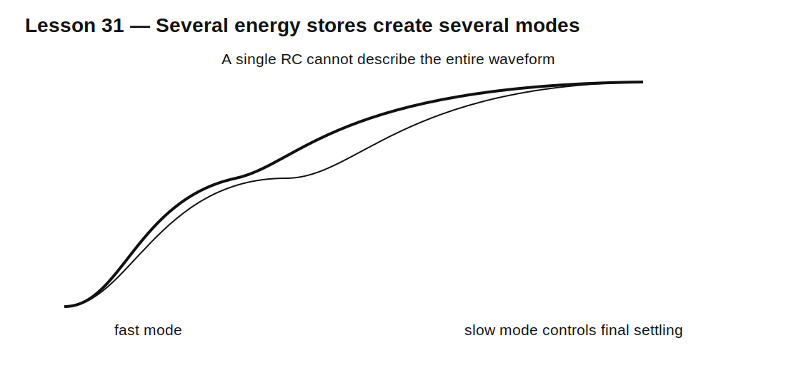

# Lesson 31 — Multiple Time Constants and Dominant Behavior

> **Fast-track time:** 15–20 minutes  
> **Capability unlocked:** Analyze circuits whose response is not described by one simple RC or RL constant.

## The engineering problem

Real circuits often contain several capacitors, inductors, and resistive paths. The response may include:

- a fast initial jump;
- a medium-speed transition;
- a slow final drift;
- multiple slopes on a semilog plot;
- overshoot or ringing.

One value of $RC$ is then not enough.

## Sum of exponential modes

A linear circuit with several independent energy-storage modes often responds as:

$$x(t)=x_{final}+A_1e^{-t/\tau_1}+A_2e^{-t/\tau_2}+\cdots$$

Each mode has its own time constant and amplitude.

The slowest significant mode often dominates final settling, but a faster mode may dominate peak stress or initial waveform shape.

## Example: remote bulk plus local capacitor

A supply network contains:

- 100 nF local capacitor with low ESL;
- 10 µF nearby ceramic;
- 470 µF remote bulk through trace resistance and inductance.

The load step is supported in sequence:

1. local 100 nF handles the fastest edge;
2. 10 µF supports the next interval;
3. bulk capacitor and regulator handle the longer event.

This is a physical example of multiple dynamic modes.



## Dominant-pole approximation

If one time constant is much slower than all others and its amplitude matters, the final response can often be approximated by that mode alone.

This is useful, but only after checking that faster modes do not violate overshoot, current, or voltage limits.

## Finding the effective resistance

For a capacitor in a linear circuit:

1. deactivate independent sources;
2. look into the capacitor terminals;
3. calculate the Thevenin resistance;
4. estimate $\tau=R_{th}C$.

When capacitors interact strongly, this per-capacitor shortcut may not reveal the true system modes. Full circuit analysis or simulation is then needed.

## KiCad simulation

Build a two-stage passive network:

- R1 = 1 kΩ, C1 = 100 nF;
- R2 = 100 kΩ, C2 = 1 µF;
- load = 1 MΩ.

Use:

```spice
.tran 1u 1s startup
```

Plot both capacitor voltages and output voltage.

Then change C1 by 10× and observe which part of the waveform moves.

## What to observe

- The fast mode settles first.
- The slow mode controls final settling.
- Changing one component may affect mode amplitudes as well as time constants.
- Directly cascaded stages load each other.
- A single-exponential curve fit can be misleading over the full time range.

## Practical uses

- startup sequencing;
- power-distribution networks;
- sensor filtering;
- amplifier bias settling;
- multi-stage debounce;
- battery and supercapacitor models;
- thermal systems.

## Common mistakes

- Assigning one RC constant to an entire multi-capacitor circuit.
- Ignoring a fast mode because final settling looks correct.
- Ignoring a slow tail because the first 90% looks fast.
- Treating cascaded passive stages as independent.
- Adding arbitrary simulation time without defining a settling requirement.

## Design challenge

Design a two-stage passive response with:

- initial 10–90% rise under 5 ms;
- final 1% settling under 100 ms;
- at least 20 dB attenuation at 10 kHz;
- load of 200 kΩ.

Choose values, identify the fast and slow modes, and verify that loading does not invalidate the estimates.

## Remember

> Multi-storage circuits contain several dynamic modes. Identify which mode controls the edge, peak, and final settling instead of forcing the entire waveform into one time constant.